# Session 10: Kubernetes Core Objects & Deployment Strategies

## Pod Creation and Inspection

**Run:**

```powershell
kubectl apply -f pod.yml
kubectl get pods -o wide
kubectl logs nginx-pod
kubectl delete -f pod.yml
```

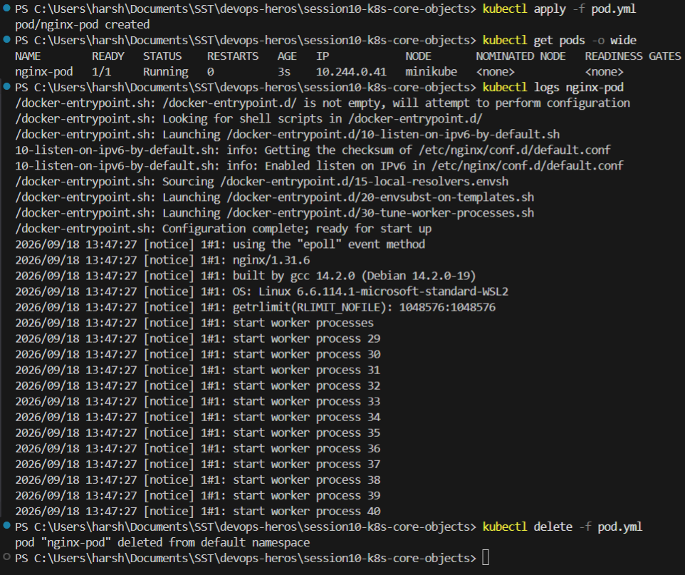

## Pod Failure States

A Pod object is stored in `etcd` successfully, but the container still fails at runtime when the
image cannot be pulled. `ErrImagePull` is the first failure, then Kubernetes switches to
`ImagePullBackOff` and waits longer between each retry.

**Run:**

```powershell
kubectl apply -f pod-lifecycle/06-imagepullbackoff.yaml
kubectl get pods
kubectl describe pod lifecycle-image-error
kubectl delete -f pod-lifecycle/06-imagepullbackoff.yaml
```

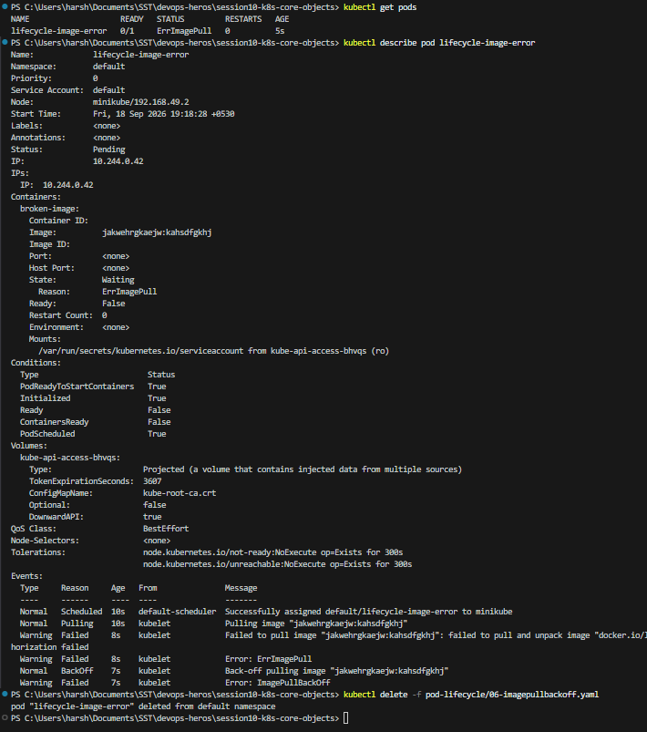

## Pod Lifecycle Phases

A short lived Pod with `restartPolicy: Never` passes through `ContainerCreating`, then `Running`,
then `Completed`, with the final phase being `Succeeded`.

**Run:**

```powershell
kubectl apply -f hello.yml
kubectl get pods -w
kubectl logs hello-pod
kubectl delete -f hello.yml
```

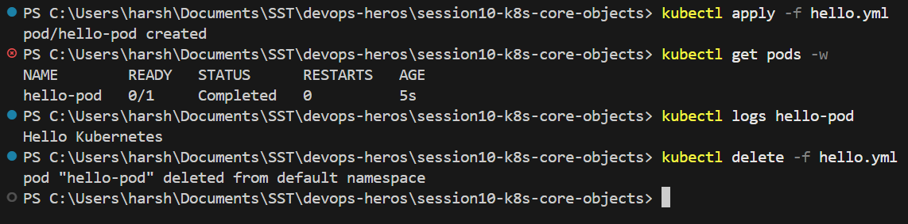

## Rolling Updates

With `maxSurge: 1` and `maxUnavailable: 0`, new Pods are added before old ones are removed, so there
is no downtime at any point.

**Run:**

```powershell
cd 01-rolling-update
kubectl apply -f deployment-v1.yaml -f service.yaml
kubectl rollout status deployment/app-rolling
kubectl apply -f deployment-v2.yaml
kubectl rollout status deployment/app-rolling
kubectl get pods -l app=app-rolling
```

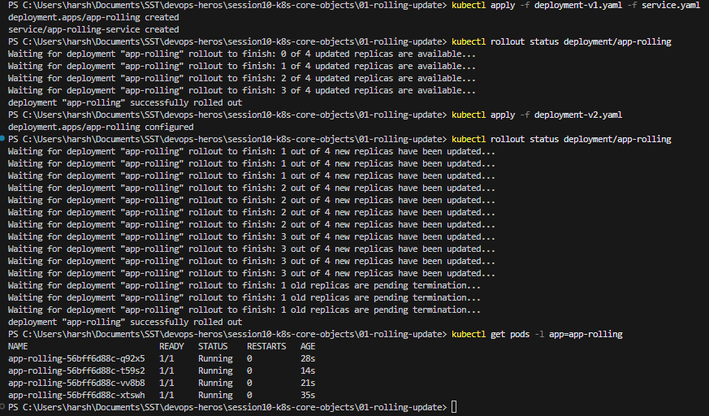


## Rollback Demonstration

**Run:**

```powershell
kubectl rollout history deployment/app-rolling
kubectl rollout undo deployment/app-rolling
kubectl rollout status deployment/app-rolling
kubectl delete -f deployment-v1.yaml -f service.yaml
```

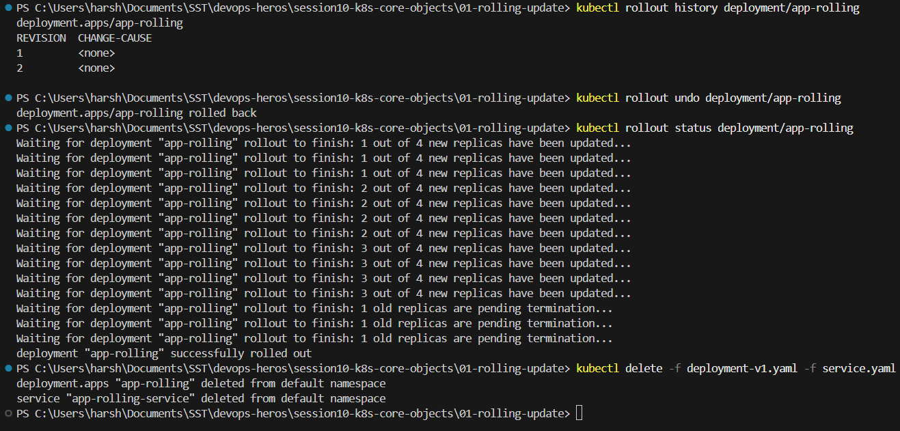

## Blue-Green Environments

Blue and Green both run at the same time. Only the Service **selector** is changed, so the switch and
the rollback are instant and no Pod is restarted.

**Run:**

```powershell
cd ../02-blue-green
kubectl apply -f deployment-blue.yaml -f deployment-green.yaml -f service-blue.yaml
kubectl get pods -l app=myapp --show-labels
kubectl describe svc myapp-service | Select-String "Selector"
```

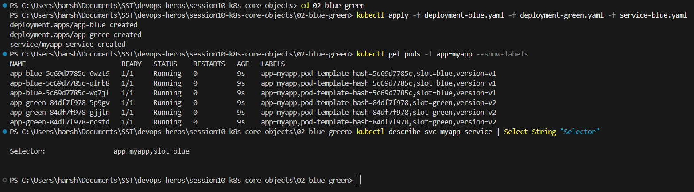

**Run:**

```powershell
kubectl apply -f service-green.yaml
kubectl describe svc myapp-service | Select-String "Selector"
kubectl get endpoints myapp-service
kubectl apply -f service-blue.yaml
kubectl delete -f service-blue.yaml -f deployment-blue.yaml -f deployment-green.yaml
```

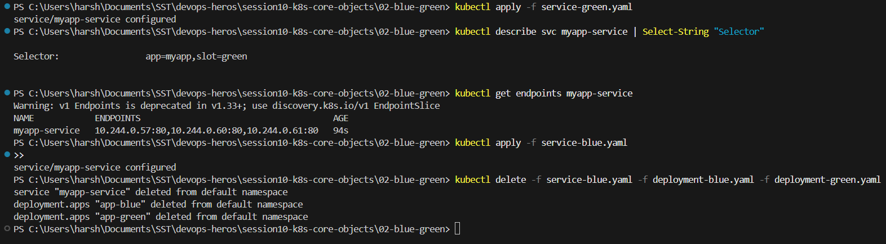
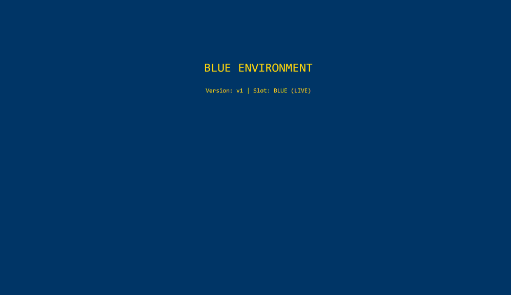
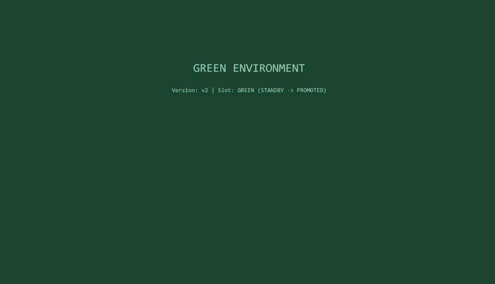

## Canary Deployments

Stable and canary share one Service, so the traffic split comes from the **Pod count ratio**. With 9
stable and 1 canary, the canary picks up roughly 10% of requests.

**Run:**

```powershell
cd ../03-canary
kubectl apply -f deployment-stable.yaml -f service.yaml -f deployment-canary.yaml
kubectl get deploy app-stable app-canary
kubectl get endpoints myapp-canary-service
```

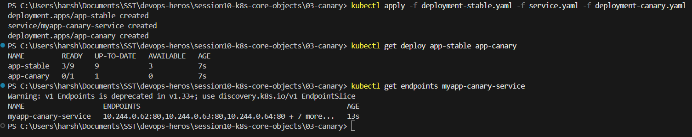


**Run:**

```powershell
kubectl run canarytest --rm -i --restart=Never --image=curlimages/curl -- sh -c 'for i in $(seq 1 30); do curl -s http://myapp-canary-service/ | grep -o "STABLE v1\|CANARY v2"; done'

kubectl scale deployment app-canary --replicas=3
kubectl scale deployment app-stable --replicas=7
kubectl delete -f service.yaml -f deployment-canary.yaml -f deployment-stable.yaml
```

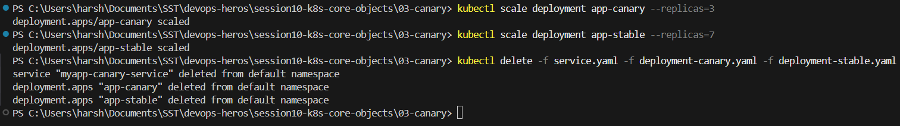

## Recreate Deployments

Recreate terminates **all** old Pods before starting any new ones, so there is a real outage window
where zero Pods are alive.

**Run:**

```powershell
cd ../04-recreate
kubectl apply -f deployment-v1.yaml -f service.yaml
kubectl rollout status deployment/app-recreate
kubectl get pods -l app=app-recreate
```

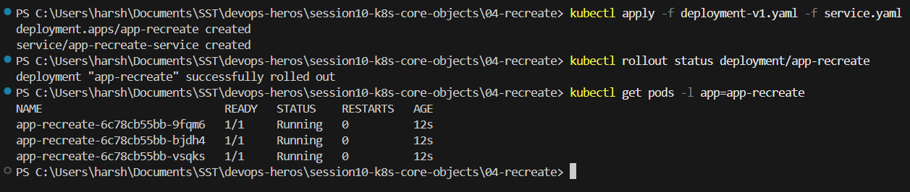
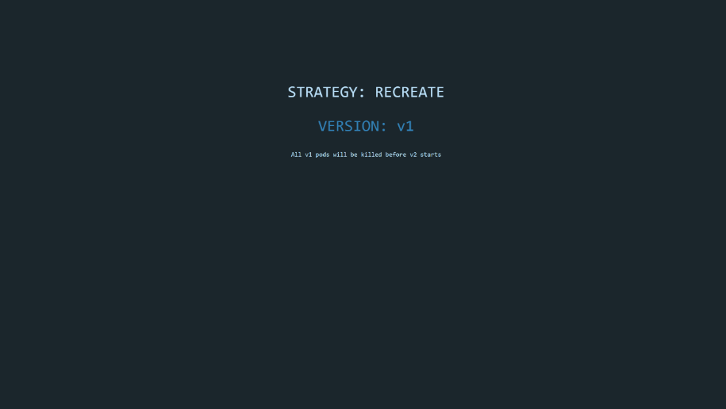

**Run (two terminals):**

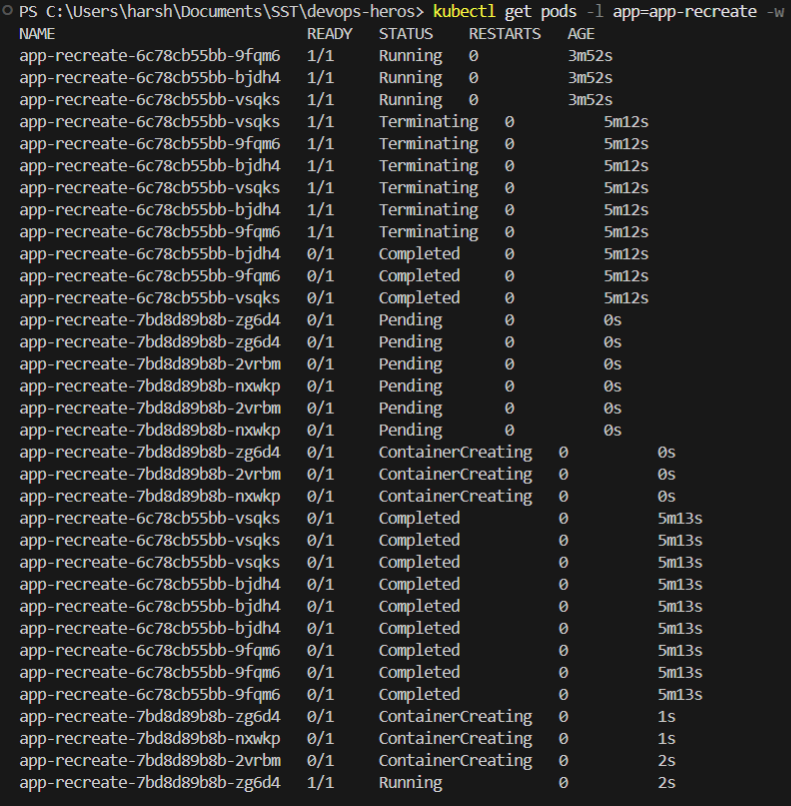


## Deployment Strategies Comparison

| Strategy | How it works | Downtime | Cost |
|---|---|---|---|
| RollingUpdate | Replaces old Pods gradually with new ones | None | Slightly more |
| Recreate | Kills every old Pod first, then creates new ones | Yes, a real outage | Normal |
| Blue-Green | Two full environments, flip the Service selector | None | 2x, both run at once |
| Canary | A few new Pods run beside the old ones | None | Slightly more |

### maxSurge and maxUnavailable

For `replicas: 4`, `maxSurge: 1`, `maxUnavailable: 0`:

- Maximum Pods during the rollout: `4 + 1 = 5`
- Minimum available Pods: `4 - 0 = 4`, so full capacity is kept the whole time

### The 4 Ports

| Field | Where | Meaning |
|---|---|---|
| `containerPort` | Pod spec | Port the app listens on inside the container, documentation only |
| `targetPort` | Service spec | Pod port the Service forwards to |
| `port` | Service spec | Port the Service exposes on its ClusterIP |
| `nodePort` | Service spec | Port `30000` to `32767` opened on every node |

Traffic flows `nodePort` to `port` to `targetPort` to `containerPort`.

### Labels vs Selectors

- **Labels** are key value tags attached to an object, such as `app: myapp` or `slot: blue`.
- **Selectors** are the query that matches those labels, which is how a Deployment or Service finds
  the Pods it owns. Labels do nothing on their own.

### Requests vs Limits

- **Requests** are the guaranteed minimum, used by the scheduler to pick a node.
- **Limits** are the hard ceiling. Exceeding the CPU limit causes throttling, exceeding the memory
  limit gets the container OOM killed.
- Units are binary: `1 GiB = 2^30` bytes, written `Mi` and `Gi`, which is not the same as `1 GB = 10^9`.
