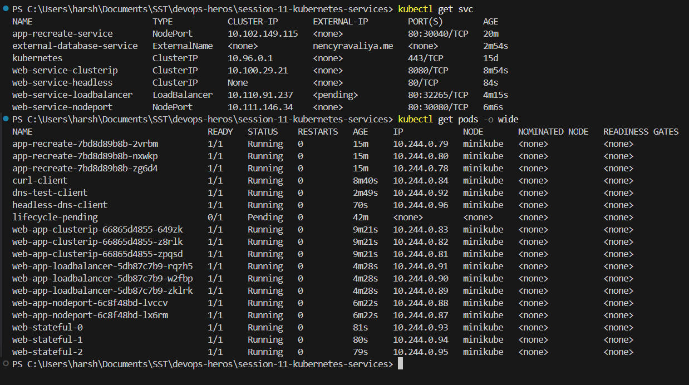
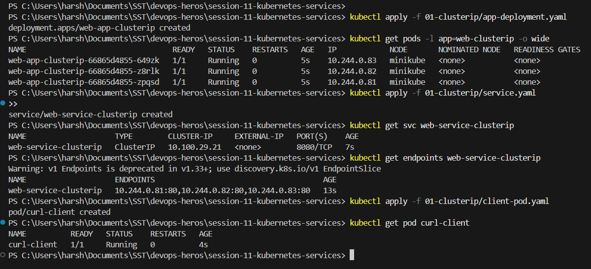
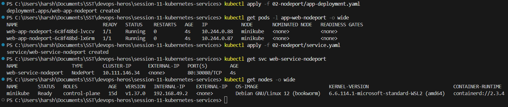
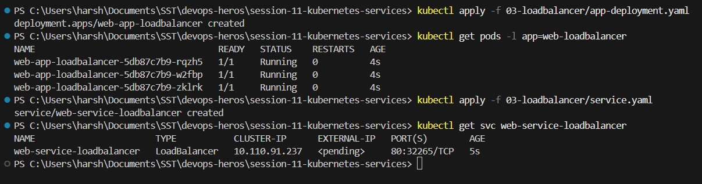
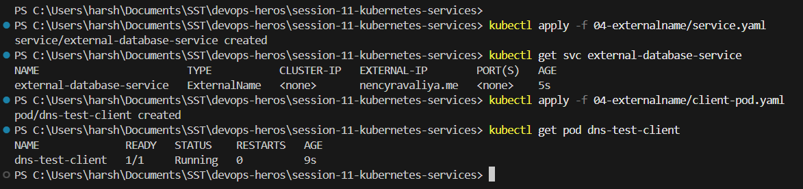
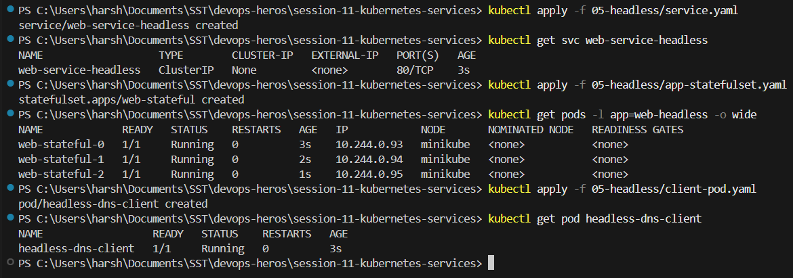

# Session 11: Kubernetes Services

## All Services and Pods

**Run:**

```powershell
kubectl get svc
kubectl get pods -o wide
```



## 1. ClusterIP Service

ClusterIP is the default Service type. It gives a stable virtual IP and a DNS name that only works
inside the cluster. Kubernetes load balances requests across the healthy Pods matched by the selector.



## 2. NodePort Service

NodePort opens the same high port (`30000` to `32767`) on every node, so the app can be reached from
outside the cluster.



## 3. LoadBalancer Service

LoadBalancer asks the cloud provider for an external load balancer. Kubernetes also builds the
NodePort and ClusterIP layers underneath it. On Minikube the `EXTERNAL-IP` stays `<pending>` until
`minikube tunnel` is running, because there is no real cloud provider.



## 4. ExternalName Service

ExternalName has no selector, no Pods and no ClusterIP. CoreDNS simply returns a CNAME record that
points the internal Service name at an external domain.



## 5. Headless Service

A Headless Service sets `clusterIP: None`. There is no virtual IP and no load balancing through
kube-proxy. CoreDNS instead returns one A record per matching Pod, which is how a StatefulSet Pod can
be addressed directly.



## Service Types Summary

| Type | ClusterIP | Reachable from | Typical use |
|---|---|---|---|
| ClusterIP | Yes | Inside the cluster only | Internal microservices |
| NodePort | Yes | Node IP on a high port | Simple external access, dev and test |
| LoadBalancer | Yes | External IP from the cloud | Public facing service in production |
| ExternalName | No | Resolves to an external domain | Alias to a database or API outside the cluster |
| Headless | `None` | Individual Pod IPs | StatefulSets that need stable per Pod addressing |

## Minikube Docker Driver Gotcha

With the Docker driver, the node runs inside an isolated Docker network, so `<node-ip>:<nodePort>`
does **not** work from Windows or macOS. Two workarounds:

- `minikube service <svc> --url` opens a tunnel and prints a usable `127.0.0.1` URL. The terminal has
  to stay open.
- `minikube tunnel` adds a route so `LoadBalancer` services get a reachable external IP.
