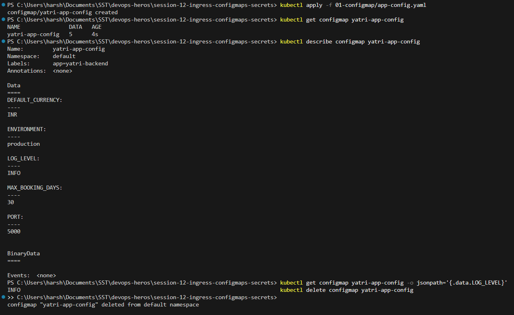
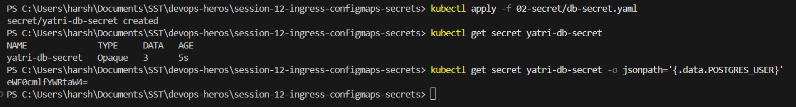
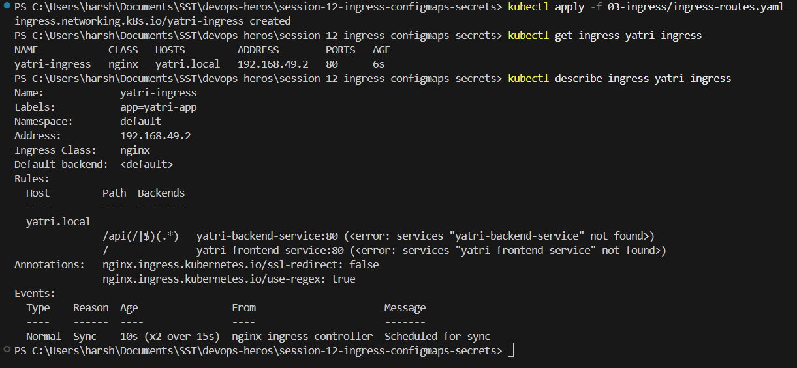

# Session 12: Ingress, ConfigMaps and Secrets

## ConfigMap

A ConfigMap keeps non secret configuration out of the image, as plain key value pairs. The same image
can then be used in dev and production with different settings.

## Secret

A Secret holds sensitive values such as passwords and tokens. The values are only **base64 encoded**,
not encrypted, so anyone who can read the Secret can decode it instantly.

## Ingress

An Ingress routes outside HTTP traffic to different Services based on the host and the URL path. One
Ingress can front many Services, which avoids paying for a separate LoadBalancer per service.

The Ingress controller has to be enabled first, since Minikube does not ship it running.

## ConfigMap vs Secret

| | ConfigMap | Secret |
|---|---|---|
| Holds | Plain configuration | Passwords, tokens, keys |
| Stored as | Plain text | Base64 encoded, not encrypted |
| Size limit | 1 MiB | 1 MiB |
| Used in a Pod as | Env vars or mounted files | Env vars or mounted files |

- Base64 is encoding, not security. Real protection needs encryption at rest in `etcd`, RBAC limiting
  who can read Secrets, or an external vault.
- Never commit a real Secret manifest to git, since the base64 value decodes in one command.
