# Session 13: Storage, HPA and Probes

## 1. Volumes

Data written inside a container is lost when the container is removed. A volume gives the Pod a
separate place to store data.

| | emptyDir | hostPath |
|---|---|---|
| Where | Empty folder created with the Pod | Folder on the node |
| Survives Pod deletion | No | Yes, on the same node |
| Use case | Cache, scratch files | Local testing, node level tools |

### Run emptyDir Pod

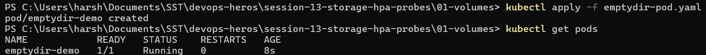

### Create a File

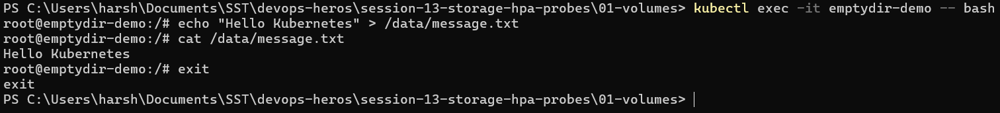

### Delete the Pod

The file is gone because the `emptyDir` was deleted along with the Pod.

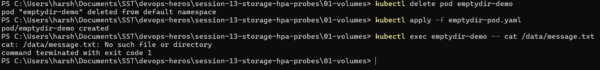

## 2. PersistentVolume and PersistentVolumeClaim

- **PV** is storage available in the cluster.
- **PVC** is a request for storage. The Pod uses the PVC, not the PV.
- `Bound` means the PVC got a matching volume.
- The data outlives the Pod.

```text
Pod  ->  PVC  ->  PV  ->  Storage
```

### Create PV, PVC and Pod

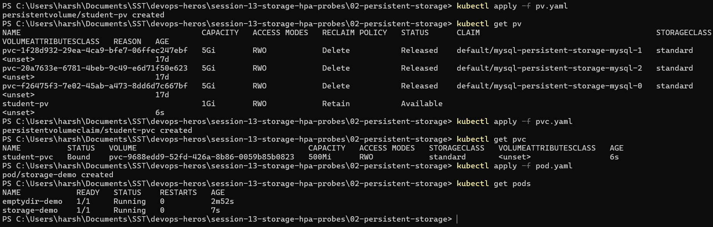

### Test Persistent Storage

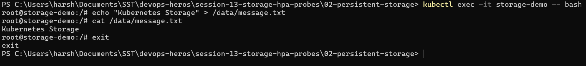

### Delete the Pod

The file is still there because the data lives on the PV, not in the Pod.

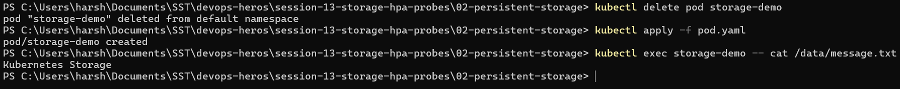

## 3. StorageClass

- A StorageClass creates PVs automatically when a PVC asks for one. This is **dynamic provisioning**.
- Minikube's default class is `standard`.
- A PVC without `storageClassName` uses the default class.

```text
PVC  ->  StorageClass  ->  PV created automatically
```

### Check StorageClass

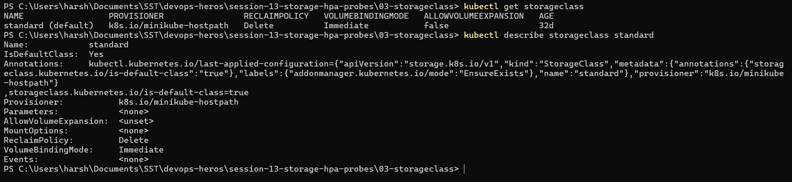

### Dynamic PVC

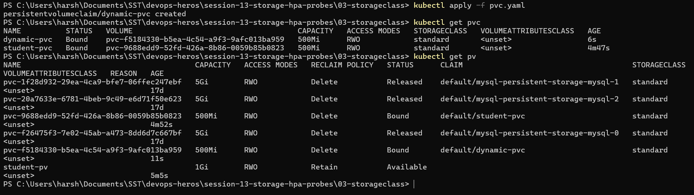

## 4. Horizontal Pod Autoscaler (HPA)

- HPA adds or removes Pods based on CPU usage.
- It needs the **Metrics Server** and `resources.requests.cpu` on the container.
- Scale up is fast. Scale down waits about 5 minutes.

### Deployment and Service

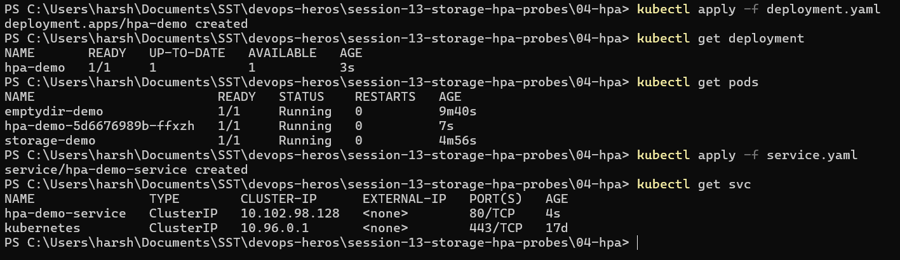

### Metrics Server

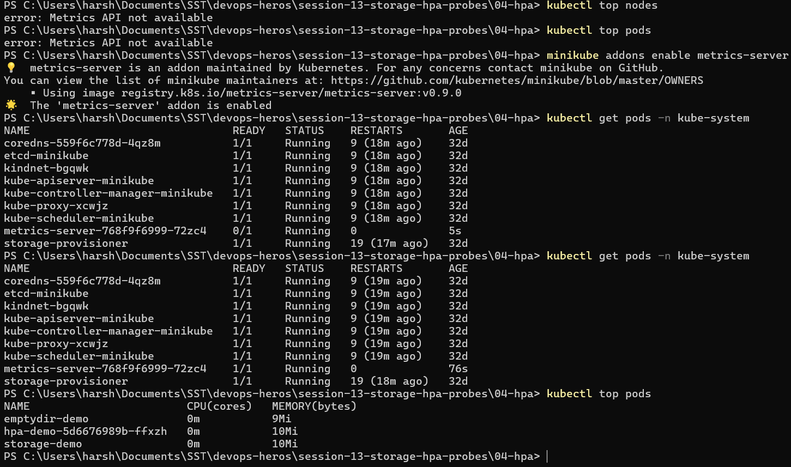

### Create HPA

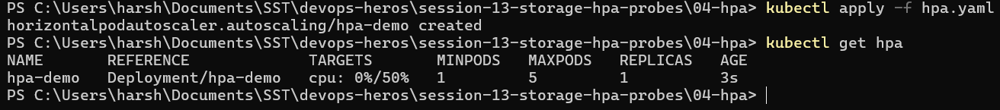

### Generate Load

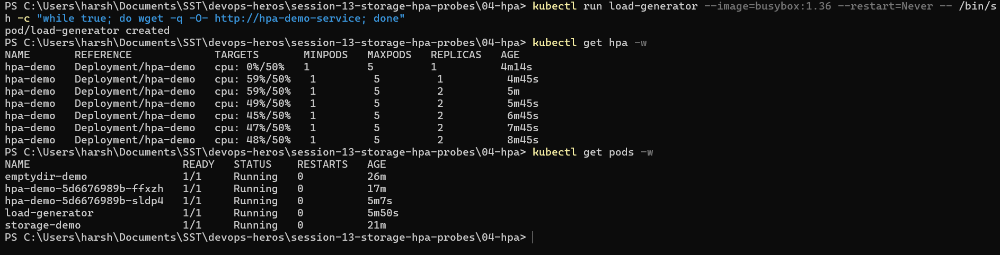

### Stop the Load

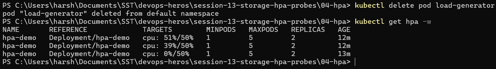

## 5. Probes

A Pod can be `Running` while the app inside is broken. Probes check the app itself.

| Probe | Question | On failure |
|---|---|---|
| Startup | Has the app started? | Container restarts |
| Readiness | Can it take traffic? | Removed from Service endpoints, no restart |
| Liveness | Is it still alive? | Container restarts |

### Liveness Probe

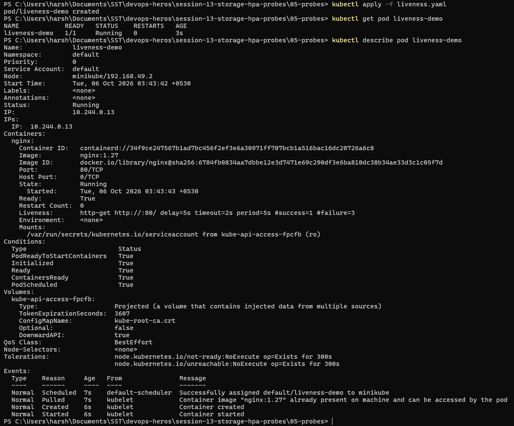

### Readiness Probe

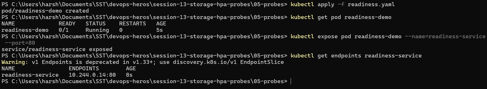

### Startup Probe

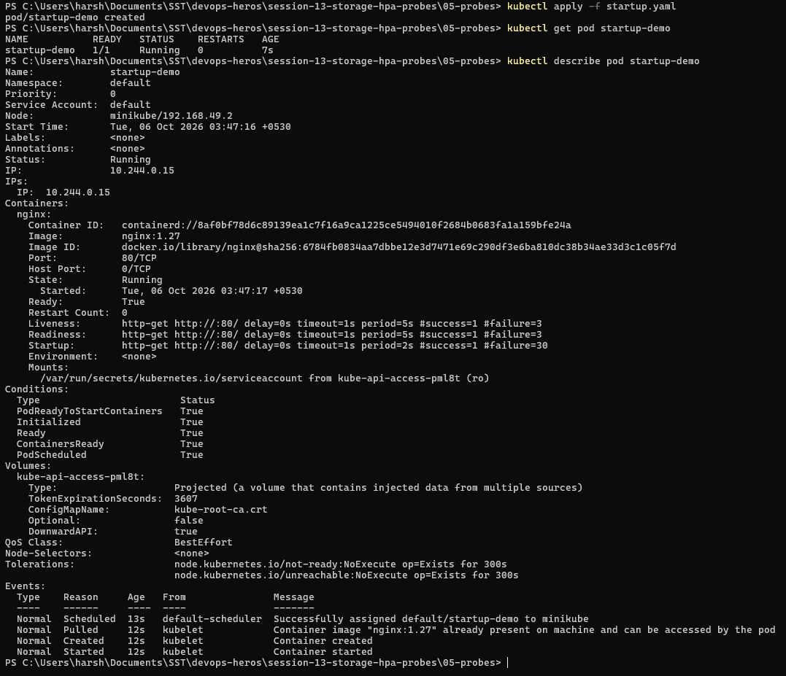

### Breaking Readiness

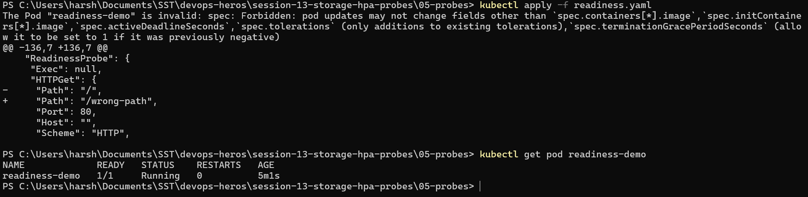

### Breaking Liveness

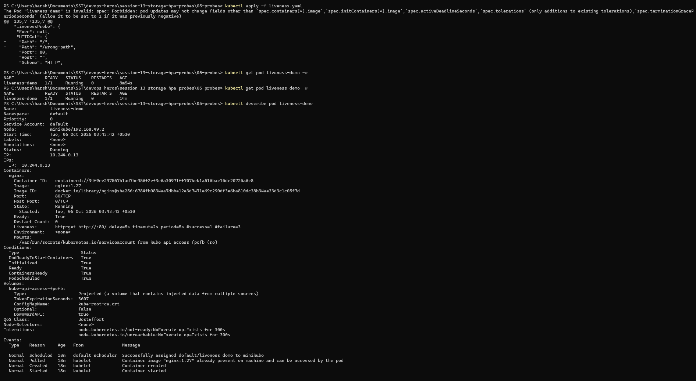

## 6. Mini Project

A web app in the `production-webapp` namespace that combines everything from this session.

| Part | Setup |
|---|---|
| Storage | PVC `web-data`, 500Mi, mounted at `/data` |
| Scaling | HPA from 2 to 5 Pods at 50% CPU |
| Health | Startup, readiness and liveness probes |

### Deployment

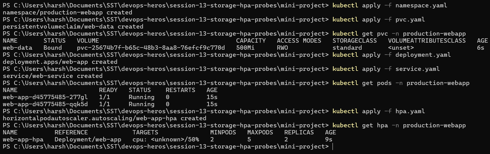

### Storage Persistence

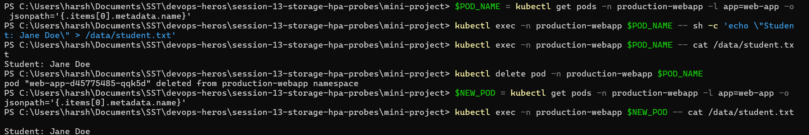

### Service Verification

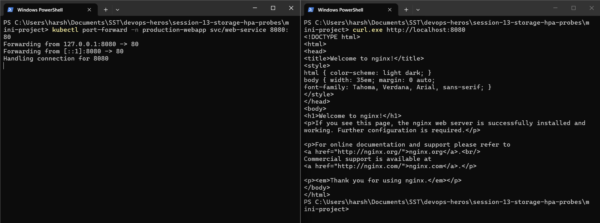

### HPA Scaling

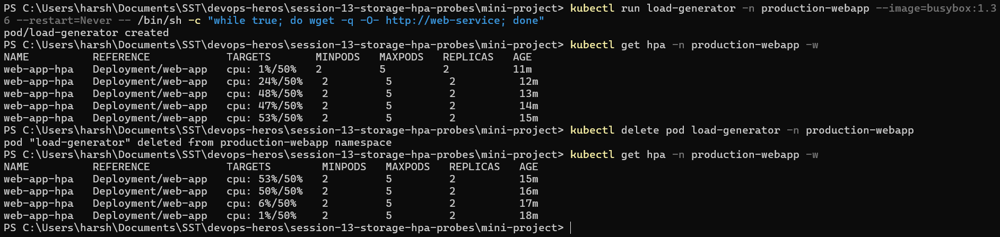

## Key Learnings

- **emptyDir** dies with the Pod, **PVC** keeps data across Pods.
- **StorageClass** removes the need to create PVs by hand.
- **HPA** scales Pods on CPU load.
- **Readiness** controls traffic, **liveness** and **startup** control restarts.
