# Session 15: Helm

Helm is the package manager for Kubernetes. One chart is written once and deployed to any environment
by passing different values.

| Term | Meaning |
|---|---|
| Chart | Packaged Kubernetes templates (the recipe) |
| Release | A running instance of a chart in the cluster |
| Values | Variables passed into the chart |

Helm 3 and later have no Tiller. Helm runs client only and stores release state as Secrets.

## 1. What is Helm

### Helm Version and Releases

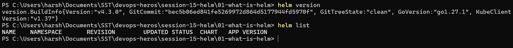

### Installing a Public Chart

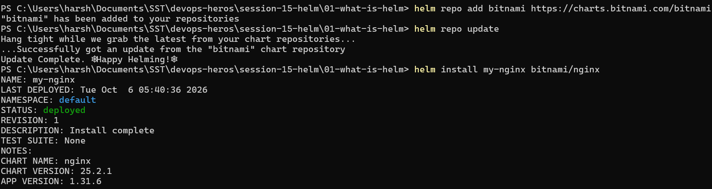

### Checking and Removing the Release

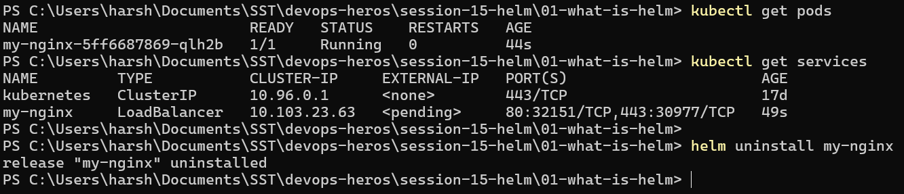

## 2. Helm Charts

- `helm create` generates a full working chart skeleton.
- `helm template` renders the YAML locally without deploying. Useful for debugging.
- `helm uninstall` removes every resource the release created.

### Creating a Chart

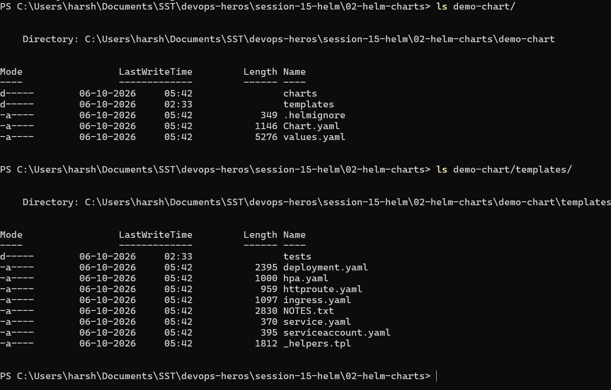

### Rendering Without Deploying

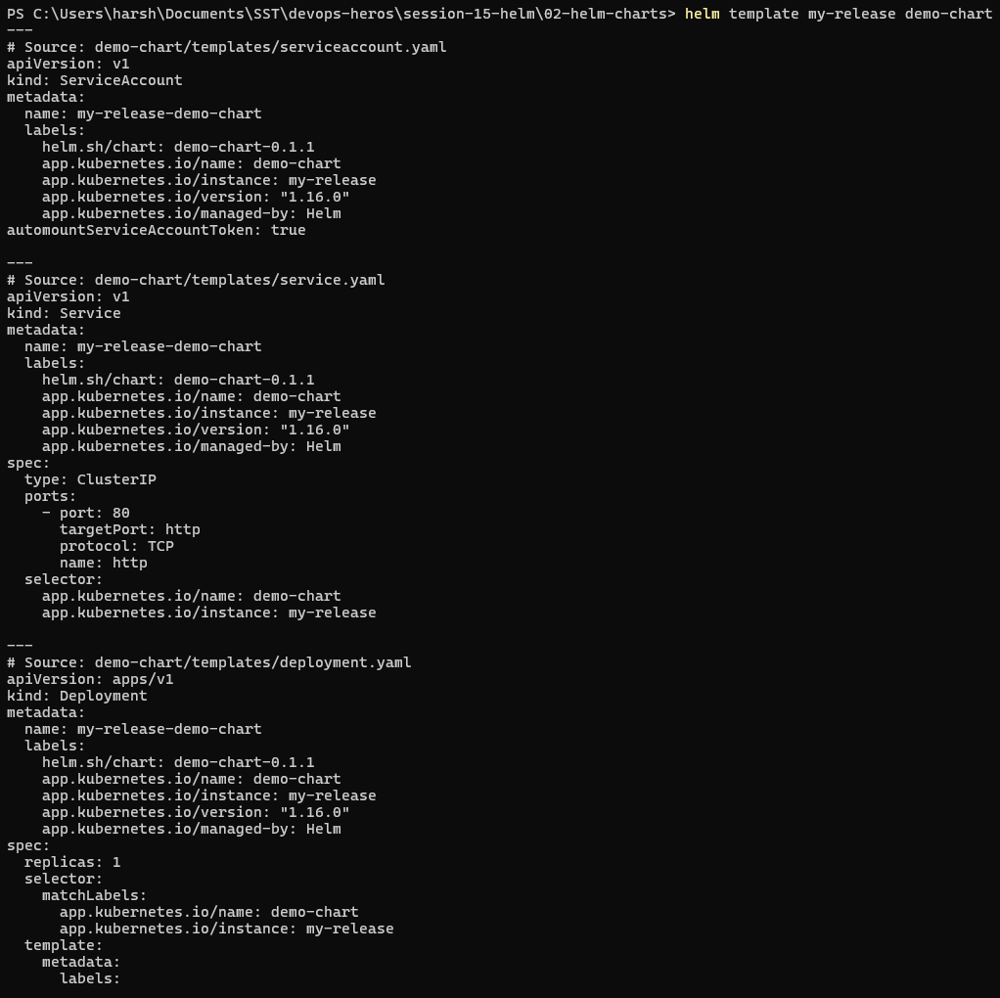

### Install, List and Uninstall

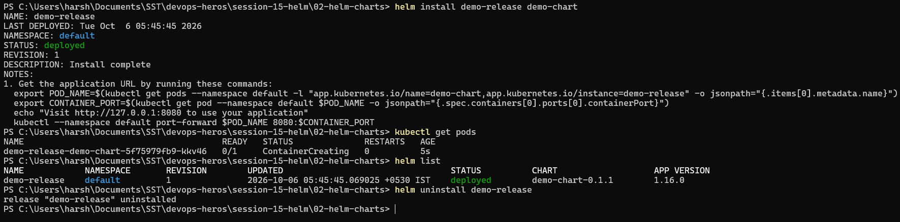

## 3. Chart Structure

```text
simple-chart/
  Chart.yaml      chart metadata
  values.yaml     default values
  templates/      Kubernetes YAML with {{ }} variables
```

`{{ .Release.Name }}` becomes the name given at install, and `{{ .Values.x }}` reads from
`values.yaml`.

### Rendering the Chart

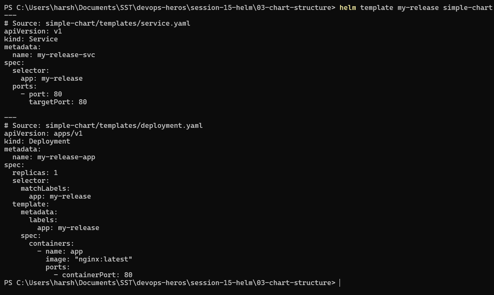

### Installing the Chart

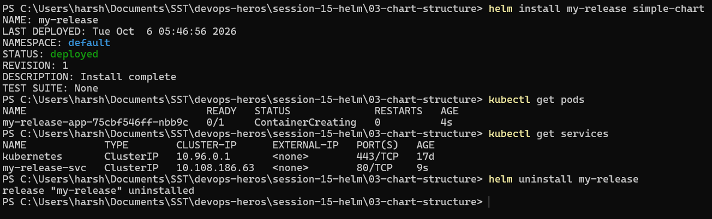

## 4. Chart.yaml

| Field | Meaning |
|---|---|
| `apiVersion: v2` | Required for Helm 3 and later |
| `version` | Version of the chart itself, changes when chart files change |
| `appVersion` | Version of the app being deployed, usually the image tag |
| `type` | `application` (deployable) or `library` (shared templates) |

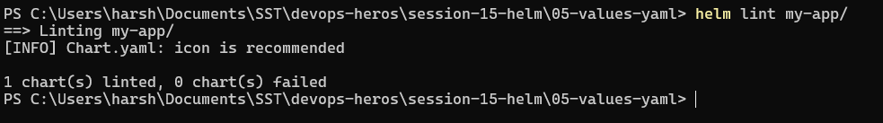

## 5. values.yaml

`values.yaml` holds the defaults. They can be overridden at install time.

```text
values.yaml  <  -f values-prod.yaml  <  --set key=value   (--set wins)
```

- `-f` files suit environment configs and stay in Git.
- `--set` is for quick one off changes.

### Overriding at Install Time

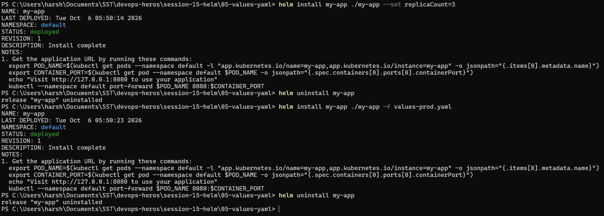

### Checking Rendered Values

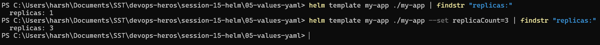

## 6. Templates

Templates are Kubernetes YAML with Go template variables. `{{- if }}` ... `{{- end }}` skips a block
when the value is false, for example the Service when `service.enabled: false`.

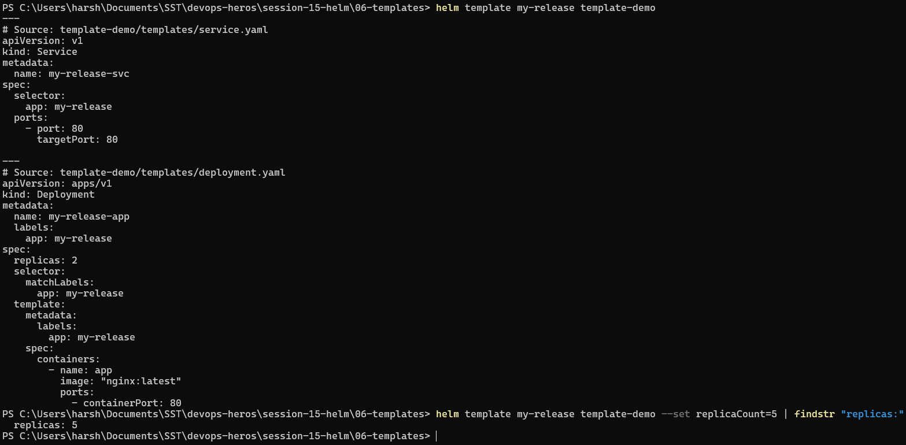

## 7. Install and Upgrade

Every install or upgrade creates a new **revision**, which is what makes rollback possible.

| Command | Behaviour |
|---|---|
| `helm install` | Fails if the release already exists |
| `helm upgrade` | Fails if the release does not exist |
| `helm upgrade --install` | Installs if new, upgrades if it exists. Safest for CI/CD |

### Install

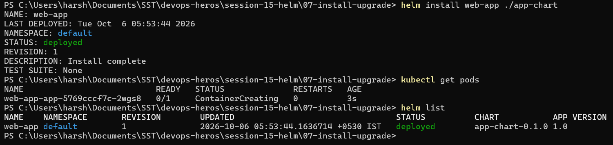

### Upgrade to 3 Replicas

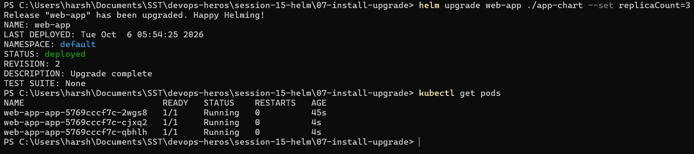

### Upgrade with --install

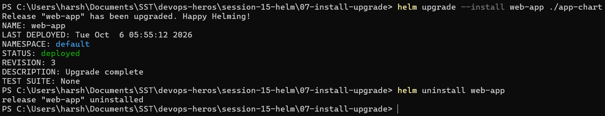

## 8. Rollback

- `helm history` lists all revisions.
- `helm rollback <release> N` returns to revision N and creates a new revision, so history is kept.
- `--atomic` rolls back automatically if the upgrade does not become healthy in time. In Helm 4 it is
  renamed to `--rollback-on-failure`.

### Broken Upgrade

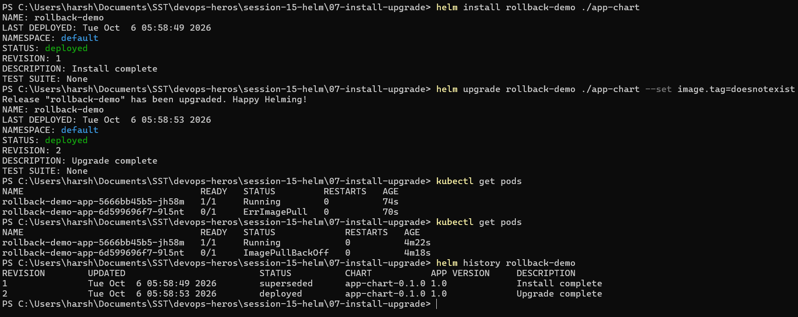

### Rollback to Revision 1

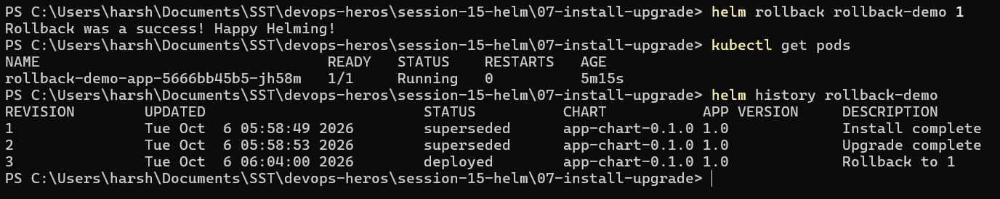

### Automatic Rollback with --atomic

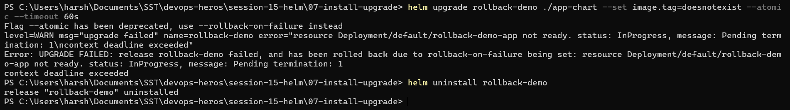

## 9. Deploying an Application

A guestbook chart with a Deployment, a NodePort Service and a ConfigMap, taken through the full
lifecycle.

```text
lint  ->  template  ->  install  ->  upgrade  ->  history  ->  rollback  ->  uninstall
```

### Lint and Render

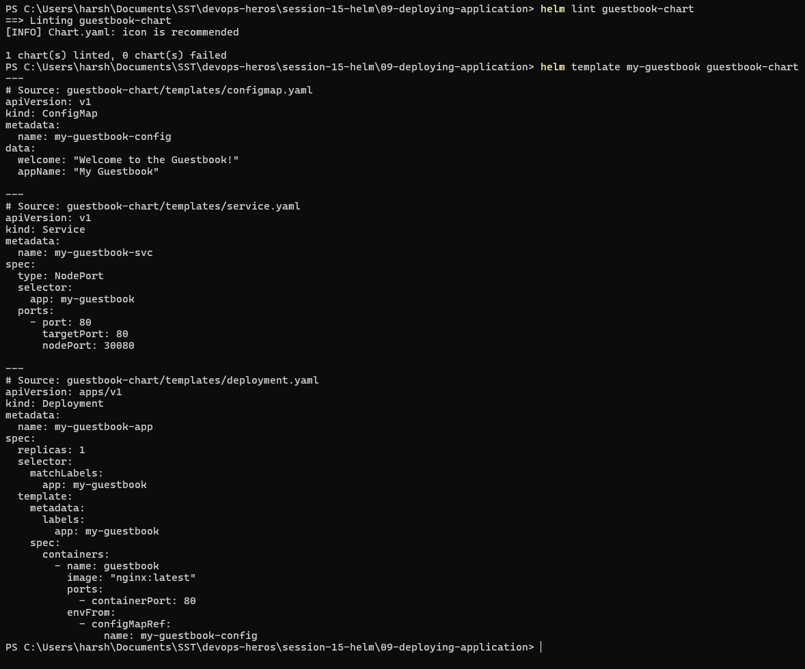

### Install and Verify

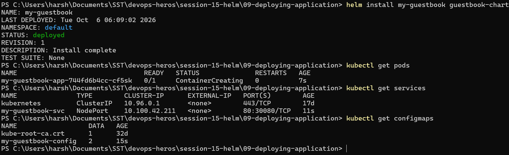

### Upgrade and History

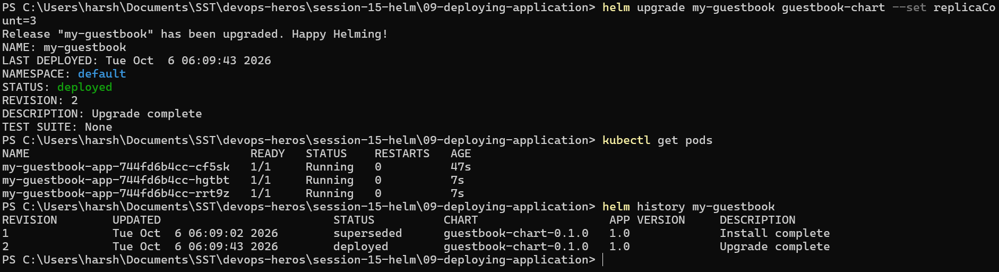

### Rollback and Clean Up

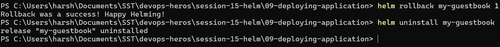

## 10. Mini Project: Notes App

A `notes-chart` with dev defaults in `values.yaml` (1 replica, `nginx:1.24`) and production values in
`values-prod.yaml` (3 replicas, `nginx:1.25`).

### Lint and Render

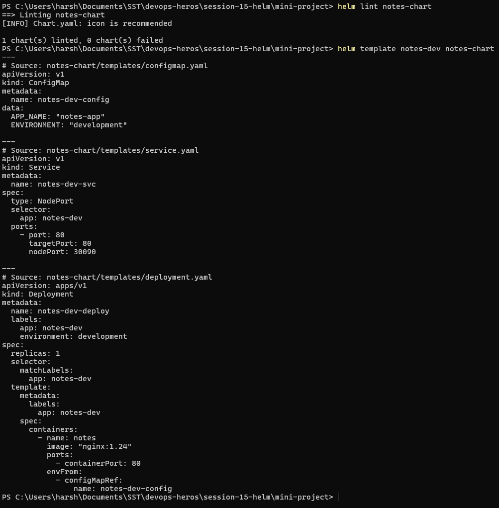

### Install (Development)

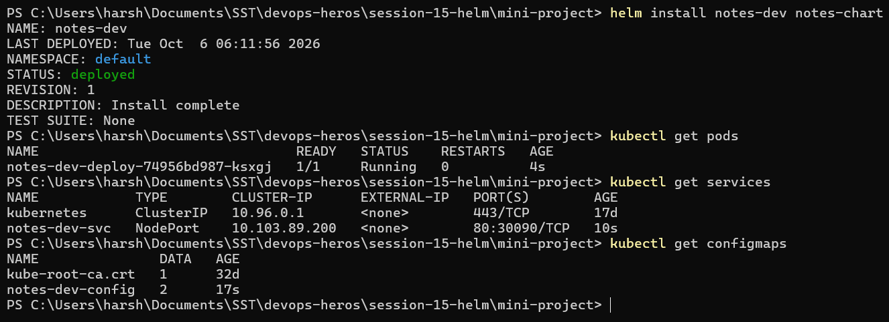

### Upgrade to Production Values

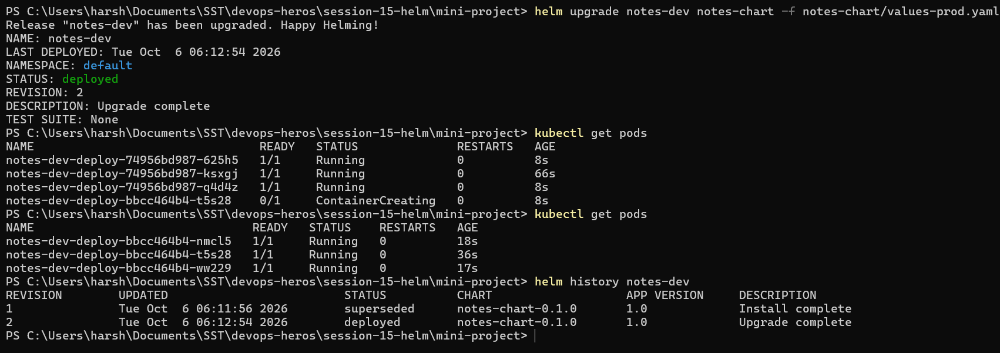

### Bad Upgrade

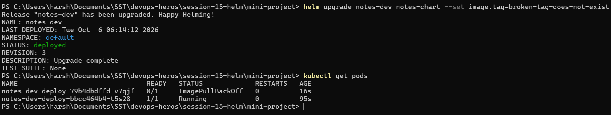

### Rollback to Revision 2

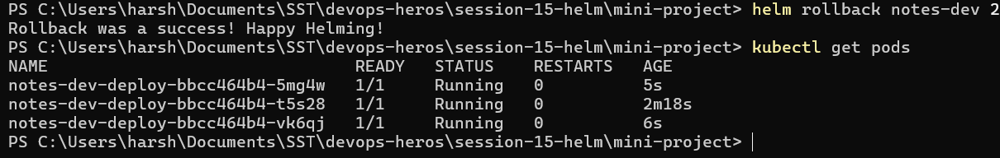

### Clean Up

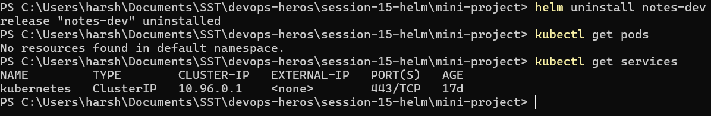

## Key Learnings

- A **chart** is written once, and **values** change it per environment.
- `helm template` and `helm lint` catch mistakes before anything is deployed.
- Every install, upgrade and rollback is a numbered **revision**.
- A bad release is undone with one `helm rollback` command.
