# Session 16: CI/CD and GitHub Actions

All workflows were run from a separate repository, `session16-cicd-github-actions`, because GitHub
only runs workflow files placed in the root `.github/workflows/` folder.

- **Repository:** https://github.com/Harshita-008/session16-cicd-github-actions
- **Workflow runs:** https://github.com/Harshita-008/session16-cicd-github-actions/actions

## 1. CI vs CD

| CI (Continuous Integration) | CD (Continuous Delivery / Deployment) |
|---|---|
| Every push is built and tested | Tested code is packaged and released |
| Finds problems early | Automates the release |
| Build, Test, Validate | Deliver (manual approval) or Deploy (automatic) |

## 2. CI/CD Pipeline

A pipeline is a chain of automated stages. If one stage fails, the rest do not run.

```text
Checkout  ->  Build  ->  Test  ->  Package  ->  Deploy
```

## 3. Running the Project Locally

The same app, tests and build script that the pipeline runs were first checked on the local machine.

### Running the Application

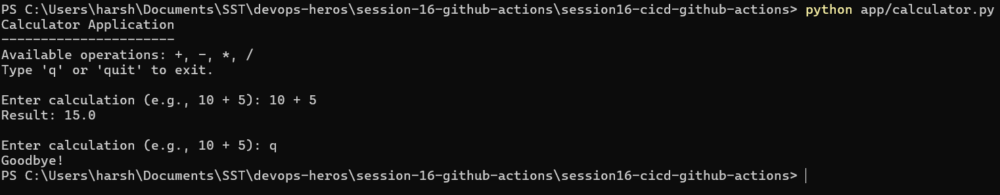

### Installing Dependencies and Running Tests

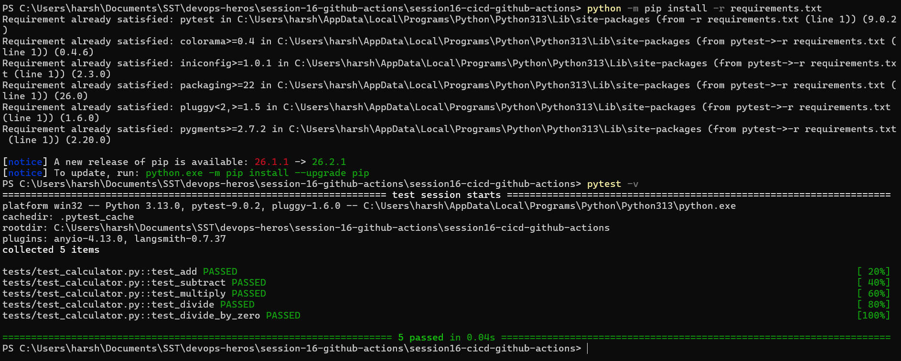

### Building the Application

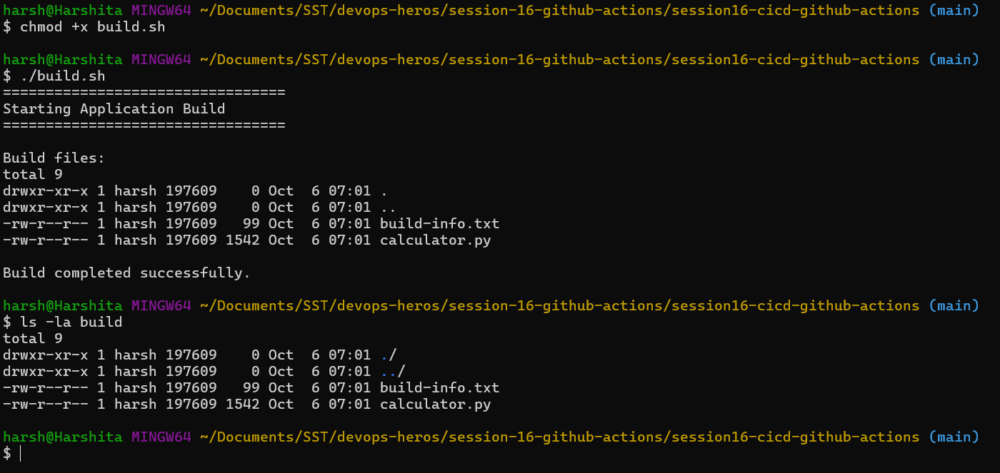

## 4. Pushing to GitHub

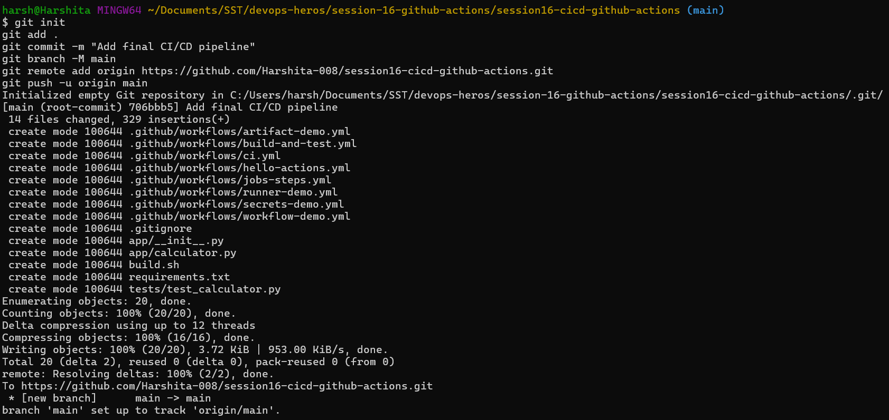

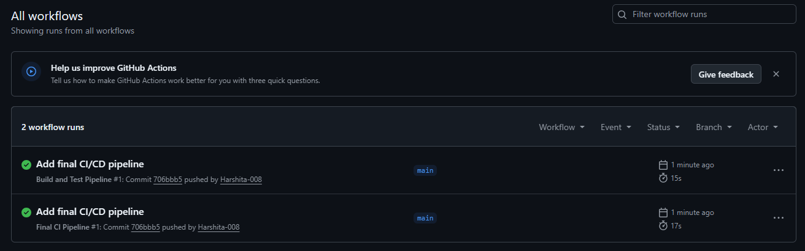

## 5. GitHub Actions

GitHub Actions is an automation platform built into GitHub. A YAML file in `.github/workflows/`
describes what to run, and GitHub runs it on its own machines.

```text
Repository  ->  Workflow  ->  Job  ->  Steps
```

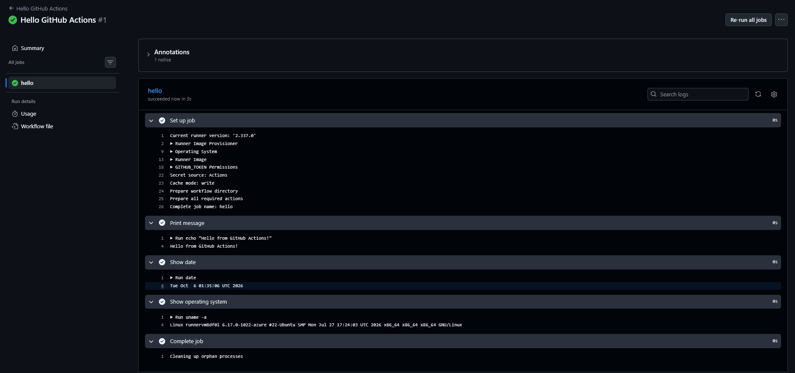

## 6. Workflows

A workflow defines **when** (the trigger in `on:`) and **what** (jobs and steps). Common triggers are
`push`, `pull_request` and `workflow_dispatch` (manual Run workflow button).

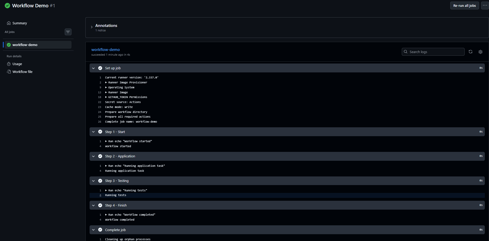

## 7. Jobs and Steps

| Job | Step |
|---|---|
| Larger unit, has its own runner | Single task inside a job |
| Jobs run in parallel by default | Steps run in order |
| `needs:` makes a job wait for another | Uses `run:` (command) or `uses:` (action) |

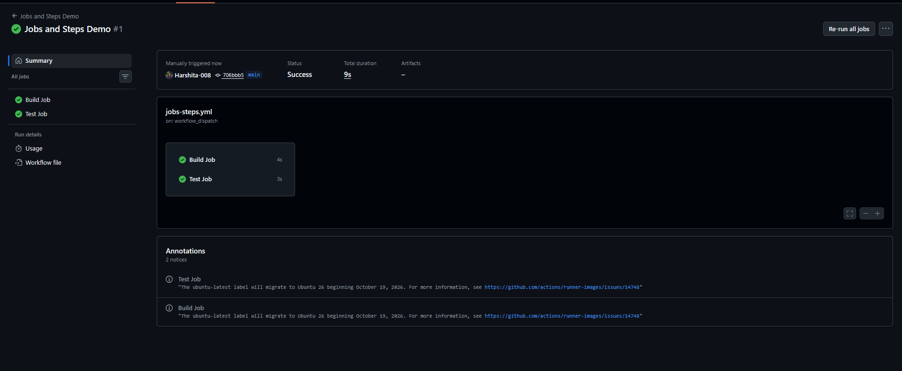

## 8. Runners

A runner is the machine that executes a job. `runs-on: ubuntu-latest` gives a fresh Ubuntu VM from
GitHub for every job.

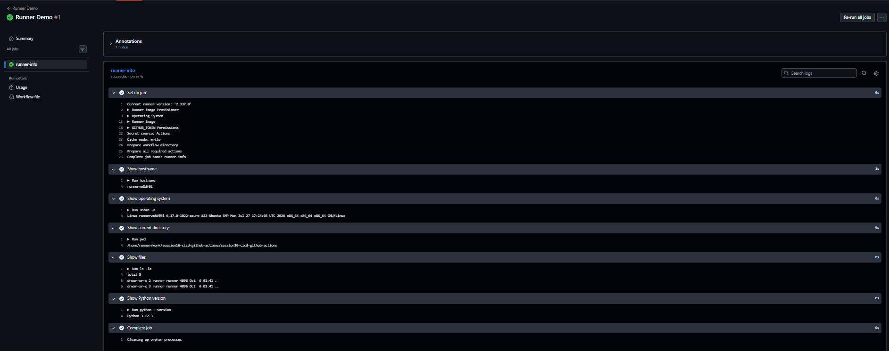

## 9. Secrets

Passwords and tokens are stored in **Settings > Secrets and variables > Actions**, never in the YAML.
They are read with `${{ secrets.NAME }}` and masked as `***` in logs.

### Creating the Secret

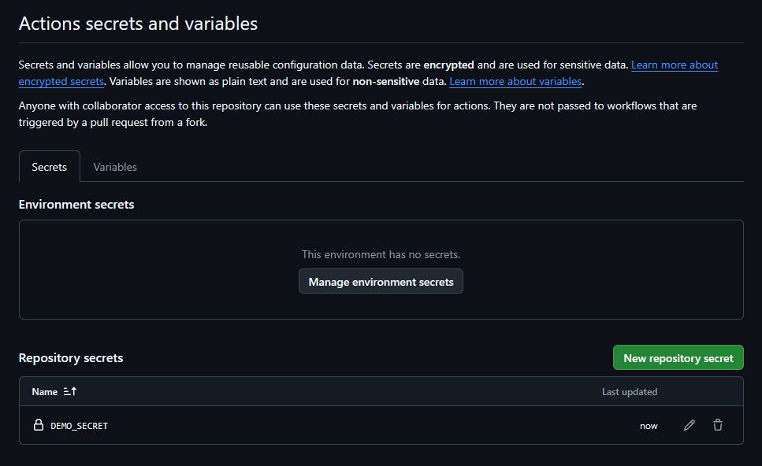

### Using the Secret in a Workflow

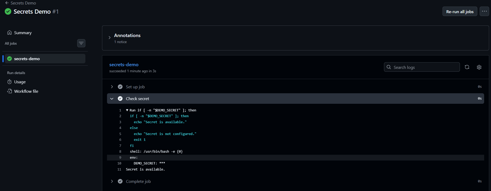

## 10. Artifacts

An artifact is a file produced by a workflow run and stored by GitHub after the job ends, such as a
build folder or a test report. Git stores the source code, artifacts store the output.

### Artifact Workflow Run

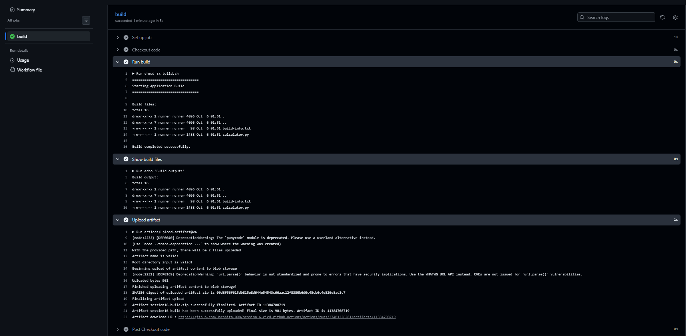

### Downloading the Artifact

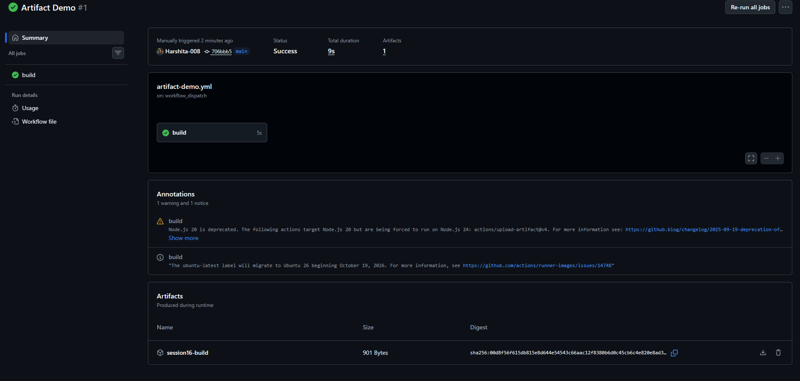

## 11. Build and Test Pipeline

One job that checks out the code, sets up Python, installs dependencies, runs the tests, builds and
uploads the build folder.

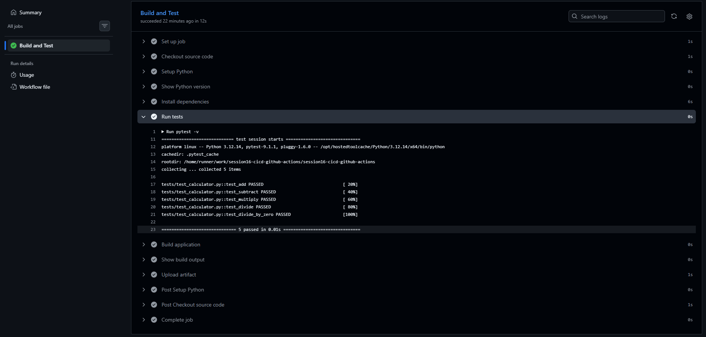

## 12. Final CI/CD Pipeline

Three jobs. `build` and `security-check` both have `needs: test`, so they only start after the tests
pass.

```text
test  ->  build  ->  calculator-build artifact
      ->  security-check
```

### Successful Pipeline

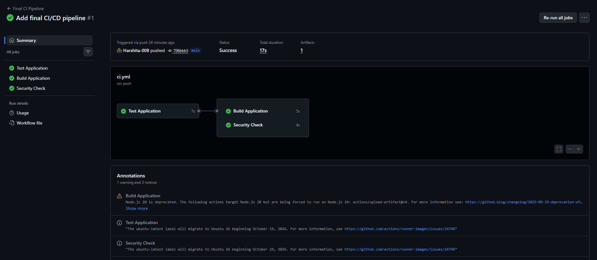

### Build Artifact

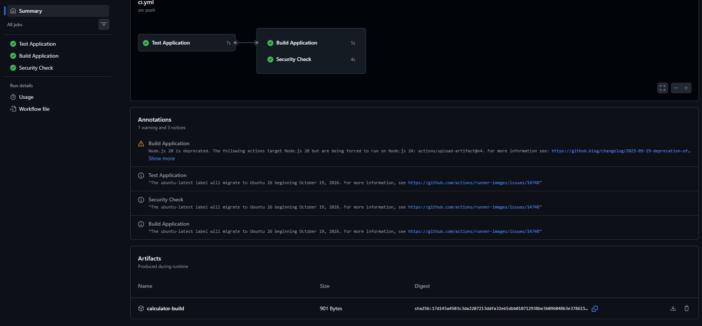

### Failure Test

`add()` was changed to return `a + b + 1`. The test failed locally and on GitHub, and the build job
did not run.

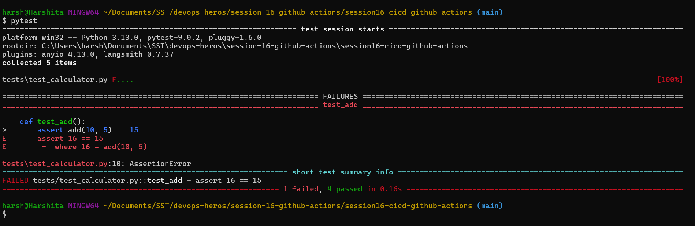

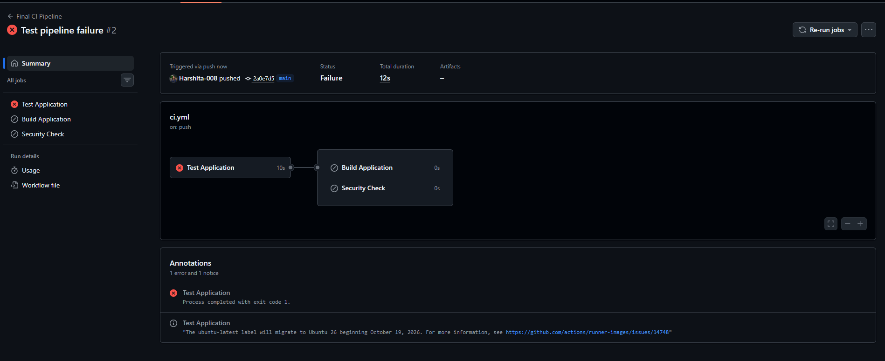

### Fix

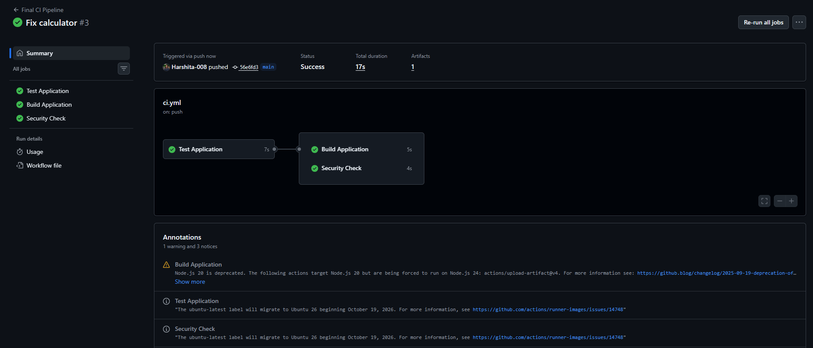

## Key Learnings

- **CI** checks every push automatically, **CD** moves healthy code towards users.
- **Workflow > Jobs > Steps**, and every job runs on a **runner**.
- `needs:` stops later jobs when an earlier one fails.
- **Secrets** keep credentials out of code, **artifacts** keep build output after the run.
