# Session 17: DevSecOps

DevSecOps adds security checks into every stage of the CI/CD pipeline instead of testing security
only at the end.

```text
Tests -> SAST -> SCA -> Docker Build -> Image Scan -> Push to Registry -> Deploy to Kubernetes
```

The demo app `hey-cicd` (a small Flask dashboard) was cloned into its own GitHub repository so the
pipeline could run.

- **Repository:** https://github.com/Harshita-008/hey-cicd
- **Pipeline run:** https://github.com/Harshita-008/hey-cicd/actions
- **Docker image:** https://hub.docker.com/r/harshitah08/hey-cicd

## 1. Project Setup

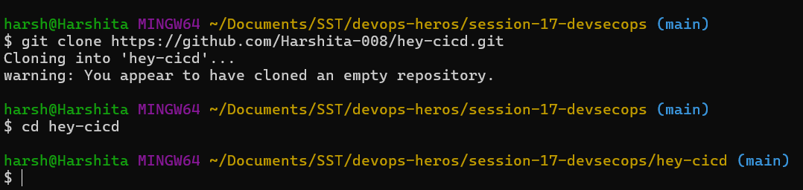

## 2. Running the App Locally

### Virtual Environment and Dependencies

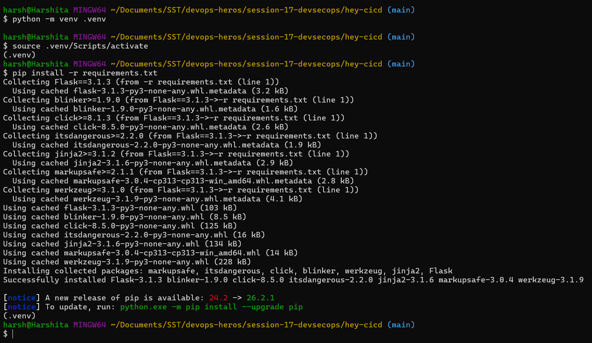

### Running the App

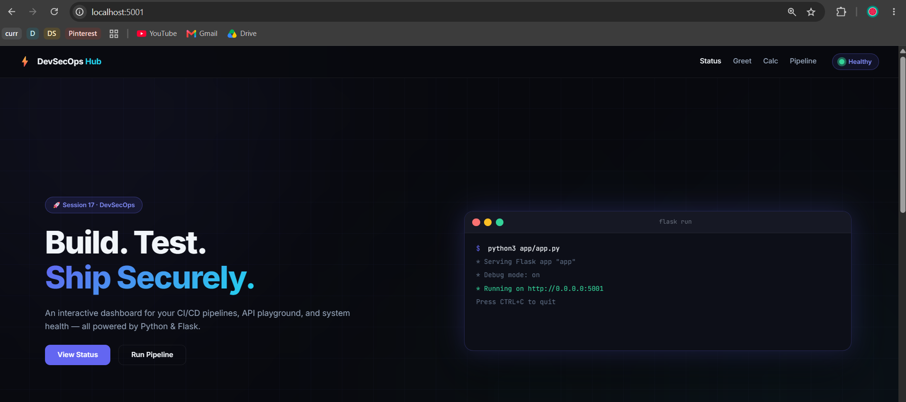

### Testing the API

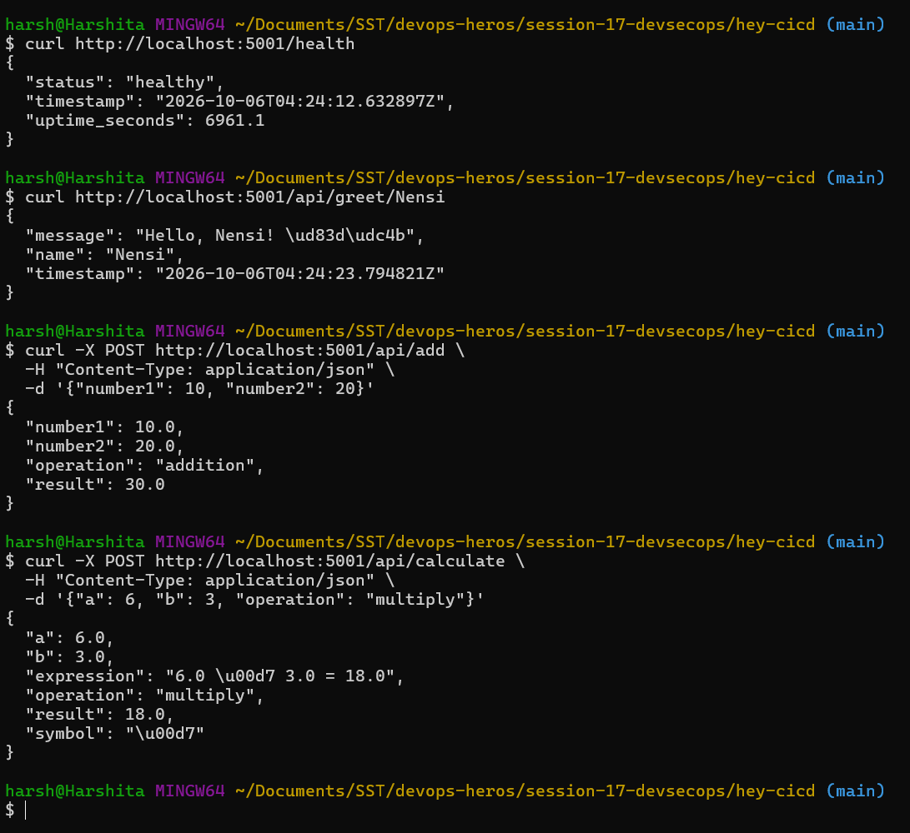

### Unit Tests with Coverage

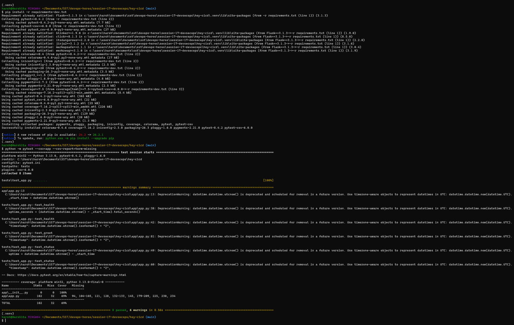

## 3. SCA (Software Composition Analysis)

SCA checks third party **dependencies** for known vulnerabilities. SAST checks our own code, SCA
checks the packages it uses. Tool used: `pip-audit`.

Remediation flow: find package and version, check the fixed version, update, run tests, scan again.

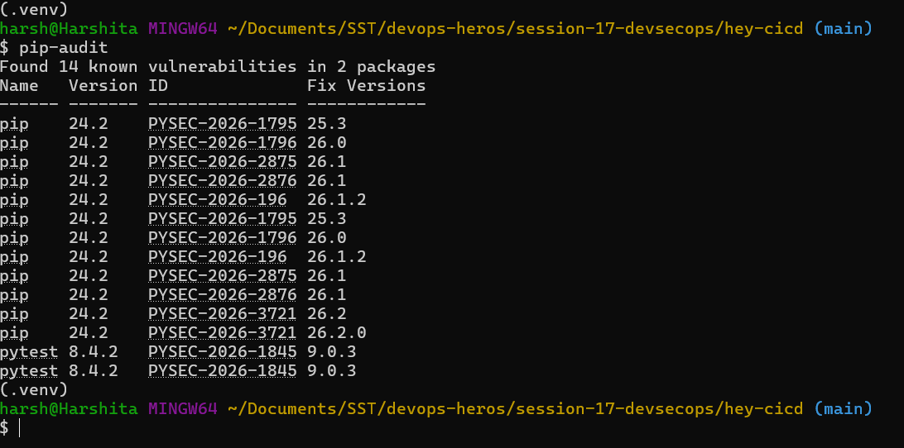

## 4. Running with Docker

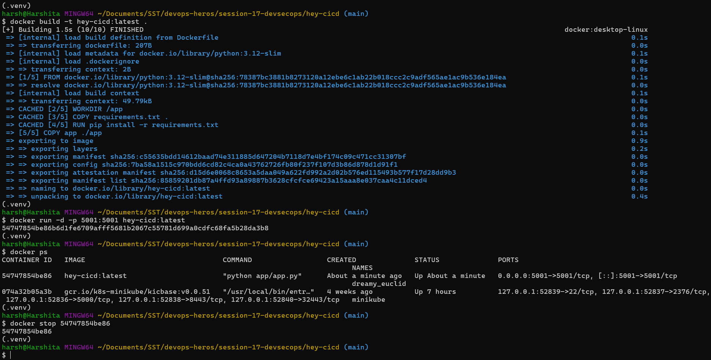

## 5. Container Image Scanning

The code can be clean while the final image still has vulnerable OS packages or libraries, so the
image itself is scanned. Tool used: **Trivy**.

### Full Scan

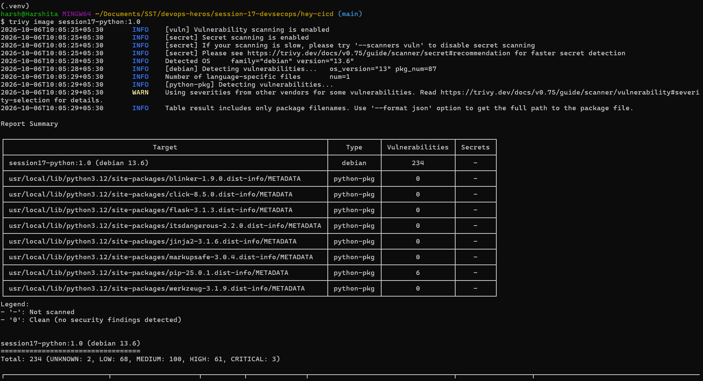

### HIGH and CRITICAL Only

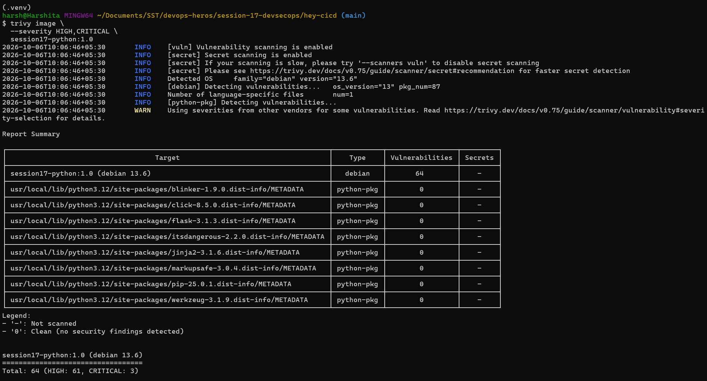

### Scan as a Gate (--exit-code 1)

With `--exit-code 1`, Trivy exits with code `1` when findings match, so a pipeline step fails and
stops the next stages.

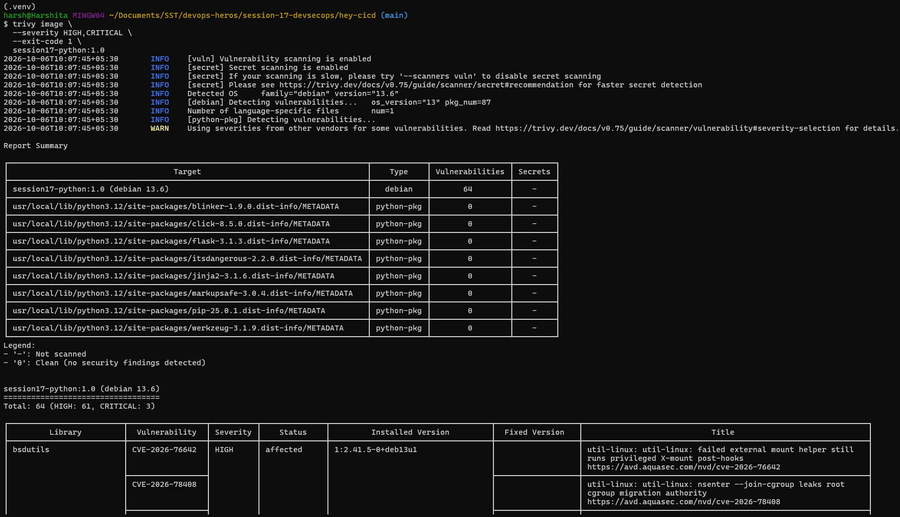

## 6. DevSecOps Pipeline (GitHub Actions)

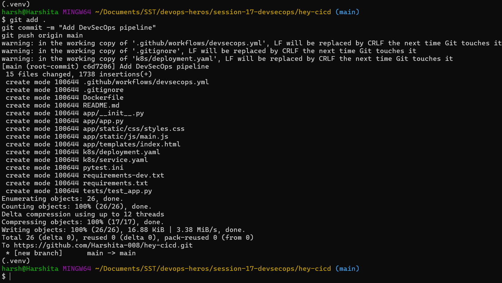

Seven jobs. `docker-build` needs `test`, `sast` and `sca`, so the image is only built after all three
pass.

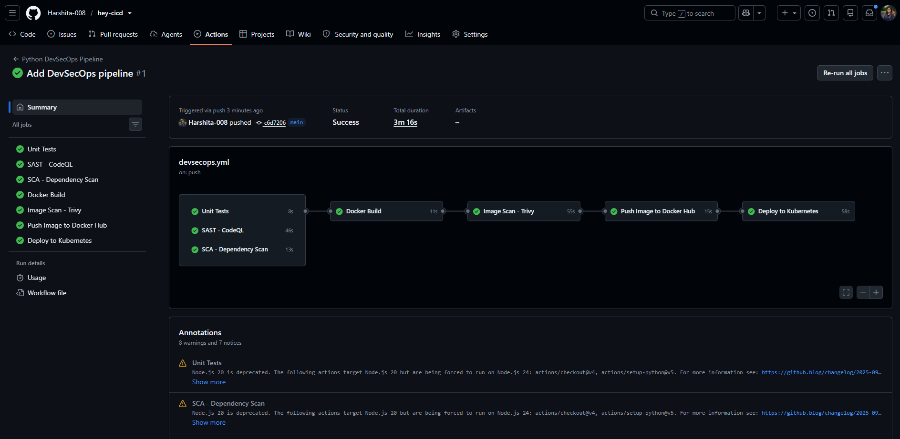

### SAST (Static Application Security Testing)

SAST scans the **source code** without running it. Tool used: **GitHub CodeQL**, results appear in
the repository Security tab. A clean SAST result alone does not mean the app is secure.

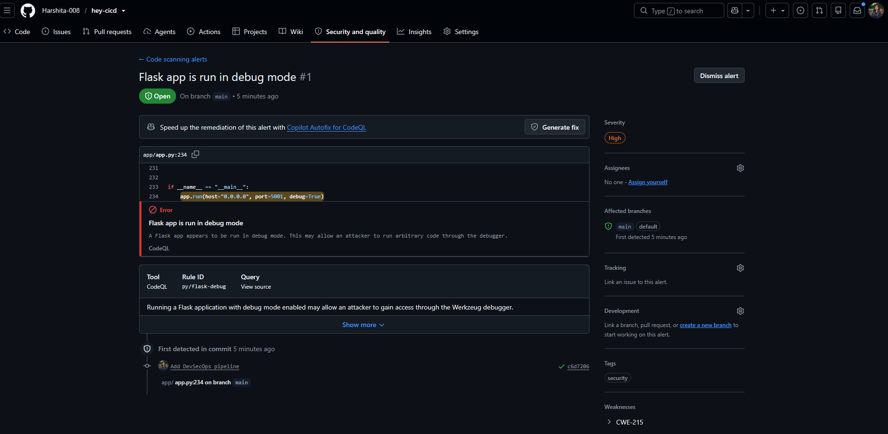

### SCA in the Pipeline

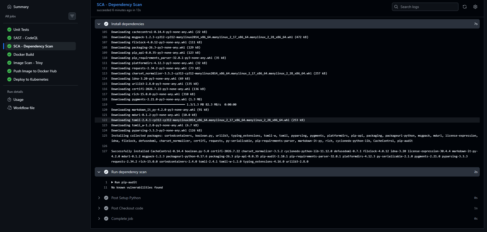

### Image Scan in the Pipeline

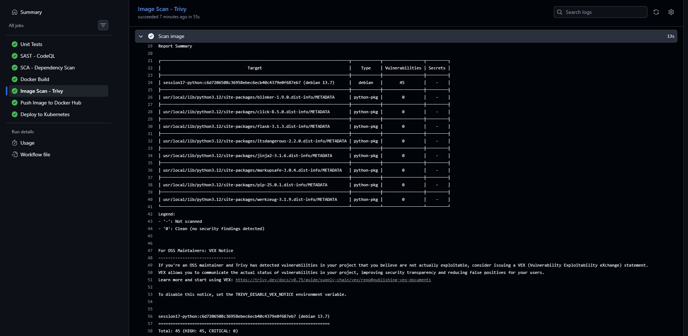

## 7. Container Registry

A registry stores the built image so Kubernetes can pull it. The pipeline pushes two tags: the commit
SHA and `latest`. Credentials come from a GitHub secret, never from the code.

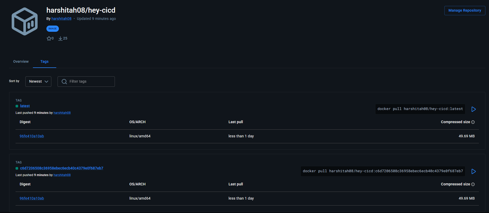

## 8. Deploy in the Pipeline

The deploy job creates a temporary Kind cluster on the runner, applies the manifests, waits for the
rollout and calls the app with `curl`. It runs only on a push to `main`.

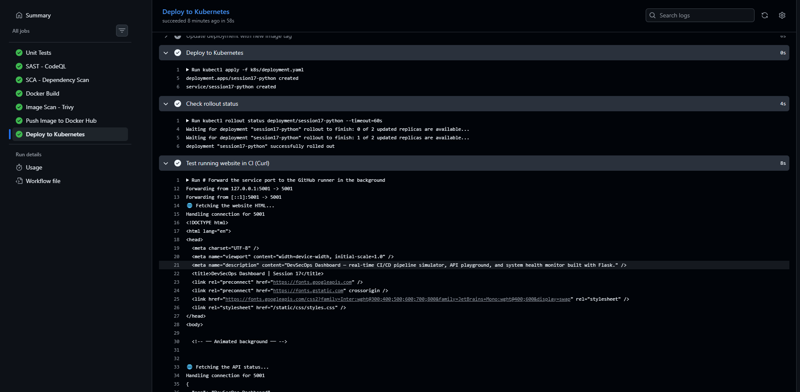

## 9. Secret Scanning

Secrets (API keys, passwords, tokens) must never be committed. GitHub secret scanning detects known
credential patterns and push protection blocks them before the push. A leaked real secret must be
**revoked and rotated**, deleting the line is not enough.

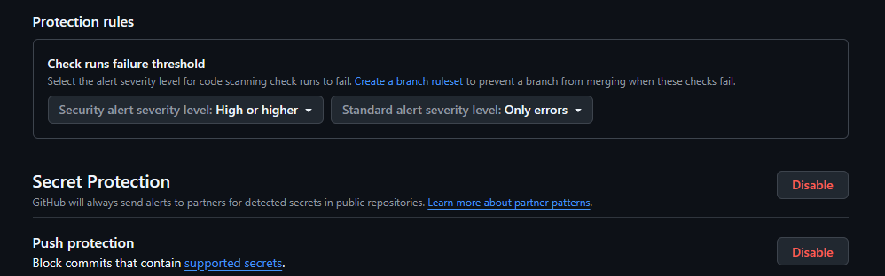

## 10. Kubernetes Deployment (Local)

### Applying the Manifests

The manifest has the placeholder tag `__IMAGE_TAG__`, which the pipeline replaces. Applied locally
as is, the Pods cannot pull that tag.

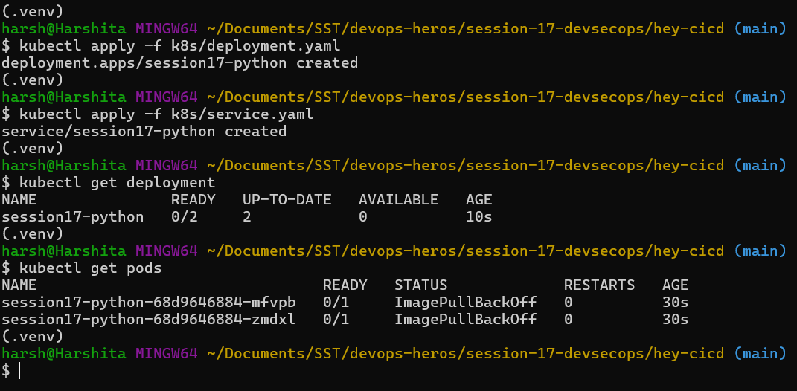

### Updating the Image and Watching the Rollout

`kubectl set image` changes the image and triggers a rolling update, `kubectl rollout status` waits
until it completes.

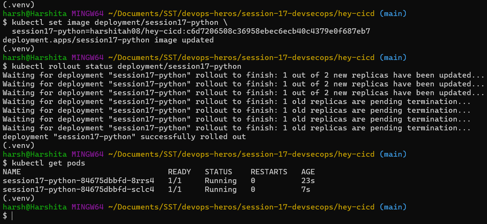

### Accessing the App

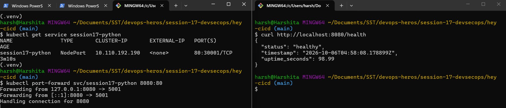

## 11. Security Gates

A scan finds a problem, a **gate** decides whether the pipeline continues.

| Check | Gate behaviour |
|---|---|
| Unit tests | Failure blocks the build |
| SAST | Policy defined findings can block |
| SCA | Vulnerable dependencies can block |
| Secret scanning | Push protection blocks known secrets |
| Image scan | `--exit-code 1` on HIGH/CRITICAL blocks the push |
| Rollout | Failed rollout marks the deploy as failed |

## Key Learnings

- Security is checked at every stage, not only before release.
- **SAST** checks code, **SCA** checks dependencies, **Trivy** checks the final image.
- `needs:` and exit codes turn scans into **gates**.
- Credentials live in secrets, and a leaked credential is always rotated.
