# Session 19: Cloud Fundamentals and Terraform on AWS

## 1. Cloud Service Models

| Model | I manage | Provider manages | Example |
|---|---|---|---|
| IaaS | OS, runtime, app, data | Hardware, network, virtualization | AWS EC2 |
| PaaS | App and data | Everything below the app | AWS Elastic Beanstalk |
| SaaS | Only usage | Everything | Gmail |

## 2. Regions and Availability Zones

- A **Region** is a geographic area, for example `ap-south-1` (Mumbai).
- An **Availability Zone** is an isolated data centre group inside a Region, for example `ap-south-1a`.
- Running across multiple AZs keeps an app up if one AZ fails.

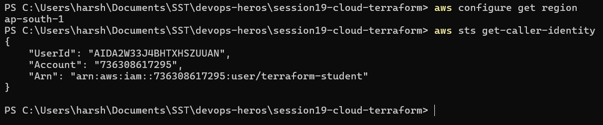

## 3. VPC and Subnets

- A **VPC** is a private network in AWS with its own IP range, for example `10.0.0.0/16`.
- A **subnet** is a smaller range inside the VPC that lives in one AZ, for example `10.0.1.0/24`.
- A **public** subnet has a route to the internet, a **private** one does not.

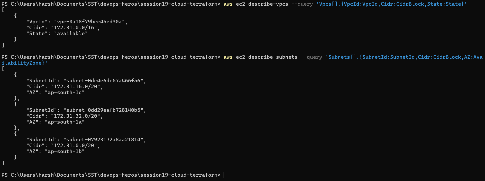

## 4. Route Tables and Internet Gateway

- A **route table** decides where traffic leaving a subnet goes.
- An **Internet Gateway** connects the VPC to the internet.
- A subnet is public when its route table sends `0.0.0.0/0` to the Internet Gateway.

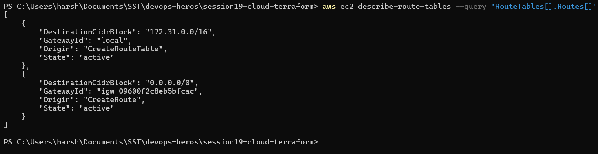

## 5. Security Groups

A security group is a **stateful** firewall on a resource. Inbound rules say what may come in, and
replies to allowed traffic go out automatically. SSH (port 22) should not be open to `0.0.0.0/0`.

| | Route table | Security group |
|---|---|---|
| Controls | Where traffic goes | Whether traffic is allowed |
| Attached to | Subnet | Resource (ENI) |

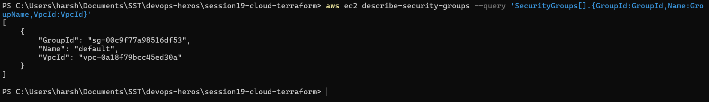

## 6. Terraform VPC Lab

Terraform builds the whole network: VPC, public subnet, Internet Gateway, route table, route table
association and a web security group (ports 80 and 443). No EC2 instance, so there is no compute cost.

```text
Internet -> Internet Gateway -> Route Table (0.0.0.0/0) -> Public Subnet 10.0.1.0/24 (VPC 10.0.0.0/16)
```

### Init to Plan

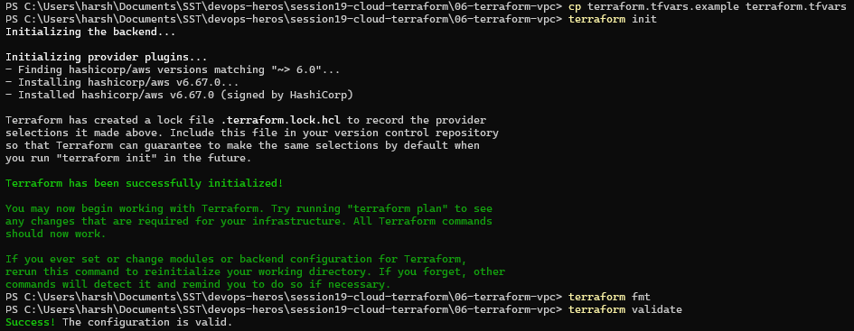

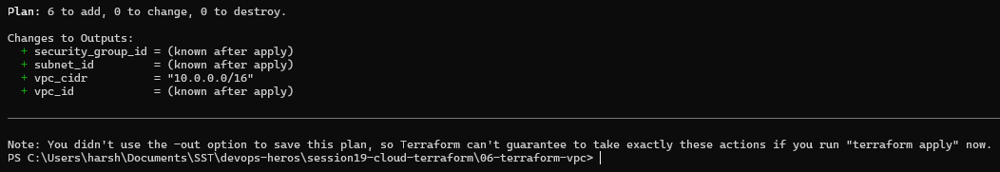

### Apply

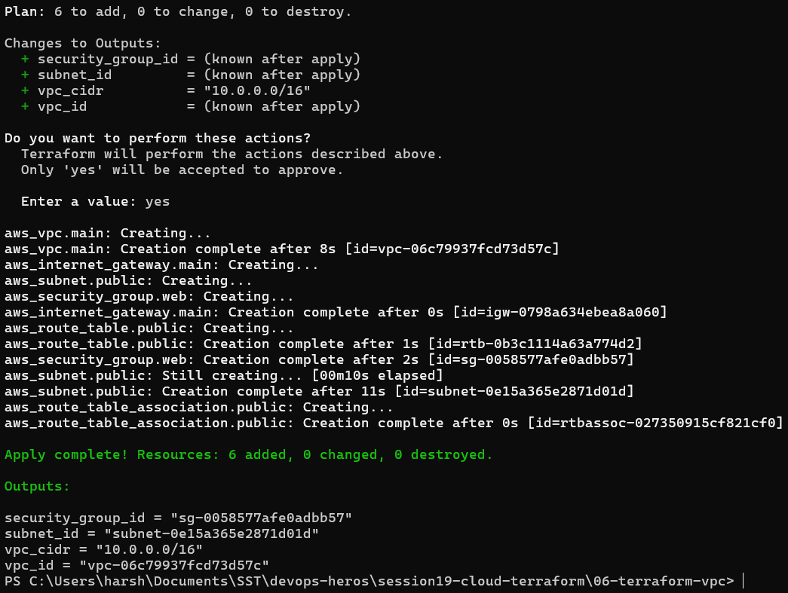

### State and Outputs

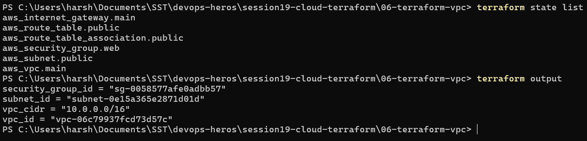

### Verify with AWS CLI

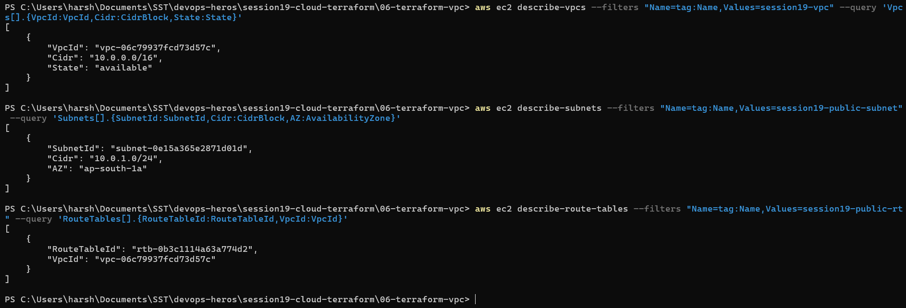

### Exercise: Changing the CIDR

Changing the VPC CIDR cannot be done in place, so the plan shows the VPC and everything inside it
being **replaced** (`-/+`).

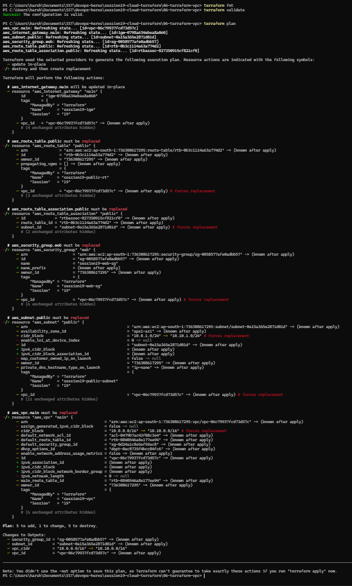

### Destroy

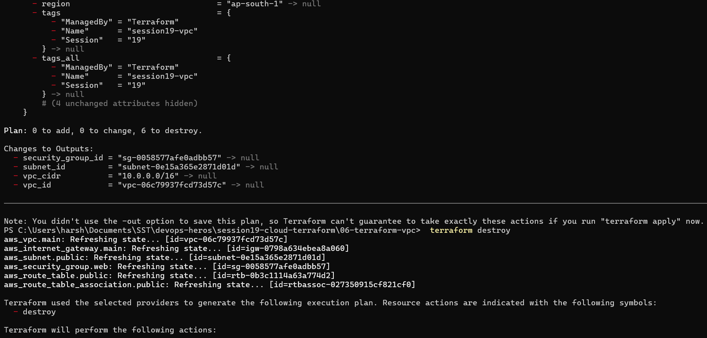

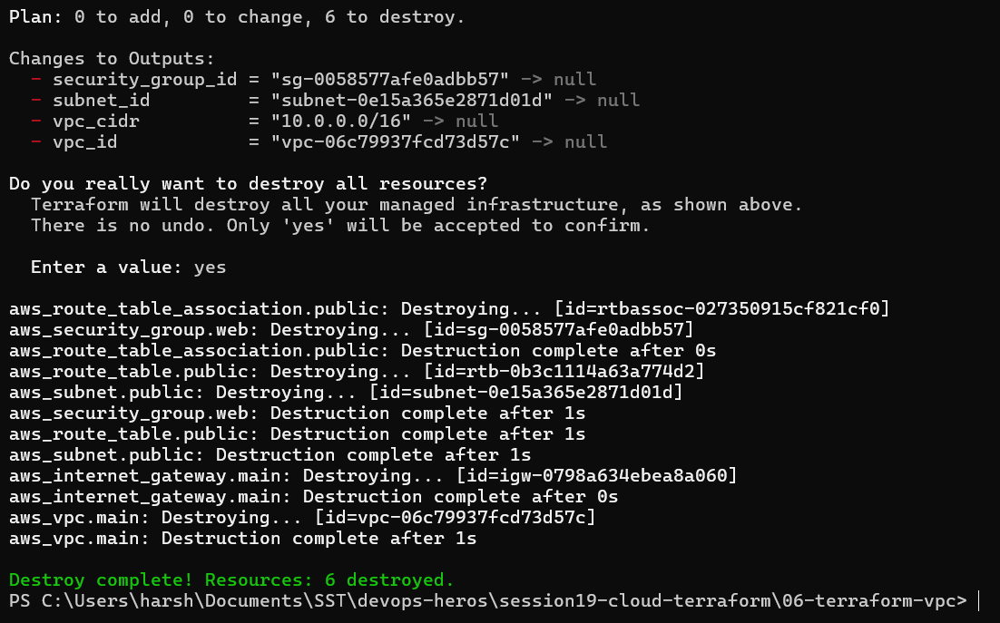

## 7. Terraform Workflow

```text
init -> fmt -> validate -> plan -> apply -> state list -> destroy
```

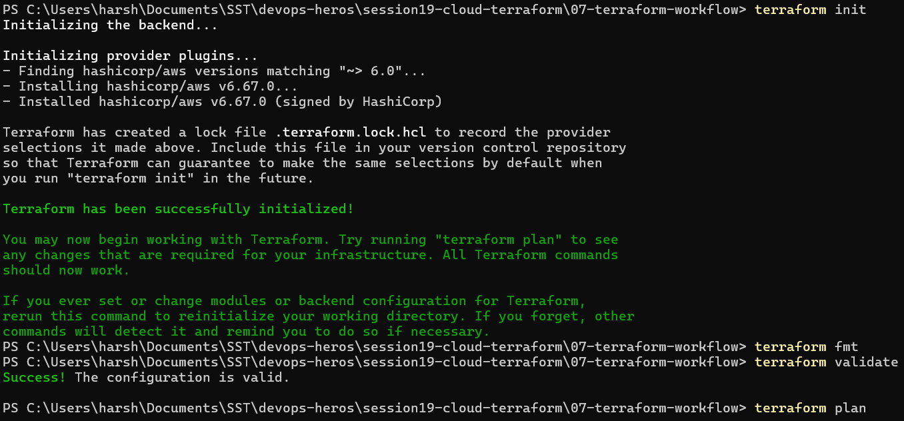

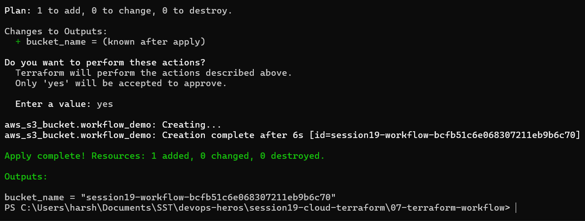

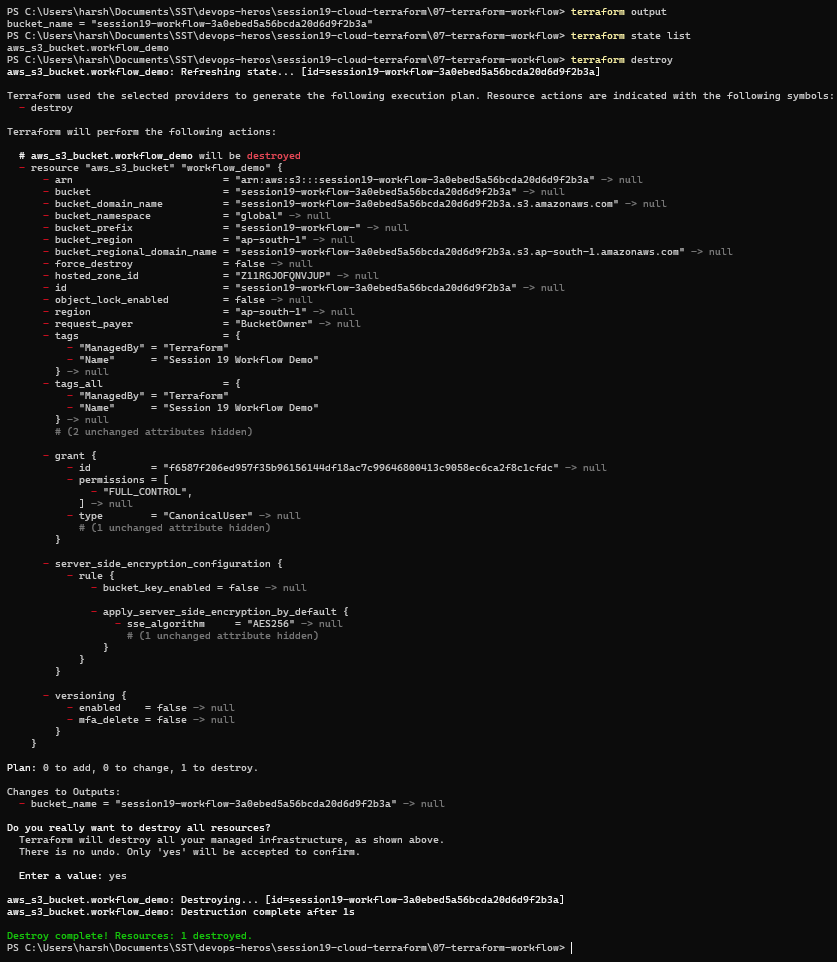

## 8. Mini Project: VPC 10.20.0.0/16

The same network built for `10.20.0.0/16` with subnet `10.20.1.0/24`.

### Init to Plan

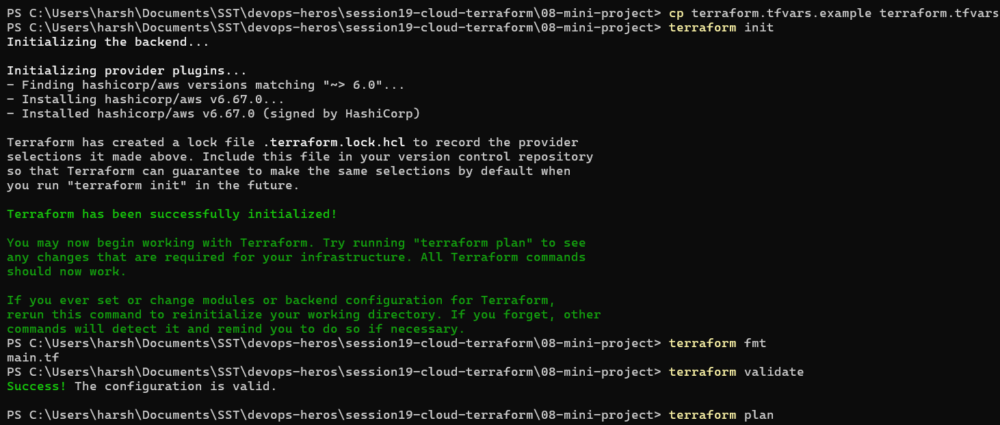

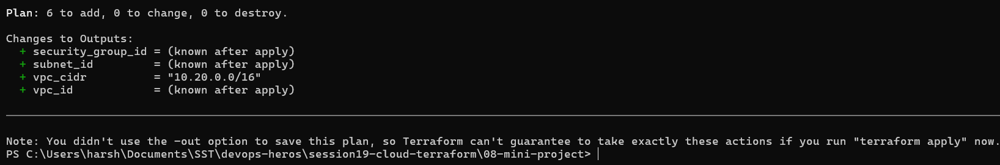

### Apply, Outputs and State

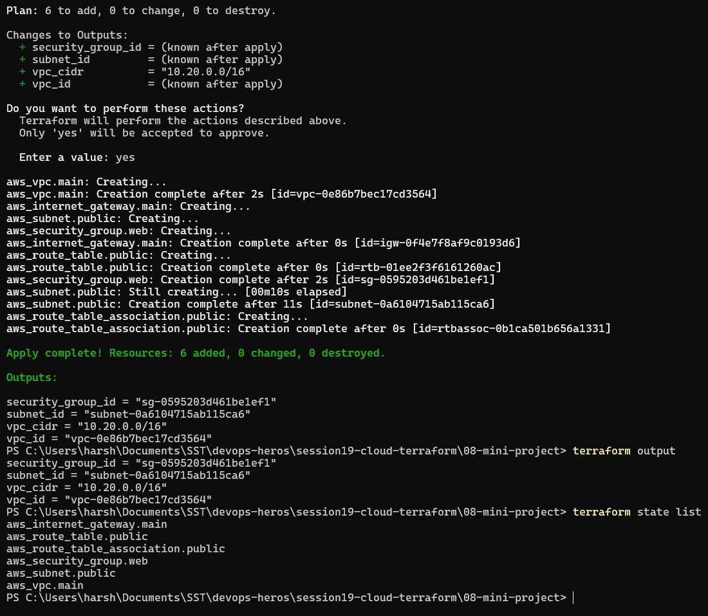

### Verify with AWS CLI

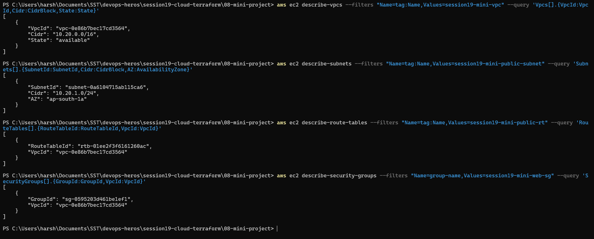

### Cleanup

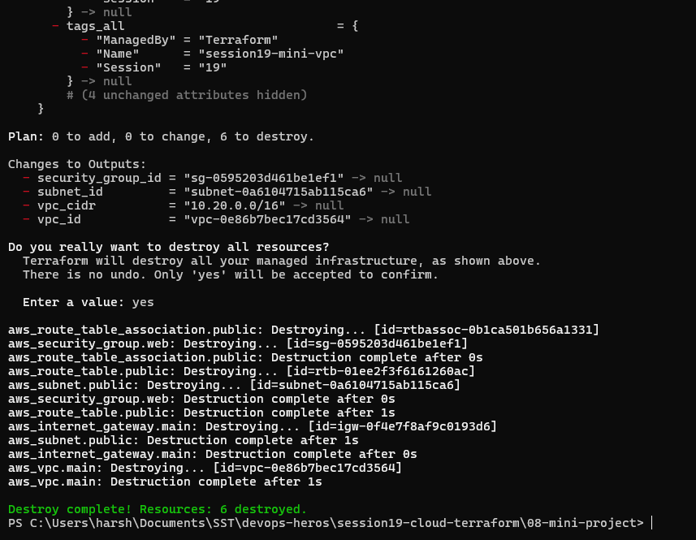

## Key Learnings

- **IaaS, PaaS, SaaS** differ in how much the provider manages.
- **Region > AZ > VPC > Subnet**, and the route table makes a subnet public or private.
- **Security groups** filter traffic, **route tables** direct it.
- Terraform creates a full network in one `apply` and removes it in one `destroy`.
