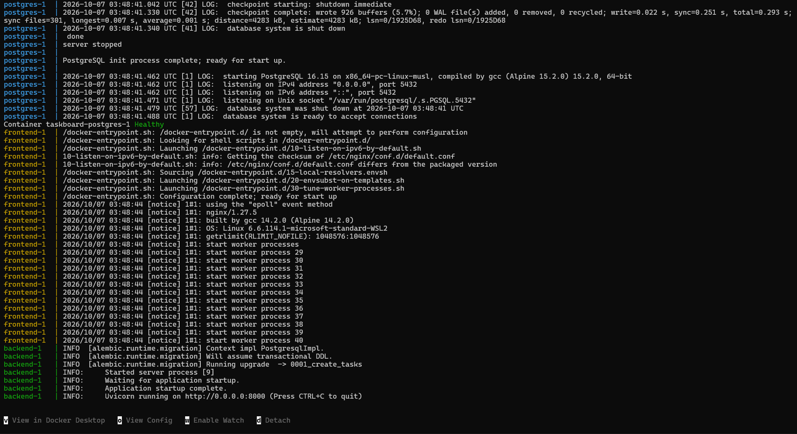
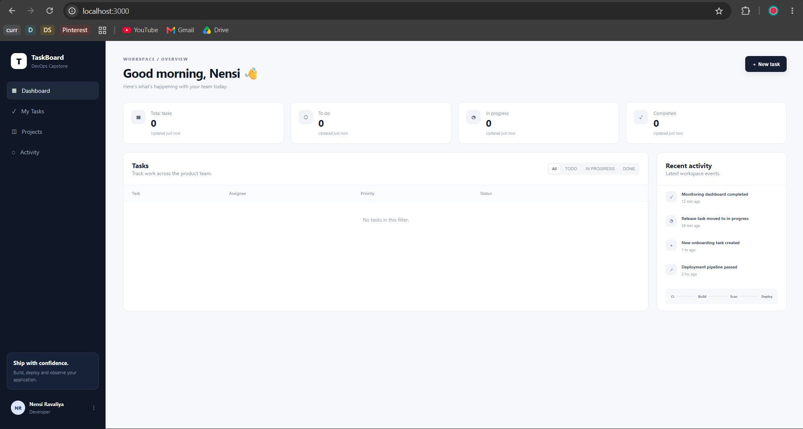
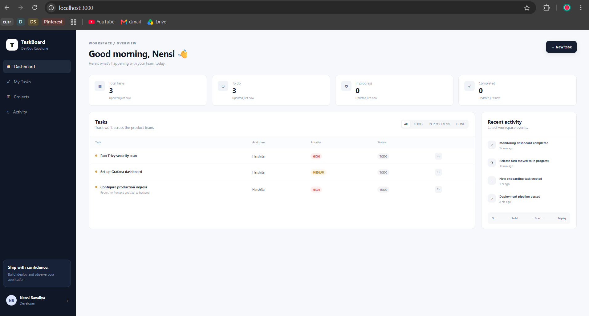
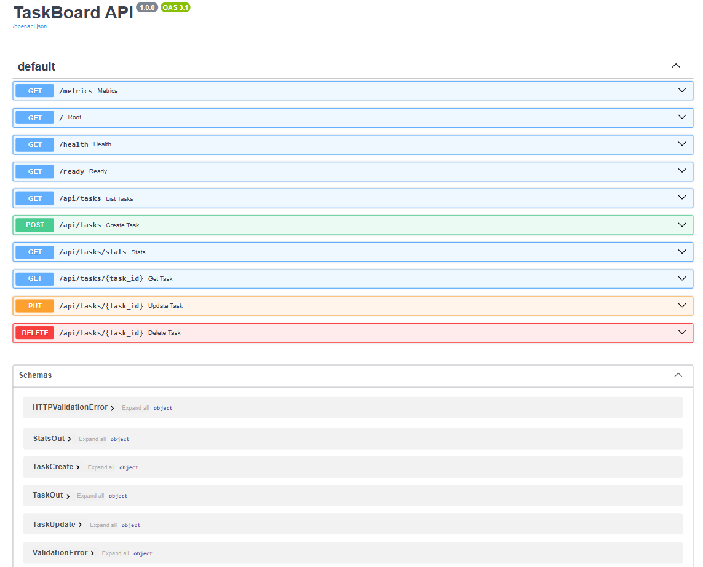
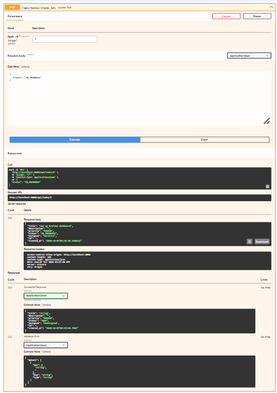
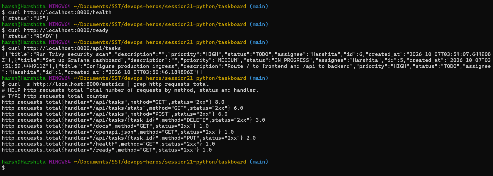
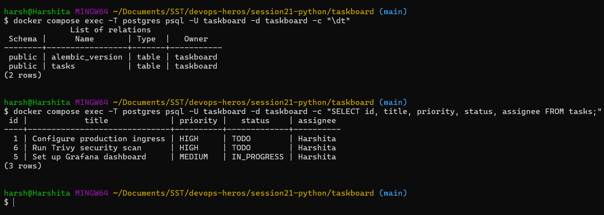
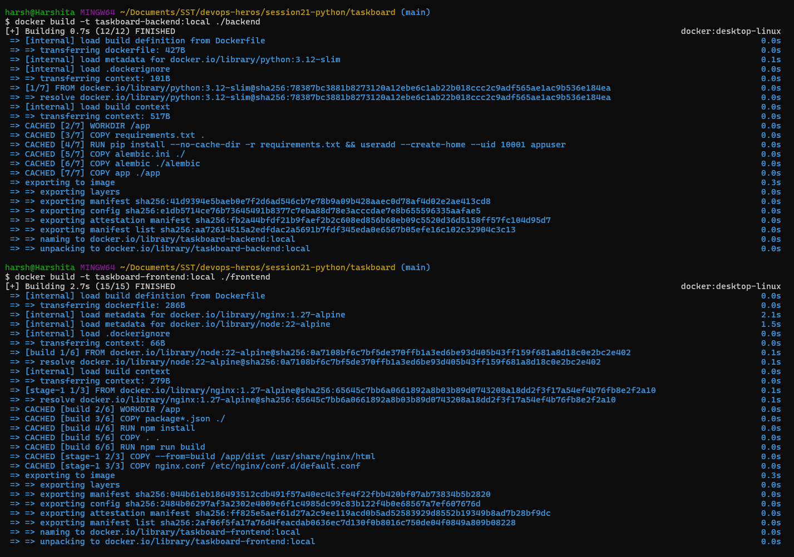
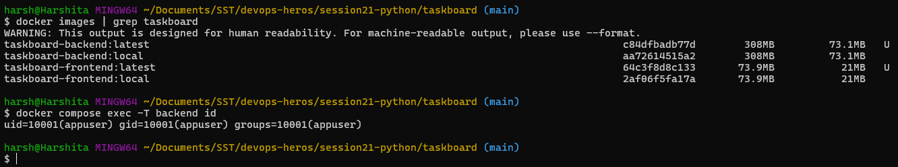
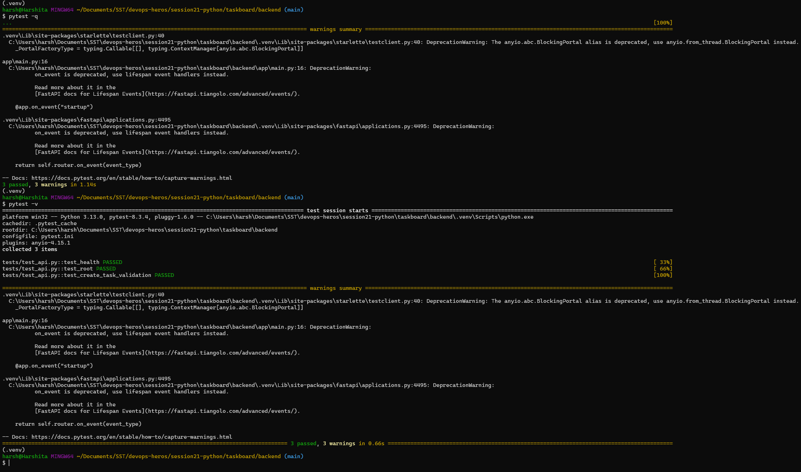

# Session 21: DevOps Final Capstone, TaskBoard Demo

TaskBoard is the reference project for the capstone: a small project management app with a React
frontend, a FastAPI backend and PostgreSQL. This demo runs the app locally with Docker Compose,
shows its API, database and metrics, and runs its tests.

```text
Browser -> Frontend (React, nginx :3000) -> /api -> Backend (FastAPI :8000) -> PostgreSQL
```

## 1. The Application

- **Frontend:** React + Vite dashboard served by nginx. The browser only calls `/api/...`, and nginx
  forwards it to the backend.
- **Backend:** FastAPI with SQLAlchemy and Alembic migrations.
- `/health` is the liveness check, `/ready` also checks the database, `/metrics` is for Prometheus.

## 2. Running Locally with Docker Compose

One command builds both images and starts frontend, backend and PostgreSQL together.

### Compose Up



### TaskBoard Dashboard



### Creating a Task



### API Docs (Swagger)



Updating a task through the API (`PUT /api/tasks/5`, status `IN_PROGRESS`):



### Health and Metrics



### Tasks Table in PostgreSQL



### Docker Images

The backend image runs as a non root user (UID 10001). The frontend uses a multi stage build: Node
builds the static files, and only nginx and the built files end up in the final image.





## 3. Testing with Pytest

Tests are the first quality gate. They run against a separate SQLite test database, never the real
one, so a failing test can stop a pipeline before any image is built.



## Key Learnings

- Docker Compose runs the whole stack (frontend, backend, database) with one command.
- nginx forwards `/api` to the backend, so the browser never needs the backend's address.
- `/health`, `/ready` and `/metrics` give orchestrators and monitoring tools what they need.
- Automated tests are the first quality gate before anything is built or deployed.
