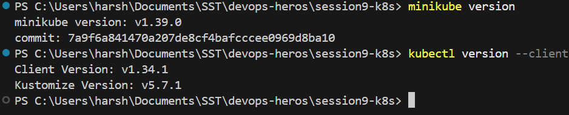
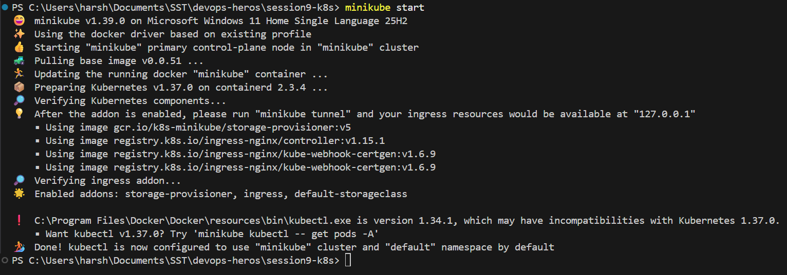
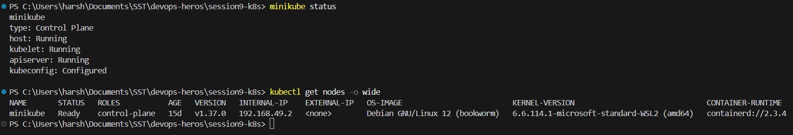
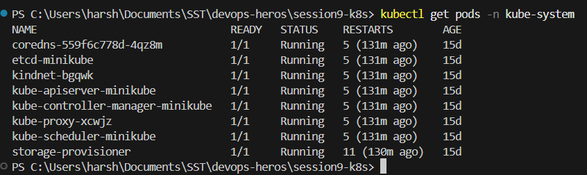
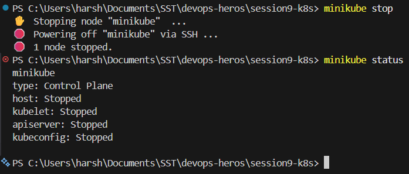

# Session 9: Kubernetes Fundamentals & Minikube Setup

## Minikube & kubectl Installation

**Run:**

```powershell
minikube version
kubectl version --client
```



## Starting the Minikube Cluster

**Run:**

```powershell
minikube start
```



## Cluster Status and Node Health

**Run:**

```powershell
minikube status
kubectl get nodes -o wide
```



## Control Plane Components Running as Pods

**Run:**

```powershell
kubectl get pods -n kube-system
```



## Stopping the Cluster

**Run:**

```powershell
minikube stop
minikube status
```



## Kubernetes Cluster Architecture & Component Analysis

Kubernetes is split into a **control plane**, which decides what should happen, and **worker nodes**,
which actually run the containers.

### Control Plane

- **kube-apiserver:** The front door of the cluster. `kubectl`, users and every other component talk
  through its REST API. It is the only component that reads and writes `etcd` directly.
- **etcd:** A distributed key value store holding the whole cluster state, configuration, secrets and
  metadata. If `etcd` is lost, the cluster state is lost.
- **kube-scheduler:** Watches for Pods that have no node assigned and picks a suitable one based on
  resource requests, affinity rules, taints and tolerations.
- **kube-controller-manager:** Runs the control loops that compare desired state against actual state
  and correct the difference, such as keeping replica counts correct or reacting to a node failure.

### Worker Nodes

- **kubelet:** The agent on every node. It receives the PodSpec from the API server, tells the runtime
  to start containers, checks their health and reports status back.
- **kube-proxy:** Maintains the network rules that let Services route traffic to the correct Pods.
- **Container runtime:** Actually runs the containers through the Container Runtime Interface (CRI).
  Common ones are `containerd` and `CRI-O`.
- **Pod:** The smallest deployable unit. A Pod holds one or more related containers that share the
  same network namespace and storage.

The control plane decides placement and policy, while the worker nodes provide the compute. Kubernetes
keeps reconciling the actual state until it matches the desired state.
