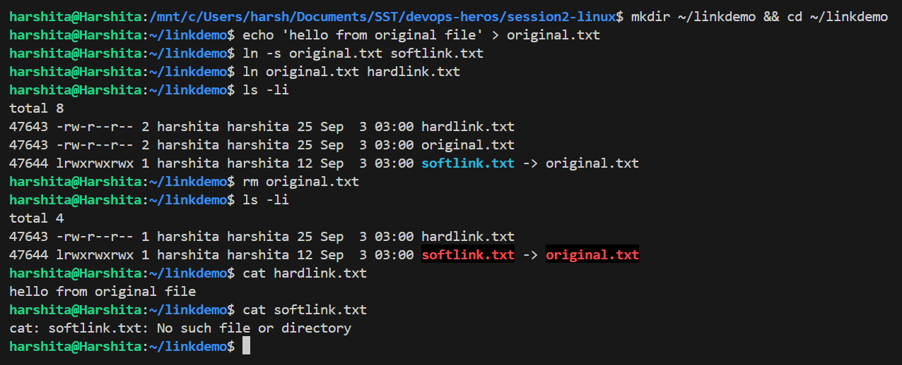

# Linux Fundamentals

## Task 1: Soft Link & Hard Link

### What is a Link in Linux?

A link in Linux is a reference (pointer) to a file. Linux supports two types of links: hard links
and soft links (symbolic links).

Both are created with the `ln` command. The difference is what they actually point to. A hard link
points to the file's **inode** (the data itself), while a soft link points to the file's **path**.

### Hard Link

A hard link is a direct reference to the data on disk. It is another name for the same file.

**Key Properties:**
- Shares the same inode number as the original file.
- If the original file is deleted, the hard link still works. The data survives until every hard
  link to it is removed.
- Cannot span across different filesystems or partitions.
- Cannot be created for directories, which prevents circular references in the directory tree.
- Changes made through one hard link are visible through all of them, since they point to the same
  data.
- Has the same file size as the original.

Command to create a hard link:

```bash
ln <original_file> <hard_link_name>
```

### Soft Link (Symbolic Link)

A soft link is a shortcut to the original file's path. It is a separate small file that stores the
path of the target instead of pointing to the inode.

**Key Properties:**
- Has a different inode number than the original file.
- If the original file is deleted, the soft link breaks and becomes a dangling link.
- Can span across different filesystems and partitions.
- Can be created for directories.
- Its size equals the length of the stored path, not the size of the target file.
- The link has its own permissions, but actual access depends on the target file's permissions.

Command to create a soft link:

```bash
ln -s <original_file> <soft_link_name>
```

---

### Comparison Table

| Feature | Hard Link | Soft Link |
|---|---|---|
| Inode Number | Same as original | Different from original |
| Points to | The inode (data) | The file path |
| Works if original is deleted? | Yes | No (dangling link) |
| Cross-filesystem? | No | Yes |
| Link to directories? | No | Yes |
| File size | Same as original | Small (stores path only) |
| `ls -l` type character | `-` (looks like a normal file) | `l` |
| Command | `ln file link` | `ln -s file link` |

---

### Creating and Deleting Links

#### Creating Both Links

```bash
# Create a test directory and file
mkdir ~/linkdemo && cd ~/linkdemo
echo 'hello from original file' > original.txt

# Create a soft link and a hard link
ln -s original.txt softlink.txt
ln    original.txt hardlink.txt

# Verify inode numbers and link counts
ls -li
```

Output:

```
47643 -rw-r--r-- 2 harshita harshita 25 Sep  3 02:45 hardlink.txt
47643 -rw-r--r-- 2 harshita harshita 25 Sep  3 02:45 original.txt
47644 lrwxrwxrwx 1 harshita harshita 12 Sep  3 02:45 softlink.txt -> original.txt
```

**Observations:**
- `original.txt` and `hardlink.txt` both show inode **47643**, so it is one file with two names.
- Their link count is **2**, which is the number right after the permissions.
- `softlink.txt` has a different inode (47644) and a link count of 1.
- The soft link size is **12 bytes**, exactly the length of the string `original.txt`. This confirms
  that a soft link only stores the path.
- The soft link line starts with `l` and shows an `->` arrow to the target.

#### Deleting the Original File

```bash
# Delete the original file
rm original.txt
ls -li

# Hard link still works
cat hardlink.txt

# Soft link is broken (dangling)
cat softlink.txt
```

Output:

```
47643 -rw-r--r-- 1 harshita harshita 25 Sep  3 02:45 hardlink.txt
47644 lrwxrwxrwx 1 harshita harshita 12 Sep  3 02:45 softlink.txt -> original.txt

--- cat hardlink.txt ---
hello from original file
--- cat softlink.txt ---
cat: softlink.txt: No such file or directory
```

**Observations:**
- The hard link still prints the data.
- Its link count dropped from **2 to 1**, so `rm` removed only a name, not the data. The data is
  freed only when the count reaches 0.
- The soft link is now dangling. `ls -l` still shows the arrow pointing at `original.txt`, but
  reading it fails with `No such file or directory`.
- A broken soft link also appears in a different colour in the terminal.

### Soft vs Hard Link Demo



**Output:** matching inodes with link count 2, then the hard link surviving and the soft link
breaking after the original is deleted.

---

### Testing the Hard Link Limitations

Both restrictions listed earlier were tested to confirm them.

```bash
# 1. Hard link to a directory
ln mydir dirhard
# ln: mydir: hard link not allowed for directory

# 2. Hard link across two filesystems
ln ~/linkdemo/xfs.txt /mnt/c/Users/harsh/xfs_hard.txt
# ln: failed to create hard link ... : Invalid cross-device link
```

**Observations:**
- The directory restriction is enforced directly by `ln`.
- The second error confirms the cross filesystem rule. Here `/` is `/dev/sdd` and `/mnt/c` is the
  Windows drive, so they are two separate filesystems.
- The reason is that inode numbers are only unique within a single filesystem, so an inode reference
  is meaningless on another one.

A soft link to a directory works with no error, since it only stores a path:

```bash
ln -s mydir dirsoft
ls -ld dirsoft
# lrwxrwxrwx 1 harshita harshita 5 Sep  3 02:45 dirsoft -> mydir
```

### Deleting Links

```bash
rm softlink.txt      # removes the soft link only
rm hardlink.txt      # removes that one name only
unlink softlink.txt  # same result, removes a single link
```

**Points to remember:**
- Deleting a link never deletes the target file's data, it only removes one name.
- For a soft link pointing to a directory, the correct command is `rm dirsoft` and **not**
  `rm -r dirsoft/`. The trailing slash makes the command follow the link into the real directory and
  delete its contents.

---

### Interview Questions

**Q: Difference between a soft link and a hard link?**

A hard link is a second name for the same inode, so both names are equal and deleting one keeps the
data. A soft link is a separate small file holding a path, so it breaks if the target is removed.

**Q: Why can't you hard link across filesystems?**

A hard link is a directory entry pointing to an inode number, and inode numbers are only meaningful
inside a single filesystem. This appears as `Invalid cross-device link`.

**Q: Why can't you hard link a directory?**

It would allow loops in the directory tree, which would break tools that walk it and make it hard to
tell parent from child. Only the kernel creates such links, for `.` and `..`.

**Q: How do you spot a soft link?**

`ls -l` shows `l` as the first character along with an `->` arrow. `readlink -f file` prints the real
target.

**Q: What does the number after permissions in `ls -l` mean?**

The hard link count for that inode. That is the value which changed from 2 to 1 in the delete test.

---

## Task 2: `adduser` vs `useradd`

### What They Actually Are

Both commands live in `/usr/sbin`, but they are not the same kind of program:

```bash
file /usr/sbin/adduser /usr/sbin/useradd
```

```
/usr/sbin/adduser: Perl script text executable
/usr/sbin/useradd: ELF 64-bit LSB pie executable, x86-64 ... stripped
```

This single output explains every difference between them. `adduser` is a **Perl script** that
wraps the low level tools, and `useradd` is the **compiled binary** doing the actual work.

### `useradd`

`useradd` is a low level binary available on all Linux distributions.

**Key Properties:**
- Does not create a home directory by default, unless the `-m` flag is used.
- Does not set a password, so the account stays locked until `passwd` is run.
- Does not copy skeleton files (`.bashrc`, `.profile`) by default.
- Defaults to the `/bin/sh` shell on this system, taken from `/etc/default/useradd`.
- Requires every user property to be configured manually through flags.
- Non-interactive, which makes it suitable for scripts and Dockerfiles.

```bash
# Basic usage (no home directory created)
sudo useradd testuser1

# With home directory and a proper login shell
sudo useradd -m -s /bin/bash testuser1

# Set the password separately
sudo passwd testuser1
```

### `adduser`

`adduser` is a higher level Perl script (a wrapper around `useradd`) available on Debian and Ubuntu
systems.

**Key Properties:**
- Automatically creates the home directory.
- Prompts for a password interactively.
- Copies skeleton files from `/etc/skel` into the home directory.
- Creates a matching group for the user.
- Uses `/bin/bash` as the default shell.
- Prompts for optional details such as full name and phone number.
- Interactive, so it is intended for use by hand rather than in scripts.

```bash
# Interactive, prompts for password and details
sudo adduser testuser2
```

The default shells mentioned above were confirmed from the config files on this system:

```bash
grep -vE '^#|^$' /etc/default/useradd
# SHELL=/bin/sh

grep -E 'DSHELL|DHOME|SKEL' /etc/adduser.conf
# Default: DSHELL=/bin/bash
# Default: DHOME=/home
# Default: SKEL=/etc/skel
```

**Note:** In `/etc/adduser.conf` every setting is commented out on this system, so `adduser` runs on
its built in defaults. The file still documents them for reference.

### Comparison Table

| Feature | `useradd` | `adduser` |
|---|---|---|
| Type | Low level binary | High level Perl script |
| Home directory | Not created by default | Created automatically |
| Password | Must be set separately | Prompted during creation |
| Skeleton files | Not copied by default | Copied automatically |
| Default shell | `/bin/sh` | `/bin/bash` |
| User's own group | Depends on flags and config | Created automatically |
| Interactivity | Non-interactive | Interactive |
| Availability | All Linux distros | Debian and Ubuntu primarily |
| Best suited for | Scripts and Dockerfiles | Creating a user by hand |

### Which is Preferred on Ubuntu?

**`adduser` is preferred on Ubuntu and Debian** because it handles all the common setup steps in one
command: creating the home directory, copying skeleton files, creating the matching group, setting
`/bin/bash`, and prompting for a password. This reduces the chance of misconfiguration.

With `useradd`, forgetting `-m` or skipping `passwd` produces a user with no home directory and no
usable password, which is a common mistake.

`useradd` remains the better choice inside scripts and Dockerfiles, because it is non-interactive
and exists on every distribution, not only Debian based ones.

### Creating a Test User

```bash
# Create the test user using the recommended command
sudo adduser testuser

# Verify the user, group, home directory and shell
id testuser
grep testuser /etc/passwd
ls -ld /home/testuser
sudo ls -a /home/testuser        # shows .bashrc and .profile copied from /etc/skel
```


```bash
# Cleanup, remove the test user along with the home directory
sudo deluser --remove-home testuser
```

---

### Interview Questions

**Q: `adduser` vs `useradd`?**

`useradd` is the low level binary and does the bare minimum. `adduser` is a Perl wrapper around it
that is interactive and sets up the home directory, group, shell and password.

**Q: You ran `useradd bob` and the user cannot log in. Why?**

No home directory (`-m` was missing), the shell defaults to `/bin/sh`, and no password is set so the
account stays locked. The fix is `usermod` and `passwd`, or using `adduser` in the first place.

**Q: Which would you use in a Dockerfile?**

`useradd`, because it is non-interactive and available on non-Debian base images too.

---

## Task 3: `journalctl`

### What is `journalctl`?

`journalctl` is a command line utility for querying and viewing the logs collected by systemd's
journal service (`systemd-journald`). It provides one central place to read all system and service
logs.

**Key Features:**
- Collects kernel messages, service output and boot messages into a single indexed store.
- Filters logs by service (unit), time range, priority and boot.
- Removes the need to manually open separate files such as `/var/log/syslog`.
- Stores logs in a binary indexed format, so `journalctl` is required to read them and `cat` will
  not work.
- Reads from `/var/log/journal` when storage is persistent, or `/run/log/journal` when it is
  volatile.

**Access note:** `sudo` was not needed on this system because the current user is in the `adm`
group:

```bash
id -nG
# harshita adm cdrom sudo dip plugdev users
```

Without membership of `adm` or `systemd-journal`, only the user's own messages are visible and
`sudo` becomes necessary.

### Viewing System Logs

```bash
journalctl                  # all logs, oldest first
journalctl -r               # reverse order, newest first
journalctl -n 20            # last 20 lines only
journalctl -f               # follow in real time, like tail -f
journalctl -k               # kernel messages only
journalctl --no-pager       # print directly instead of opening less
journalctl --disk-usage     # space used by the journal
```

**Note:** `--no-pager` is an important flag. By default the output opens in `less`, which gets in the
way when the output needs to stay on screen or be piped into another command.

Last 5 entries from the whole system:

```bash
journalctl --no-pager -n 5
```

```
Sep 03 02:47:52 Harshita snapd[167]: overlord.go:543: Released state lock file
Sep 03 02:47:52 Harshita snapd[167]: daemon stop requested to wait for socket activation
Sep 03 02:47:52 Harshita systemd[1]: snapd.service: Deactivated successfully.
Sep 03 02:47:59 Harshita chronyd[228]: Selected source 185.125.190.123 (2.ntp.ubuntu.com)
Sep 03 02:48:00 Harshita wsl-pro-service[175]: WARNING Daemon: could not connect to Windows Agent...
```

Journal size on this system:

```bash
journalctl --disk-usage
# Archived and active journals take up 272.2M in the file system.
```

### Viewing Logs for a Specific Service

The `-u` flag limits the output to one systemd unit:

```bash
journalctl -u <service>        # all logs for one service
journalctl -u <service> -n 50  # last 50 lines for that service
journalctl -u <service> -f     # follow that service live
```

The unit has to exist on the system, so the running services were listed first:

```bash
systemctl list-units --type=service --state=running --no-pager --no-legend
```

This showed `cron.service`, `chrony.service`, `rsyslog.service`, `systemd-resolved.service` and
`systemd-journald.service`. `cron.service` was used for the practice.

```bash
journalctl -u cron.service --no-pager -n 5
```

```
Sep 03 02:47:28 Harshita systemd[1]: Stopped cron.service - Regular background program processing daemon.
Sep 03 02:47:43 Harshita systemd[1]: Started cron.service - Regular background program processing daemon.
Sep 03 02:47:43 Harshita (cron)[156]: cron.service: Referenced but unset environment variable evaluates to an empty string: EXTRA_OPTS
Sep 03 02:47:43 Harshita cron[156]: (CRON) INFO (pidfile fd = 3)
Sep 03 02:47:43 Harshita cron[156]: (CRON) INFO (Running @reboot jobs)
```

**Observations:**
- The output shows the full lifecycle of the service: stopped, then started, then cron's own startup
  messages.
- Each line carries the timestamp, hostname, process name and PID, which makes it easy to trace a
  single process.
- This is the main command for finding out why a service failed to start.

### Filtering by Time

```bash
journalctl --since today
journalctl --since "1 hour ago"
journalctl --since "2026-09-01 00:00:00"
journalctl --since "2026-09-01" --until "2026-09-02"
```

Combined with a unit filter, today's cron entries came to 25 lines:

```bash
journalctl -u cron.service --since today --no-pager | wc -l
# 25
```

### Filtering by Priority

Priority runs from `emerg` (most severe) down to `debug`. Passing `-p err` shows errors and anything
more severe.

```bash
journalctl -p err --no-pager -n 5
```

```
Sep 03 02:47:43 Harshita kernel: misc dxg: dxgk: dxgkio_is_feature_enabled: Ioctl failed: -22
Sep 03 02:47:43 Harshita kernel: misc dxg: dxgk: dxgkio_query_adapter_info: Ioctl failed: -22
...
```

These are WSL GPU passthrough messages and are harmless on this setup, but they confirm the priority
filter is working.

### Viewing Logs from Previous Boots

```bash
journalctl --list-boots --no-pager
```

```
 -1 5c66745610154876a710651d8d35238f Mon 2026-08-31 05:15:30 UTC Mon 2026-08-31 05:15:49 UTC
  0 adf574e85b6946069e26faa7b93e6c69 Thu 2026-09-03 02:44:43 UTC Thu 2026-09-03 02:48:16 UTC
```

**Observations:**
- `0` is the current boot, `-1` is the previous one.
- `journalctl -b` limits output to the current boot and `journalctl -b -1` to the previous one, which
  is useful for checking why a machine crashed last time.
- Older boots appearing here proves journal storage is persistent on this system.

### Useful Flags Summary

| Flag | Description |
|---|---|
| `-u <unit>` | Logs for one service only |
| `-f` | Follow live |
| `-n <N>` | Last N lines |
| `-r` | Reverse order, newest first |
| `-b` / `-b -1` | Current boot / previous boot |
| `-p err` | Priority filter (`emerg` to `debug`) |
| `--since` / `--until` | Time range |
| `-k` | Kernel messages only |
| `--no-pager` | Do not open `less` |
| `--disk-usage` | Space used by the journal |
| `--vacuum-time=7d` | Delete logs older than 7 days |


---

### Interview Questions

**Q: Where does journalctl read from, and is it plain text?**

From the systemd journal under `/var/log/journal`, or `/run/log/journal` if storage is volatile. It
is a binary indexed format, so `journalctl` is required to read it and `cat` will not work.

**Q: A service will not start. What do you run?**

`systemctl status <svc>` for the summary, then `journalctl -u <svc> -n 50 --no-pager` for the actual
log lines, with `-b` to limit it to the current boot.

**Q: How do you stop the journal from filling the disk?**

`journalctl --disk-usage` to check, then `--vacuum-time=7d` or `--vacuum-size=500M`. For a permanent
limit, set `SystemMaxUse=` in `/etc/systemd/journald.conf`.

**Q: Do journal logs survive a reboot?**

Only if persistent storage is enabled. If `/var/log/journal` does not exist, logs live in `/run` and
are lost on reboot. On this system `--list-boots` shows older boots, so it is persistent.

---

## Task 4: Linux Command Cheat Sheet

### Few Important Commands

| Command | Description | Example |
|---|---|---|
| `ls` | List directory contents | `ls -la` |
| `cd` | Change directory | `cd /var/log` |
| `pwd` | Print working directory | `pwd` |
| `mkdir` | Create a directory | `mkdir my_folder` |
| `rmdir` | Remove empty directory | `rmdir my_folder` |
| `rm` | Remove files/directories | `rm -rf folder/` |
| `cp` | Copy files/directories | `cp file1.txt file2.txt` |
| `mv` | Move/rename files | `mv old.txt new.txt` |
| `touch` | Create empty file / update timestamp | `touch newfile.txt` |
| `cat` | Display file contents | `cat file.txt` |
| `chmod` | Change file permissions | `chmod 755 script.sh` |
| `chown` | Change file owner | `chown user:group file.txt` |
| `chgrp` | Change group ownership | `chgrp developers file.txt` |
| `umask` | Set default permissions | `umask 022` |
| `whoami` | Show current username | `whoami` |
| `id` | Show user ID and groups | `id username` |
| `adduser` | Add user (interactive) | `sudo adduser newuser` |
| `useradd` | Add user (low level) | `sudo useradd -m newuser` |
| `passwd` | Change password | `sudo passwd username` |
| `usermod` | Modify user account | `sudo usermod -aG sudo user` |
| `deluser` | Delete a user | `sudo deluser username` |
| `groups` | Show user's groups | `groups username` |
| `su` | Switch user | `su - username` |
| `sudo` | Execute as superuser | `sudo apt update` |
| `ps` | Show running processes | `ps aux` |
| `top` / `htop` | Real time process viewer | `top` |
| `kill` | Kill a process by PID | `kill 1234` |
| `killall` | Kill processes by name | `killall nginx` |
| `systemctl` | Manage systemd services | `systemctl status nginx` |
| `ip addr` | Show IP addresses | `ip addr show` |
| `ifconfig` | Show network interfaces (legacy) | `ifconfig` |
| `ping` | Test network connectivity | `ping google.com` |
| `curl` | Transfer data from URL | `curl https://example.com` |
| `wget` | Download files | `wget https://example.com/file.zip` |
| `netstat` | Network statistics (legacy) | `netstat -tulnp` |
| `ss` | Socket statistics | `ss -tulnp` |
| `nslookup` | DNS lookup | `nslookup google.com` |
| `dig` | DNS lookup (detailed) | `dig google.com` |
| `traceroute` | Trace packet route | `traceroute google.com` |
| `hostname` | Show/set system hostname | `hostname` |
| `df` | Disk space usage | `df -h` |
| `du` | Directory/file space usage | `du -sh /var/log` |
| `lsblk` | List block devices | `lsblk` |
| `mount` | Mount a filesystem | `mount /dev/sdb1 /mnt` |
| `fdisk` | Partition management | `sudo fdisk -l` |
| `grep` | Search text patterns | `grep "error" logfile.txt` |
| `sort` | Sort lines | `sort file.txt` |
| `uniq` | Remove duplicate lines | `sort file.txt \| uniq` |
| `wc` | Count lines/words/characters | `wc -l file.txt` |
| `tee` | Read from stdin, write to file and stdout | `echo "hi" \| tee file.txt` |
| `tar` | Archive files | `tar -czvf archive.tar.gz folder/` |
| `zip` / `unzip` | Create/extract ZIP archives | `zip archive.zip file.txt` |

---

### Practicing the Important Commands

A scratch directory was used so nothing important was touched:

```bash
mkdir -p ~/cmdpractice/logs && cd ~/cmdpractice
printf "alpha\nbeta ERROR\ngamma\ndelta ERROR\n" > logs/app.log
printf "one\ntwo\nthree\n" > notes.txt
```

#### Files and Navigation

```bash
pwd                  # /home/harshita/cmdpractice
ls -lh               # long listing with human readable sizes
cd .. / cd ~         # move up one level / go to home
mkdir -p a/b/c       # -p creates parent dirs and gives no error if they exist
rm -r <dir>          # recursive delete, use carefully
touch file           # create an empty file
```

#### Viewing and Counting

```bash
cat notes.txt        # whole file
head -2 notes.txt    # first 2 lines: one, two
tail -1 notes.txt    # last line: three
wc -l logs/app.log   # 4 logs/app.log
less bigfile         # scrollable view, q to quit
```

#### Searching

```bash
grep -n  "ERROR" logs/app.log   # show matching lines with line numbers
grep -c  "ERROR" logs/app.log   # count matching lines
grep -ri "error" .              # recursive and case insensitive
find . -name "*.log"            # find files by name pattern
```

Output:

```
2:beta ERROR
4:delta ERROR
```

**Observations:**
- `grep -c` returned `2`, matching the two lines found above.
- The `-n` flag is the most useful part, since line numbers make large log files easier to navigate.
- `find . -name "*.log"` returned `./logs/app.log`.

#### Permissions

```bash
touch script.sh
ls -l script.sh      # -rw-r--r--
chmod +x script.sh
ls -l script.sh      # -rwxr-xr-x
```

**Observations:**
- The three `x` bits appear after `chmod +x`, one for owner, group and others.
- The numeric form does the same thing. `chmod 755 script.sh` gives `rwx` to the owner and `r-x` to
  group and others.
- `chown user:group file` changes ownership but requires root.

#### Disk and Memory

```bash
df -h /      # free space per filesystem
du -sh .     # size of the current directory
free -h      # memory and swap usage
```

Output:

```
Filesystem      Size  Used Avail Use% Mounted on
/dev/sdd       1007G  2.1G  954G   1% /

16K	.

               total        used        free      shared  buff/cache   available
Mem:           7.6Gi       506Mi       6.8Gi       3.5Mi       475Mi       7.1Gi
Swap:          2.0Gi          0B       2.0Gi
```

**Observations:**
- `df` reports space per filesystem, while `du` reports the size of a specific directory.
- Simple way to remember it: **df for the disk, du for the directory.**

#### Processes and System

```bash
ps aux | head -4       # snapshot of running processes
top -bn1 | head -5     # -b batch mode, -n1 one pass, so it does not take over the terminal
uptime                 # load average and time since boot
kill <pid>             # request a process to stop
kill -9 <pid>          # force kill
```

Output:

```
 02:49:02 up 4 min,  1 user,  load average: 0.08, 0.08, 0.03
Tasks:  31 total,   1 running,  30 sleeping,   0 stopped,   0 zombie
```

**Observations:**
- Only 31 tasks, because this is WSL and not a full desktop install.
- `kill` sends `SIGTERM` by default, which allows a clean shutdown. `-9` sends `SIGKILL`, which
  cannot be ignored and should be the last option.

#### Pipes and Redirection

```bash
printf "b\na\nb\nc\na\n" | sort | uniq -c   # count duplicates
echo "first" >  out.txt                     # overwrite
echo "second" >> out.txt                    # append
cat out.txt
```

Output:

```
      2 a
      2 b
      1 c

first
second
```

**Observations:**
- `uniq` only collapses **adjacent** duplicates, which is why `sort` has to run first.
- `>` overwrites the file while `>>` appends to it, so mixing the two up destroys the existing
  contents.

---

### Cleanup

```bash
rm -rf ~/linkdemo ~/cmdpractice
```
