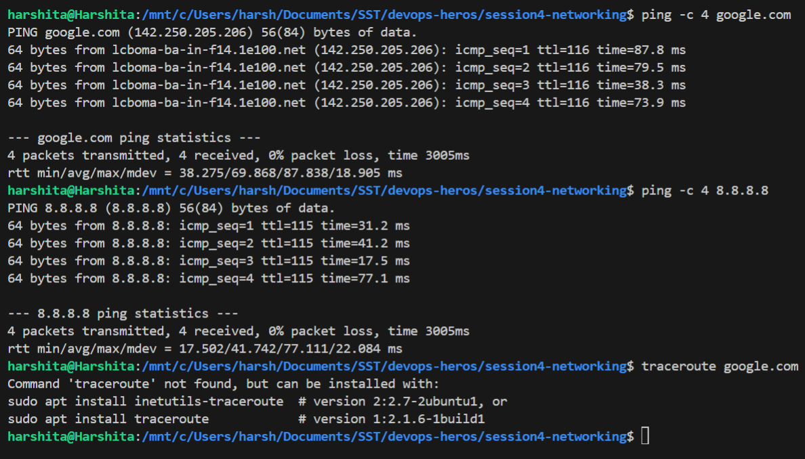
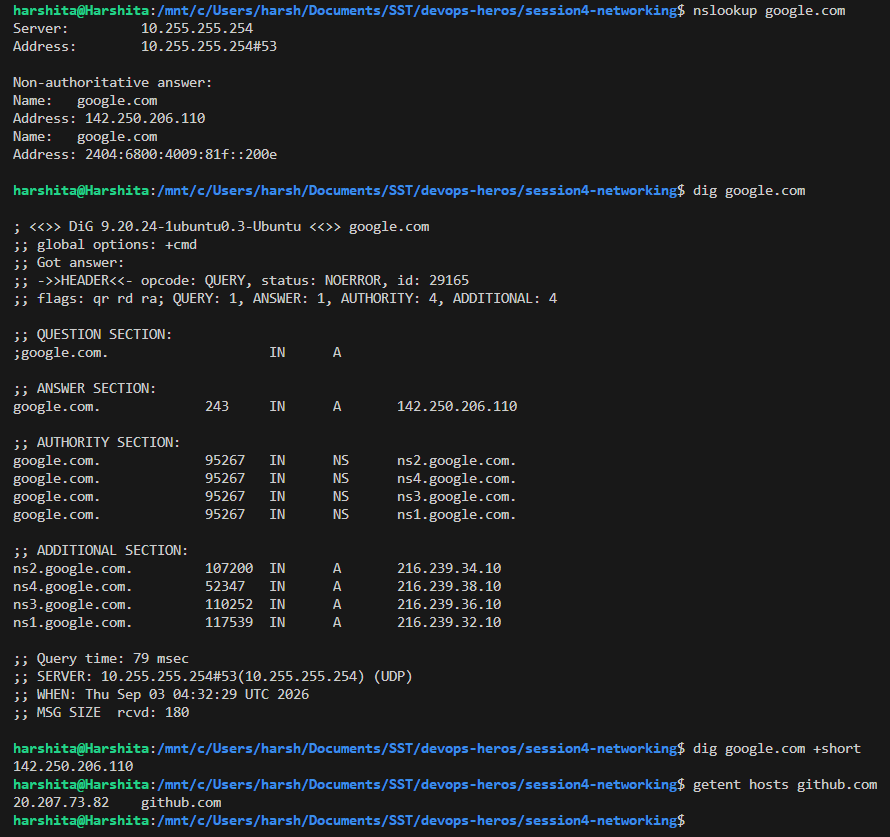
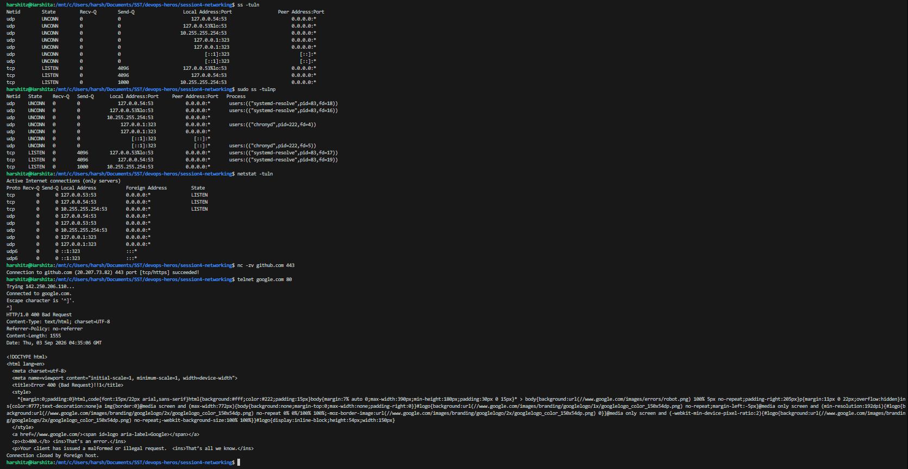
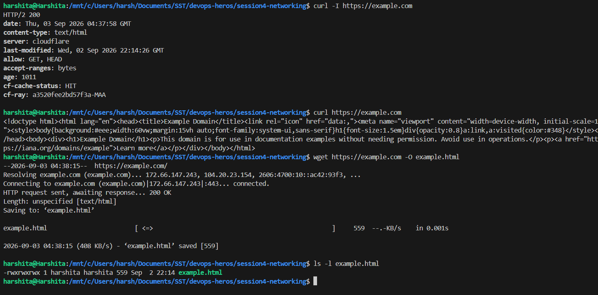
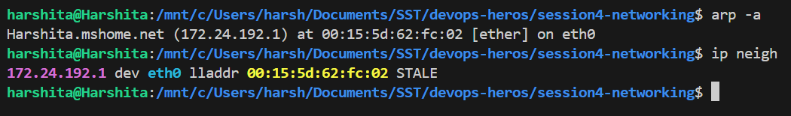
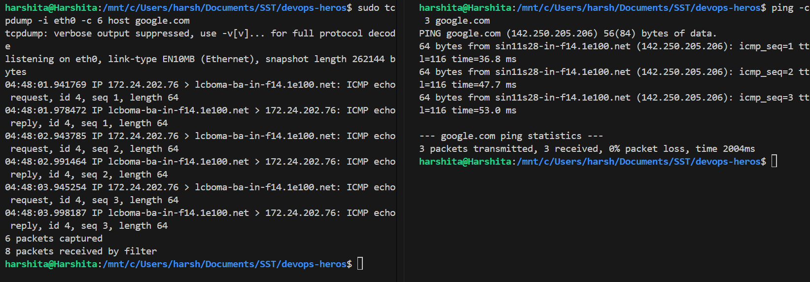
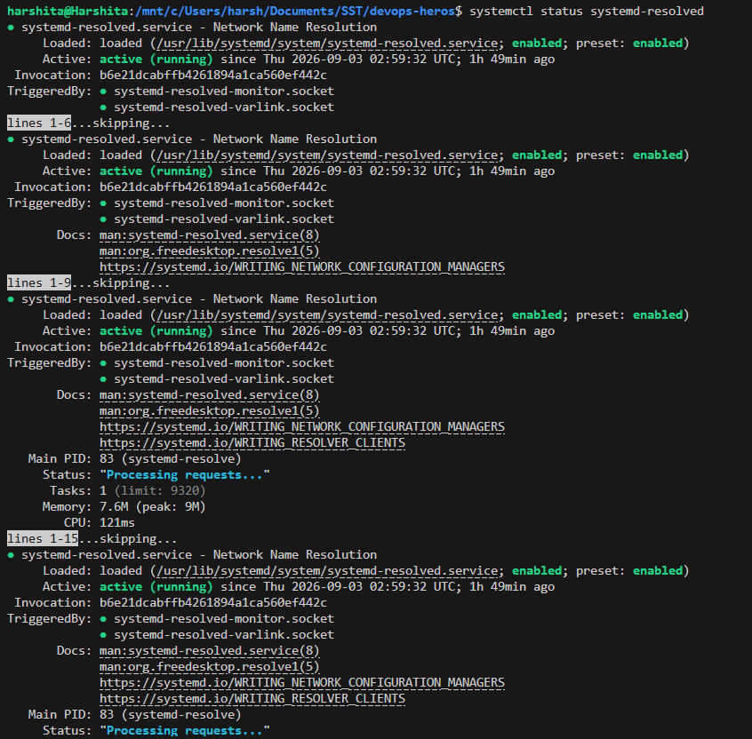
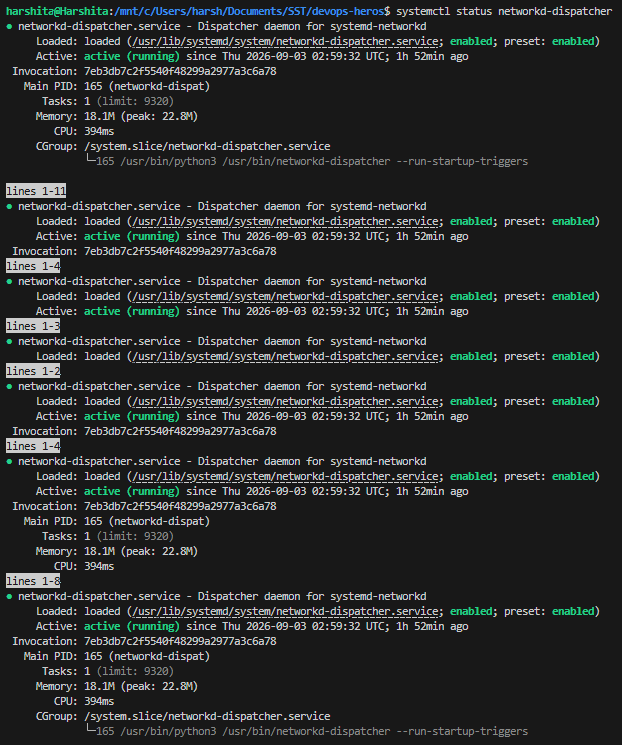

# Networking Fundamentals

## Overview

Practicing the basic Linux networking commands: checking the interface and IP address, testing
connectivity, looking up DNS records, and listing open ports and connections.

---

## Setup

Most of these commands are not installed by default on Ubuntu, so they were installed first:

```bash
sudo apt update
sudo apt install -y bind9-dnsutils net-tools traceroute tcpdump telnet
```

| Package | Commands it provides |
|---|---|
| `bind9-dnsutils` | `dig`, `nslookup` |
| `net-tools` | `ifconfig`, `netstat`, `route`, `arp` |
| `traceroute` | `traceroute` |
| `tcpdump` | `tcpdump` |
| `telnet` | `telnet` |

**Note:** the package is `bind9-dnsutils` on Ubuntu 26.04. The older name `dnsutils` no longer
exists, so `apt install dnsutils` fails with a "no candidate" error.

---

## IP Address Basics

| Class | First octet range | Default subnet mask | Network bits |
|---|---|---|---|
| A | 1 to 126 | `255.0.0.0` (`/8`) | 8 |
| B | 128 to 191 | `255.255.0.0` (`/16`) | 16 |
| C | 192 to 223 | `255.255.255.0` (`/24`) | 24 |
| D | 224 to 239 | Used for multicast | Not applicable |

- The subnet mask splits an IP address into a **network part** and a **host part**.
- Usable hosts in a network are `2^(host bits) - 2`. Two addresses are reserved, one for the network
  itself and one for the broadcast address.
- Private ranges that are not routable on the internet: `10.0.0.0/8`, `172.16.0.0/12` and
  `192.168.0.0/16`.

---

## 1. Interface and IP Information

```bash
hostname
hostname -I
ip addr show
ip -br addr
ifconfig
```

**What each command does:**
- `hostname` prints the name of the machine.
- `hostname -I` prints only the IP address, which is quicker than reading the full `ip addr` output.
- `ip addr show` lists every network interface with its IP address, MAC address and state. `lo` is
  the loopback interface (`127.0.0.1`) and `eth0` is the real network interface.
- `ip -br addr` gives the same information in a short one line per interface format, which is much
  easier to read.
- `ifconfig` is the older command for the same job. `ip` has replaced it, but `ifconfig` still shows
  up in older guides.

**What I understood:** every interface has its own IP. The loopback address `127.0.0.1` always points
back to the same machine, so it is used for testing locally without touching the network.

### Screenshot


---

## 2. Routing Table and Gateway

```bash
ip route
route -n
```

**What each command does:**
- `ip route` shows the routing table, which is the list of rules deciding where a packet is sent.
- The line starting with `default via` is the **default gateway**, the router used for any address
  that is not on the local network.
- `route -n` prints the same table in the older format. `-n` shows numbers instead of resolving
  names, which makes it faster.

**What I understood:** traffic for the local network goes out directly, and everything else is handed
to the default gateway. Without a default route, the machine can only reach its own network.

### Screenshot


---

## 3. Testing Connectivity

```bash
ping -c 4 google.com
ping -c 4 8.8.8.8
traceroute google.com
```

**What each command does:**
- `ping` sends ICMP echo requests and reports how long the reply took. `-c 4` limits it to 4 packets,
  otherwise it keeps running until stopped with `Ctrl+C`.
- The summary line shows packet loss and the minimum, average and maximum round trip time.
- `traceroute` lists every router (hop) a packet passes through before reaching the destination.

**What I understood:** pinging a domain name tests DNS and connectivity together, while pinging an IP
such as `8.8.8.8` tests only connectivity. If the IP works but the domain does not, the problem is
DNS and not the network. `traceroute` is useful for finding the exact hop where traffic stops.

### Screenshot



---

## 4. DNS Lookup

```bash
nslookup google.com
dig google.com
dig google.com +short
getent hosts github.com
```

**What each command does:**
- `nslookup` resolves a domain name to its IP address and shows which DNS server answered.
- `dig` does the same but gives full detail, including the `ANSWER SECTION` and the record type.
- `dig google.com +short` prints only the IP addresses, which is handy inside scripts.
- `getent hosts` resolves a name the same way normal programs do, using `/etc/hosts` first and then
  DNS.

**What I understood:** DNS turns a name into an IP address, because the network only routes IPs.
`dig` is the better tool for troubleshooting since it shows the record type and the responding
server, while `nslookup` is enough for a quick check.

### Screenshot



---

## 5. Ports and Connections

```bash
ss -tuln
sudo ss -tulnp
netstat -tuln
nc -zv github.com 443
telnet google.com 80
```

**What each command does:**
- `ss -tuln` lists listening sockets. The flags mean `t` for TCP, `u` for UDP, `l` for listening only
  and `n` for numeric ports instead of service names.
- Adding `-p` shows which process owns each port, but it needs `sudo` to display the names.
- `netstat -tuln` is the older equivalent of `ss`.
- `nc -zv host port` checks whether a single port is reachable. `-z` only scans without sending data
  and `-v` prints the result.
- `telnet host port` opens a raw connection to one port. The line `Connected to google.com.` is the
  proof that port 80 is open. `Ctrl+]` escapes back to the telnet prompt, and `quit` exits.

**Note about the telnet output:** after connecting, telnet returned `HTTP/1.0 400 Bad Request`
followed by an HTML error page. This is not a failure. Port 80 expects a properly formed HTTP
request, and since nothing valid was typed, Google replied with a 400 and closed the connection.
Getting any HTTP reply at all confirms the web server is listening.

**What I understood:** a service is only reachable if something is listening on that port. `ss` is
the first thing to check when a service refuses connections, and `nc -zv` or `telnet` confirms from
the outside whether a port is actually open. `nc` is easier for a quick check because it prints
`succeeded` and exits on its own, while `telnet` opens a real session and can send data to the port.

**Note:** `sudo ss -tulnp` is the useful version, because the `-p` flag adds the process column and
shows which program owns each port, such as `systemd-resolve` on port 53 and `chronyd` on port 323.

### Screenshot



---

## 6. Transferring Data

```bash
curl -I https://example.com
curl https://example.com
wget https://example.com -O example.html
ls -l example.html
```

**What each command does:**
- `curl -I` requests only the HTTP headers, so the status code and server details are visible without
  the page body.
- `curl` without flags prints the response body to the terminal.
- `wget` downloads and saves to a file instead. `-O` sets the output filename.
- `ls -l` confirms the downloaded file exists and its size.

**What I understood:** `curl` is for checking and inspecting a response, and `wget` is for saving
files. `curl -I` is the fastest way to confirm a website or API is responding, since a `200` status
means it is up.

### Screenshot



---

## 7. ARP Table

```bash
arp -a
ip neigh
```

**What each command does:**
- `arp -a` shows the ARP table, which maps IP addresses on the local network to MAC (hardware)
  addresses.
- `ip neigh` is the modern replacement and shows the same mapping plus a state such as `REACHABLE`
  or `STALE`.

**What I understood:** IP addresses are used for routing, but the actual delivery on a local network
happens using MAC addresses. ARP is the step that finds the MAC address for an IP. The default
gateway usually appears here, since it is the device talked to most often.

### Screenshot



---

## 8. Capturing Packets

Two terminals are needed. `tcpdump` runs in the first one and waits, then the `ping` in the second
terminal generates the traffic it captures.

```bash
# terminal 1
sudo tcpdump -i eth0 -c 6 host google.com

# terminal 2
ping -c 3 google.com
```

**What each command does:**
- `tcpdump` captures the actual packets going in and out of an interface.
- `-i eth0` selects the interface, which is `eth0` on this machine as shown by `ip route`.
- `-c 6` stops after 6 packets, otherwise it keeps capturing until `Ctrl+C`.
- `host google.com` is a filter, so only traffic to and from that host is captured.

**What I understood:** `tcpdump` needs `sudo` because reading raw packets requires root. It shows
whether requests are actually leaving the machine and whether replies come back, which the other
commands cannot prove. Each captured line shows the direction, so a request with no reply points to
the problem being on the far side.

### Screenshot



---

## 9. Network Service Status

```bash
systemctl status systemd-resolved
systemctl status networkd-dispatcher
```

**What each command does:**
- `systemctl status <service>` shows whether a network service is loaded, enabled and currently
  running.
- `systemd-resolved` is the service handling DNS name resolution.

**Note:** the troubleshooting guide uses `systemctl status NetworkManager`, but NetworkManager is not
present on this setup. Running it returns `Unit NetworkManager.service could not be found`, because
WSL manages the network itself and uses `systemd-resolved` instead.

**What I understood:** if DNS lookups fail while a direct IP ping still works, checking whether
`systemd-resolved` is running is the first useful step, since a stopped service explains the failure
before any deeper troubleshooting.

### Screenshot




---

## Command Summary

| Command | Purpose |
|---|---|
| `hostname -I` | Show the machine's IP address |
| `ip addr show` | List interfaces and their IPs |
| `ip route` | Show the routing table and default gateway |
| `ping -c 4 <host>` | Test connectivity and measure delay |
| `traceroute <host>` | Show the path taken to a host |
| `nslookup <domain>` | Quick DNS lookup |
| `dig <domain>` | Detailed DNS lookup |
| `ss -tuln` | List listening ports |
| `netstat -tuln` | Older equivalent of `ss` |
| `nc -zv <host> <port>` | Check if one port is open |
| `telnet <host> <port>` | Open a raw connection to one port |
| `curl -I <url>` | Fetch HTTP headers only |
| `wget <url>` | Download a file |
| `arp -a` | Show IP to MAC address mappings |
| `sudo tcpdump -i eth0 host <host>` | Capture packets on an interface |
| `systemctl status <service>` | Check if a network service is running |
