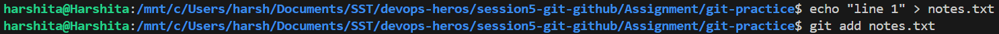
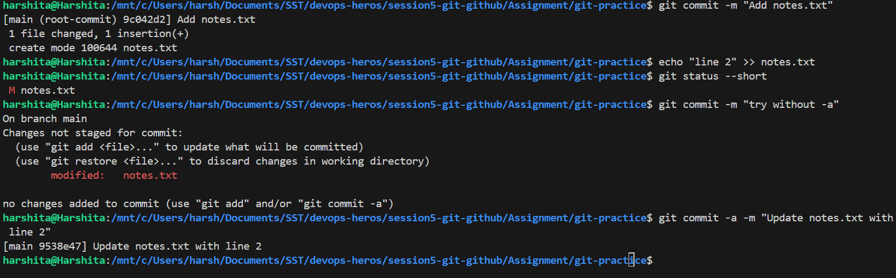
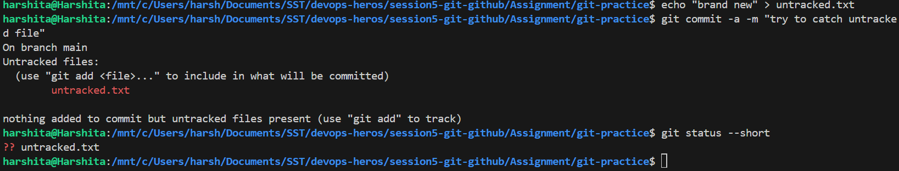
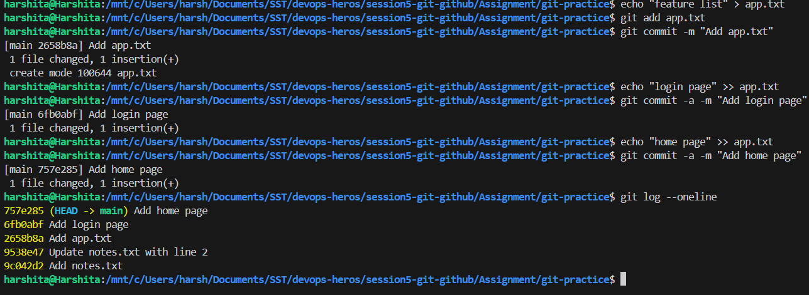
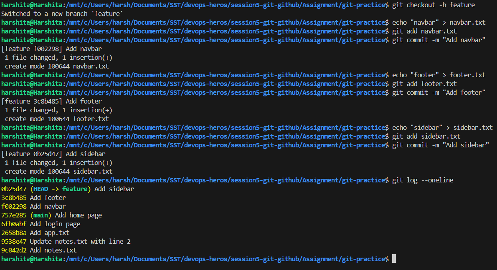
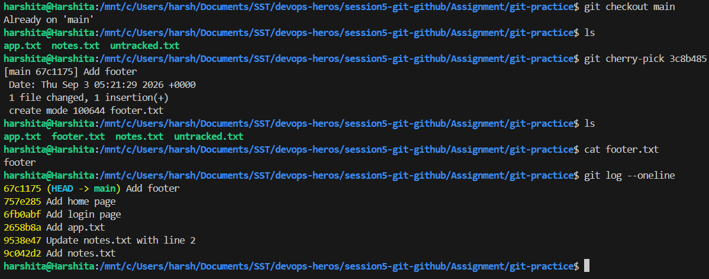
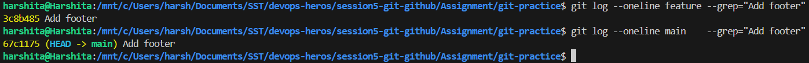

# Git and GitHub

## Overview

Two things practiced here: the difference between `git commit -m` and `git commit -a -m`, and using
`git cherry-pick` to copy one specific commit from a branch into `main`.

---

## Setup

The practice is done inside its own repository, in a `git-practice` folder next to this file:

```bash
cd session5-git-github/Assignment
mkdir git-practice && cd git-practice
git init -b main
```

---

## Task 1: `git commit -m` vs `git commit -a -m`

### What the flags mean

- `-m` supplies the commit message on the same line, instead of opening an editor.
- `-a` means **all tracked files**. It stages every modified or deleted file that git already knows
  about, and then commits them in one step.
- So `git commit -a -m "msg"` is the same as running `git add .` on tracked files followed by
  `git commit -m "msg"`.

### Comparison

| | `git commit -m` | `git commit -a -m` |
|---|---|---|
| Stages modified tracked files | No, `git add` is needed first | Yes, automatically |
| Includes **untracked** (new) files | No | No |
| Commits deleted files | Only after `git add`/`git rm` | Yes, automatically |
| Steps needed | Two (`add`, then `commit`) | One |
| Control over what goes in | Full, file by file | None, takes all tracked changes |

### Testing both commands

```bash
# make a first commit so there is something tracked
echo "line 1" > notes.txt
git add notes.txt
git commit -m "Add notes.txt"

# now change the tracked file but do NOT stage it
echo "line 2" >> notes.txt
git status --short

# 1. try committing without -a
git commit -m "try without -a"

# 2. now try the same thing with -a
git commit -a -m "Update notes.txt with line 2"
```

**What happens:**
- `git status --short` shows ` M notes.txt`, meaning modified but not staged.
- The first command **fails**. Git prints `no changes added to commit` and exits with an error,
  because nothing was staged.
- The second command **works** and commits the change straight away, because `-a` staged the tracked
  file first.

### Screenshot




### The limit of `-a`

`-a` only covers files git is already tracking. A brand new file is invisible to it:

```bash
echo "brand new" > untracked.txt
git commit -a -m "try to catch untracked file"
git status --short
```

**What happens:**
- The commit **fails** with `nothing added to commit but untracked files present`.
- `git status --short` still shows `?? untracked.txt`, so the file was never added.
- A new file always needs `git add` first. There is no shortcut for it.

### Screenshot



**What I understood:** `-a` is a shortcut for editing files that already exist in the repo, and it
saves running `git add` every time. It is not a way to commit everything, since new files still have
to be added by hand. Using `git add` separately is safer when only some of the changes should go into
the commit.

---

## Task 2: Git Cherry-Pick

### What cherry-pick does

- `git cherry-pick <commit-hash>` copies the changes from **one specific commit** onto the current
  branch.
- It is useful when only one fix from a branch is needed, and merging the whole branch would bring
  changes that are not wanted yet.
- The copied commit gets a **new hash**, because it now sits on a different branch with a different
  parent. The change is the same, but the commit is a new one.

### Step 1: Create commits on main

```bash
echo "feature list" > app.txt
git add app.txt
git commit -m "Add app.txt"

echo "login page" >> app.txt
git commit -a -m "Add login page"

echo "home page" >> app.txt
git commit -a -m "Add home page"

git log --oneline
```

### Screenshot



### Step 2: Create a branch and commit in it

```bash
git checkout -b feature

echo "navbar" > navbar.txt
git add navbar.txt
git commit -m "Add navbar"

echo "footer" > footer.txt
git add footer.txt
git commit -m "Add footer"

echo "sidebar" > sidebar.txt
git add sidebar.txt
git commit -m "Add sidebar"

git log --oneline
```

- `git checkout -b feature` creates the branch and switches to it in one command.
- `git log --oneline` on this branch shows the 3 new commits on top of the 3 from `main`.
- The short hash printed at the start of each line is what cherry-pick needs.

### Screenshot



### Step 3: Cherry-pick one commit into main

The `Add footer` commit was chosen. Its hash has to be copied from the `git log --oneline` output in
the previous step, because the hash is different in every repository.

```bash
git checkout main
ls                              # only app.txt is here

git cherry-pick <footer-hash>   # paste the real hash from the log

ls                              # footer.txt has now appeared
cat footer.txt
git log --oneline
```

**How to verify it worked:**
- `footer.txt` now exists on `main`, and `cat footer.txt` shows `footer`.
- `git log --oneline` on `main` lists `Add footer` at the top, above the 3 original commits.
- `navbar.txt` and `sidebar.txt` are **not** there, which proves only the one chosen commit was
  copied and not the whole branch.

### Screenshot



### Checking the hash changed

```bash
git log --oneline feature --grep="Add footer"
git log --oneline main    --grep="Add footer"
```

- Both print the same commit message, but the hashes are different.
- This confirms cherry-pick makes a **new commit** carrying the same change, rather than moving the
  original one.

### Screenshot



**What I understood:** cherry-pick is for taking one commit and leaving the rest behind. A merge
would have brought `navbar` and `sidebar` across as well. The important part is picking the correct
hash from `git log`, since that is what decides which change gets copied.

---

## Command Summary

| Command | Purpose |
|---|---|
| `git commit -m "msg"` | Commit what is already staged |
| `git commit -a -m "msg"` | Stage all tracked changes and commit in one step |
| `git status --short` | Short view of staged, modified and untracked files |
| `git log --oneline` | One line per commit with its short hash |
| `git checkout -b <name>` | Create a branch and switch to it |
| `git checkout <name>` | Switch to an existing branch |
| `git add <file>` | Stage one named file |
| `git restore --staged <file>` | Unstage a file added by mistake |
| `git cherry-pick <hash>` | Copy one commit onto the current branch |
| `git cherry-pick --abort` | Cancel a cherry-pick that hit a conflict |
