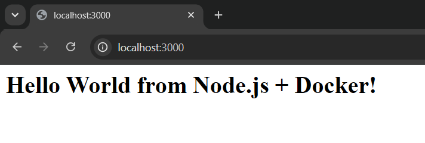
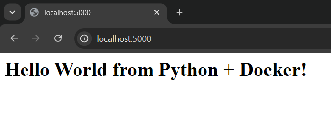
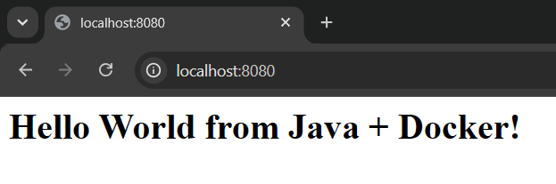
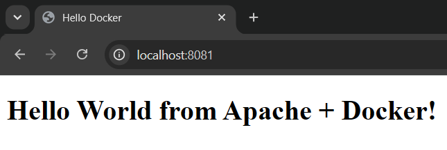
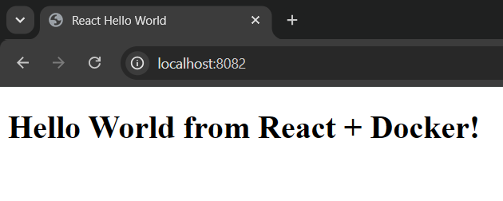
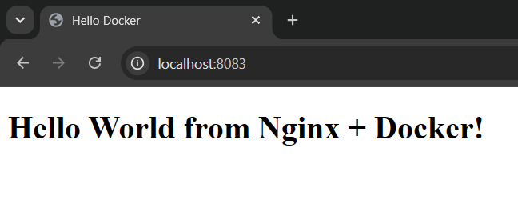
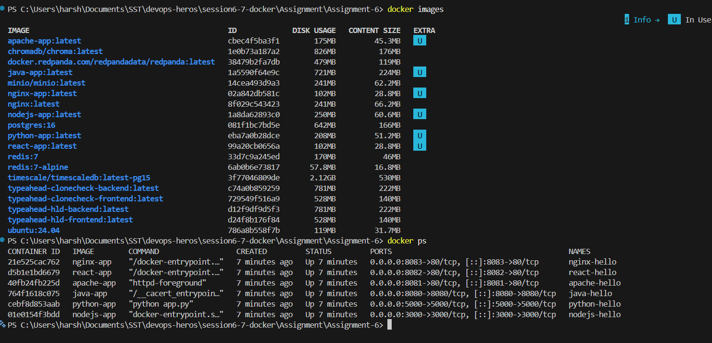

# Docker Fundamentals

## Overview

Six separate Hello World web applications, each with its own folder, application code and
Dockerfile. Every one is built into an image, run as a container, and checked in the browser.

---

## Folder Structure

```
Assignment-6/
├── Assignment_6.md
├── nodejs-app/      server.js, package.json, Dockerfile
├── python-app/      app.py, requirements.txt, Dockerfile
├── java-app/        HelloWorld.java, Dockerfile
├── Apache-app/      index.html, Dockerfile
├── React-app/       src/, index.html, package.json, vite.config.js, Dockerfile
├── nginx-app/       index.html, Dockerfile
└── screenshots/
```

Every app has its own folder with the application code and its own Dockerfile. All the commands
below are run from the `Assignment-6` folder.

---

## Applications and Ports

| Folder | Base image | Container port | Open in browser |
|---|---|---|---|
| `nodejs-app` | `node:22-alpine` | 3000 | `http://localhost:3000` |
| `python-app` | `python:3.12-slim` | 5000 | `http://localhost:5000` |
| `java-app` | `eclipse-temurin:21-jdk` | 8080 | `http://localhost:8080` |
| `Apache-app` | `httpd:2.4` | 80 | `http://localhost:8081` |
| `React-app` | `node:22-alpine` + `nginx:alpine` | 80 | `http://localhost:8082` |
| `nginx-app` | `nginx:alpine` | 80 | `http://localhost:8083` |

A different host port is used for each app so all six can run at the same time without clashing.

**Note:** image tags must be lowercase. `docker build -t Apache-app .` fails with
`repository name must be lowercase`, even though the folder name has a capital letter. So the folders
keep the names given in the task, and the image tags are written in lowercase.

---

## 1. Node.js Application

Uses Express to serve a page on port 3000.

```dockerfile
FROM node:22-alpine
WORKDIR /app
COPY package*.json ./
RUN npm install
COPY . .
EXPOSE 3000
CMD ["npm", "start"]
```

- `package*.json` is copied before the rest of the code, so the `npm install` layer is reused from
  cache when only the app code changes.
- `.dockerignore` keeps the local `node_modules` folder out of the image.

```bash
cd nodejs-app
docker build -t nodejs-app .
docker run -d -p 3000:3000 --name nodejs-hello nodejs-app
```

Open `http://localhost:3000`

### Screenshot



---

## 2. Python Application

Uses Flask to serve a page on port 5000.

```dockerfile
FROM python:3.12-slim
WORKDIR /app
COPY requirements.txt .
RUN pip install --no-cache-dir -r requirements.txt
COPY app.py .
EXPOSE 5000
CMD ["python", "app.py"]
```

- Flask runs with `host="0.0.0.0"` in `app.py`. This is required, because the default `127.0.0.1`
  only listens inside the container and the page would not open from the browser.
- `--no-cache-dir` stops pip from storing its download cache, which keeps the image smaller.

```bash
cd python-app
docker build -t python-app .
docker run -d -p 5000:5000 --name python-hello python-app
```

Open `http://localhost:5000`

### Screenshot



---

## 3. Java Application

Uses the built in `HttpServer` class, so no Maven or Gradle is needed.

```dockerfile
FROM eclipse-temurin:21-jdk
WORKDIR /app
COPY HelloWorld.java .
RUN javac HelloWorld.java
EXPOSE 8080
CMD ["java", "HelloWorld"]
```

- The `.java` file is compiled with `javac` during the build, so the image already contains the
  compiled `.class` file.
- A JDK image is needed rather than a JRE image, because `javac` only ships with the JDK.

```bash
cd java-app
docker build -t java-app .
docker run -d -p 8080:8080 --name java-hello java-app
```

Open `http://localhost:8080`

### Screenshot



---

## 4. Apache Application

Plain HTML served by the Apache httpd image.

```dockerfile
FROM httpd:2.4
COPY index.html /usr/local/apache2/htdocs/index.html
EXPOSE 80
```

- Apache serves files from `/usr/local/apache2/htdocs/`, so the HTML file is copied there.
- No `CMD` is needed, because the base image already starts Apache.

```bash
cd Apache-app
docker build -t apache-app .
docker run -d -p 8081:80 --name apache-hello apache-app
```

Open `http://localhost:8081`

### Screenshot



---

## 5. React Application

A Vite React app built with a **multi stage** Dockerfile.

```dockerfile
# stage 1: build
FROM node:22-alpine AS build
WORKDIR /app
COPY package*.json ./
RUN npm install
COPY . .
RUN npm run build

# stage 2: serve
FROM nginx:alpine
COPY --from=build /app/dist /usr/share/nginx/html
EXPOSE 80
```

- React has to be **built** first. `npm run build` turns the JSX into plain HTML, CSS and JavaScript
  inside a `dist` folder.
- The second stage copies only `dist` and throws the rest away, so Node and `node_modules` are not in
  the final image. This is what keeps a React image small.
- `COPY --from=build` is the line that pulls files out of the first stage.

```bash
cd React-app
docker build -t react-app .
docker run -d -p 8082:80 --name react-hello react-app
```

Open `http://localhost:8082`

### Screenshot



---

## 6. Nginx Application

Plain HTML served by the Nginx image.

```dockerfile
FROM nginx:alpine
COPY index.html /usr/share/nginx/html/index.html
EXPOSE 80
```

- Nginx serves files from `/usr/share/nginx/html/`, which is a different path to Apache.
- The `alpine` tag is a much smaller base image than the default one.

```bash
cd nginx-app
docker build -t nginx-app .
docker run -d -p 8083:80 --name nginx-hello nginx-app
```

Open `http://localhost:8083`

### Screenshot



---

## Checking All Images and Containers

```bash
docker images
docker ps
```

### Screenshot



---

## Cleaning Up

```bash
# stop and remove all six containers
docker stop nodejs-hello python-hello java-hello apache-hello react-hello nginx-hello
docker rm   nodejs-hello python-hello java-hello apache-hello react-hello nginx-hello
```

---

## Useful Docker Commands

| Command | Purpose |
|---|---|
| `docker build -t <name> .` | Build an image from the Dockerfile in the current folder |
| `docker images` | List the images that exist locally |
| `docker run -d -p <host>:<container> --name <n> <image>` | Run a container in the background |
| `docker ps` | List running containers |
| `docker ps -a` | List all containers, including stopped ones |
| `docker logs <name>` | Show the output of a container |
| `docker stop <name>` | Stop a running container |
| `docker rm <name>` | Delete a stopped container |
| `docker rmi <image>` | Delete an image |
| `docker exec -it <name> sh` | Open a shell inside a running container |

---

## Things to Remember

- `-p 8081:80` maps **host port : container port**. The left side is what the browser uses and the
  right side is the port the app listens on inside the container.
- `EXPOSE` is only documentation. It does not publish anything, so `-p` is still needed.
- A web app must listen on `0.0.0.0` and not `127.0.0.1`, otherwise it is unreachable from outside
  the container even when the port is mapped.
- Each base image serves static files from its own folder. Apache uses
  `/usr/local/apache2/htdocs/` and Nginx uses `/usr/share/nginx/html/`.
- `COPY` order matters. Copying the dependency file before the source code lets Docker reuse the
  install layer from cache and makes rebuilds much faster.
- Multi stage builds are for compiled and bundled apps. The build tools stay in the first stage and
  only the finished output is copied into the final image.
- Image names have to be lowercase, but container names given with `--name` can have capitals.
