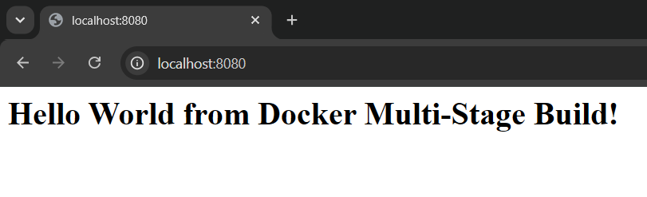
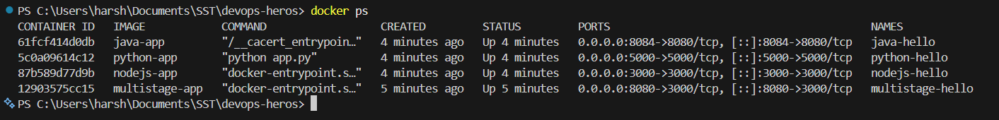
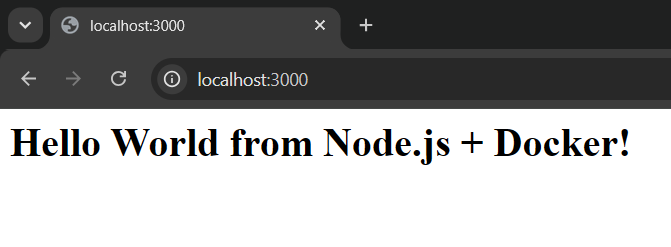
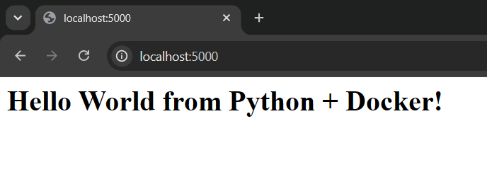
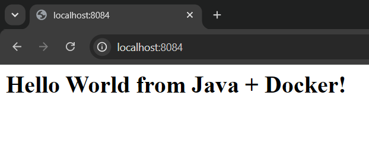

# Docker Multi-Stage Build

## Student Details

| | |
|---|---|
| Name | Harshita Hirawat |
| Enrollment Number | 24BCS10044 |

---

## Task 1: Run the Multi-Stage Dockerfile

The multi-stage Dockerfile is in the `multi-stage-dockerfile` folder of the
[devops-heros](https://github.com/Nency-Ravaliya/devops-heros) repository, so the repo is cloned
first:

```bash
git clone https://github.com/Nency-Ravaliya/devops-heros.git
cd devops-heros/session6-7-docker/multi-stage-dockerfile
```

### The Dockerfile

```dockerfile
# Stage 1: Build
FROM node:24-alpine AS builder
WORKDIR /app
COPY package*.json ./
RUN npm install
COPY . .

# Stage 2: Production
FROM node:24-alpine AS production
WORKDIR /app
COPY --from=builder /app/package*.json ./
RUN npm install --omit=dev
COPY --from=builder /app/server.js ./
EXPOSE 3000
CMD ["npm", "start"]
```

**How the two stages work:**
- Stage 1 is named `builder`. It installs **all** dependencies, including dev dependencies, and
  copies in the full source code.
- Stage 2 starts from a fresh image and only takes what it needs from `builder` using
  `COPY --from=builder`.
- `npm install --omit=dev` skips the dev dependencies, so the final image has only what is needed to
  run the app.
- Everything else from stage 1 is thrown away and never reaches the final image.

### Build and run

```bash
docker build -t multistage-app .
docker run -d -p 8080:3000 --name multistage-hello multistage-app
```

- The app listens on port **3000** inside the container, which is what `EXPOSE 3000` refers to.
- `-p 8080:3000` maps host port **8080** to container port 3000, so the app is opened on port 8080
  as required.

Open `http://localhost:8080`

The page shows **Hello World from Docker Multi-Stage Build!**

### Screenshot



### Verify the container is running

```bash
docker ps
```

- The `PORTS` column shows `0.0.0.0:8080->3000/tcp`, which confirms the app is reachable on port
  8080.

### Screenshot



---

## Task 2: Deploying Three Application Types

Three different types of applications were deployed, each from its own image. The code and
Dockerfiles are in the `Assignment-6` folder.

| Type | Image | Base image | Port mapping | Opens at |
|---|---|---|---|---|
| Node.js | `nodejs-app` | `node:22-alpine` | `3000:3000` | `http://localhost:3000` |
| Python | `python-app` | `python:3.12-slim` | `5000:5000` | `http://localhost:5000` |
| Java | `java-app` | `eclipse-temurin:21-jdk` | `8084:8080` | `http://localhost:8084` |

```bash
cd ../Assignment-6

cd nodejs-app && docker build -t nodejs-app . && docker run -d -p 3000:3000 --name nodejs-hello nodejs-app && cd ..
cd python-app && docker build -t python-app . && docker run -d -p 5000:5000 --name python-hello python-app && cd ..
cd java-app   && docker build -t java-app .   && docker run -d -p 8084:8080 --name java-hello   java-app   && cd ..
```

- Java is mapped to host port **8084** and not 8080, because the multi-stage app from Task 1 is
  already using 8080. Two containers cannot share the same host port.
- Each application uses a completely different base image and runtime, which is the point of the
  task.

### Screenshot





---

## All Containers Running

```bash
docker ps
```

### Screenshot


---

## Image Size Comparison

```bash
docker images
```

- The multi-stage image is smaller than a single stage build would be, because the build stage and
  the dev dependencies are dropped from the final image.

---

## Cleaning Up

```bash
docker stop multistage-hello nodejs-hello python-hello java-hello
docker rm   multistage-hello nodejs-hello python-hello java-hello
```

---

## Things to Remember

- A multi-stage Dockerfile has more than one `FROM`. Each `FROM` starts a new stage, and only the
  last stage becomes the final image.
- `AS builder` names a stage so later stages can copy from it with `COPY --from=builder`.
- The main benefit is a smaller and cleaner final image, because compilers, build tools and dev
  dependencies stay behind in the earlier stages.
- `EXPOSE` documents the container port only. The host port still has to be published with `-p`.
- In `-p 8080:3000` the left number is the host port and the right number is the container port.
  They do not have to match.
- Only one container can use a given host port at a time, which is why Java was moved to 8084.
