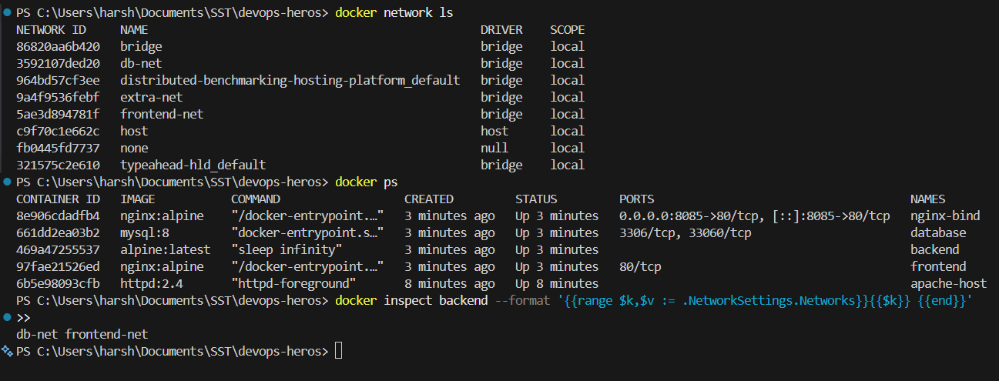
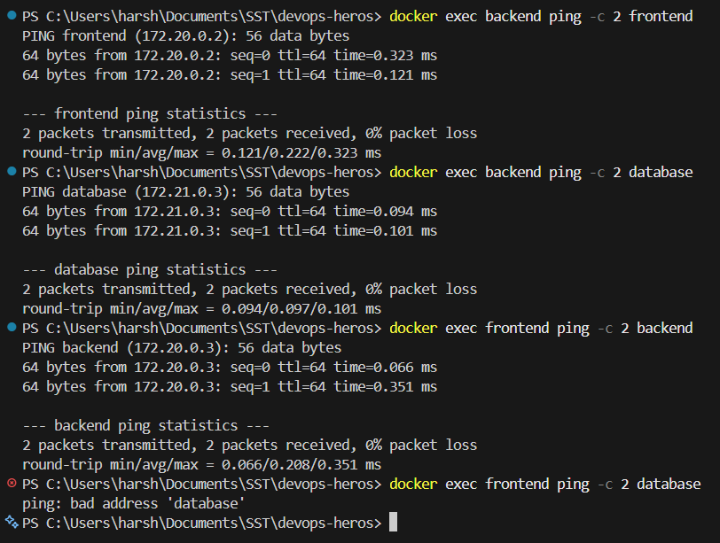
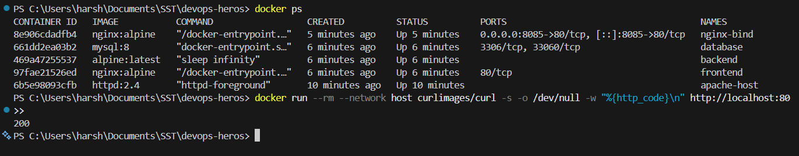
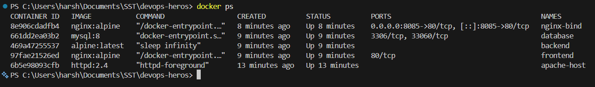

# Docker Networking and Volumes

## Overview

Four tasks: connecting containers over custom bridge networks, running a container on the host
network, using a bind mount so file changes appear live, and studying how overlay networks work.

---

## Task 1: Docker Container Networking

### Plan

| Container | Image | Networks |
|---|---|---|
| `frontend` | `nginx:alpine` | `frontend-net` |
| `backend` | `alpine:latest` | `frontend-net` **and** `db-net` |
| `database` | `mysql:8` | `db-net` |

- Three networks are created: `frontend-net`, `db-net` and `extra-net`.
- The backend sits on **two** networks, so it can talk to the frontend and to the database.
- The frontend and the database share no network, so they cannot reach each other. This is the point
  of splitting them up.
- `extra-net` is the third network. Nothing is attached to it, so it shows up in
  `docker network ls` as an empty network.

### Create the networks

```bash
docker network create frontend-net
docker network create db-net
docker network create extra-net

docker network ls
```

### Create the containers

```bash
# frontend on frontend-net
docker run -d --name frontend --network frontend-net nginx:alpine

# backend on frontend-net, then connected to db-net as well
docker run -d --name backend --network frontend-net alpine:latest sleep infinity
docker network connect db-net backend

# database on db-net
docker run -d --name database --network db-net -e MYSQL_ROOT_PASSWORD=root123 mysql:8
```

- `--network` can only be given once in `docker run`, so a second network is added afterwards with
  `docker network connect`.
- `sleep infinity` keeps the Alpine container alive. Without a long running command it starts and
  exits immediately, because Alpine has nothing to run.
- `MYSQL_ROOT_PASSWORD` is required by the MySQL image. The container refuses to start without it.

Check the backend really has two networks:

```bash
docker inspect backend --format '{{range $k,$v := .NetworkSettings.Networks}}{{$k}} {{end}}'
```

### Screenshot



### Check connectivity

```bash
# backend can reach both, because it is on both networks
docker exec backend ping -c 2 frontend
docker exec backend ping -c 2 database

# frontend can reach backend, they share frontend-net
docker exec frontend ping -c 2 backend

# frontend CANNOT reach database, no shared network
docker exec frontend ping -c 2 database
```

**What happens:**
- The three pings that share a network all succeed with **0% packet loss**.
- The last one fails with `ping: bad address 'database'`.
- The error is about the **address**, not a timeout. The name does not even resolve, because Docker's
  built in DNS only resolves container names within a shared network.

**What I understood:** containers on a user defined bridge network can reach each other by container
name, and Docker handles the DNS. Containers on different networks are fully isolated. Putting the
backend on two networks makes it the only route between the frontend and the database, which is how
a real three tier app is kept separated.

### Screenshot



---

## Task 2: Host Network

```bash
docker pull httpd:2.4
docker run -d --network host --name apache-host httpd:2.4
docker ps
```

- With `--network host` the container does **not** get its own network namespace. It shares the
  host's network directly.
- No `-p` flag is used or allowed. The container binds straight to port 80 of the host, so the
  `PORTS` column in `docker ps` stays empty.

Access it:

```bash
curl http://localhost:80
```

```bash
docker run --rm --network host curlimages/curl -s -o /dev/null -w "%{http_code}\n" http://localhost:80
```

This returns `200`.

**What I understood:** host networking removes the network isolation between container and host. It
gives slightly better network performance and avoids port mapping, but the container can no longer
be reached by name from other containers, and port conflicts with the host become possible. It also
behaves differently on Docker Desktop, because of the extra Linux VM in between.

### Screenshot



---

## Task 3: Bind Mount

### Create the folder and file

```bash
mkdir bind-mount
cd bind-mount
echo "<h1>Hello students</h1>" > index.html
```

### Run Nginx with the folder mounted

```bash
docker run -d -p 8085:80 --name nginx-bind -v "$(pwd):/usr/share/nginx/html" nginx:alpine
```

On Windows PowerShell the full path is used instead of `$(pwd)`:

```powershell
docker run -d -p 8085:80 --name nginx-bind -v "C:\path\to\bind-mount:/usr/share/nginx/html" nginx:alpine
```

- `-v host_folder:container_folder` replaces the folder inside the container with the one from the
  host.
- Nginx serves from `/usr/share/nginx/html`, so mounting there swaps in the local file.

Open `http://localhost:8085` and the page shows **Hello students**.

### Screenshot


### Modify the file and check again

```bash
echo "<h1>Hello students - file updated without restarting</h1>" > index.html
```

Refresh `http://localhost:8085`

**What happens:**
- The new text appears straight away.
- The container is **not** restarted. `docker ps` still shows the same uptime.

**What I understood:** a bind mount is a live link to a folder on the host, not a copy. Nginx reads
the file from disk on every request, so an edit shows up on the next refresh. This is why bind mounts
are used during development. A named volume is different, because Docker manages the storage and it
is not a plain folder that can be edited directly.

### Screenshot




**Note:** editing the file with PowerShell `Set-Content -Encoding utf8` adds a BOM, which shows up in
the browser as `` before the text. Editing in VS Code or with `echo` in a Linux shell avoids this.

---

## Task 4: Overlay Networks

### What an overlay network is

- An overlay network connects containers running on **different Docker hosts** as if they were on one
  network.
- A bridge network only works inside a single host. Overlay is what makes multi host networking work.
- It needs Docker Swarm mode, or another orchestrator, because something has to share the network
  state between the hosts.

### How it works

- Docker builds a virtual network **on top of** the existing physical network, which is where the name
  overlay comes from.
- Traffic between hosts is wrapped inside **VXLAN** packets on UDP port 4789. The original container
  packet becomes the payload of a normal network packet, so it can cross the real network.
- A key value store keeps the network state, so every host knows which container sits on which host.
- Containers still talk by service or container name, so from inside a container it looks exactly
  like a normal bridge network.

### Ports needed between the hosts

| Port | Protocol | Used for |
|---|---|---|
| 2377 | TCP | Swarm cluster management |
| 7946 | TCP and UDP | Node to node communication |
| 4789 | UDP | VXLAN overlay traffic |

### Use cases

- Running one application spread across several servers.
- Docker Swarm services that need to talk to each other regardless of which node they land on.
- Scaling out when one host runs out of CPU or memory.
- Keeping traffic between services on an internal encrypted network. Overlay supports encryption with
  the `--opt encrypted` flag.

### Comparison with the other drivers

| Driver | Scope | Typical use |
|---|---|---|
| `bridge` | Single host | Default for containers on one machine |
| `host` | Single host | Removes isolation, container uses the host network |
| `overlay` | Multiple hosts | Swarm services spread across a cluster |
| `none` | Single host | No networking at all |

Command to create one, for reference:

```bash
docker network create -d overlay my-overlay
```

**What I understood:** the difference is scope. Bridge stops at one machine, while overlay stretches a
single network across many machines by tunnelling the traffic. Since it depends on Swarm, it cannot be
demonstrated on a single Docker Desktop install without initialising a swarm first.

---

## Cleaning Up

```bash
docker rm -f frontend backend database apache-host nginx-bind
docker network rm frontend-net db-net extra-net
```

---

## Command Summary

| Command | Purpose |
|---|---|
| `docker network create <name>` | Create a bridge network |
| `docker network ls` | List all networks |
| `docker network connect <net> <container>` | Add a running container to another network |
| `docker network disconnect <net> <container>` | Remove a container from a network |
| `docker network inspect <net>` | Show the network details and its containers |
| `docker run --network <net>` | Start a container on a chosen network |
| `docker run --network host` | Share the host network, no port mapping |
| `docker run -v <host>:<container>` | Bind mount a host folder into the container |
| `docker exec <container> ping -c 2 <name>` | Test connectivity by container name |
| `docker network rm <name>` | Delete a network |
